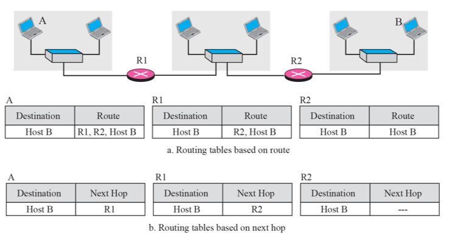

# Chapter 6. Delivery and Forwarding of IP Packets

+ IP 고유의 기능(Delivery & Forwarding) 에 대한 내용이 나온다.
+ 어떤 원칙으로 Router들은 Delivery를 하고, Routing Table을 어떻게 관리하는지 나온다.

### Delivery

+ Direct Delivery
  - A 가 B로 바로 보내는 것.(router 경유 안하고) 
  - ex : LAN 안에서 통신할 때, router 안 거쳐도 된다. 

+ Indirect Delivery 
  - 반드시 Router를 경유해서 보내는 것. 
  - "간접적" Delivery.
  - ex : 보내려고 하는 것이 router 바깥에 있으면, router 를 경유할 수 밖에 없다. 

### Forwarding(전달)

+ next hop 으로 전달하는 것.
+ hop : 출발지와 도착지 사이에 있는 network 장비를 총칭.
+ 3가지 원칙이 존재한다
+ Routing Table entry를 어떻게 꾸미는지에 관한 내용이다. 

+ 1번째 원칙 : Next Hop Method
  - A에서 B로 보내려고 하는데 router가 두개 존재한다. 
