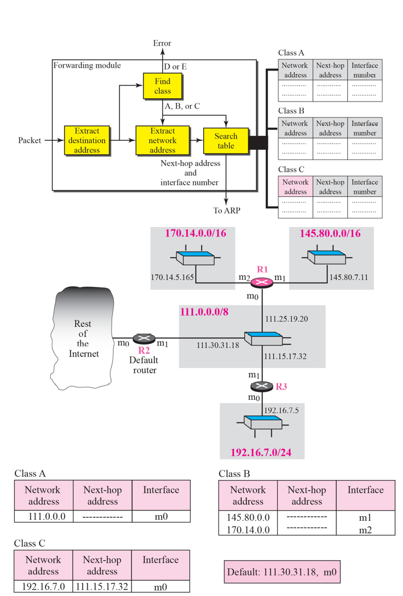
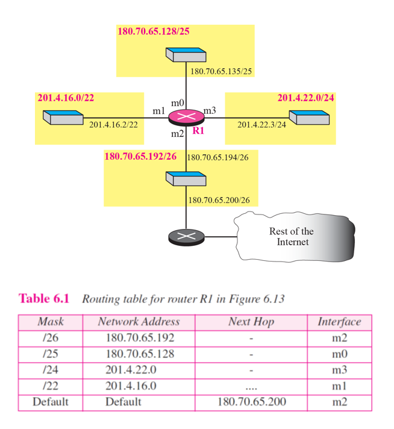
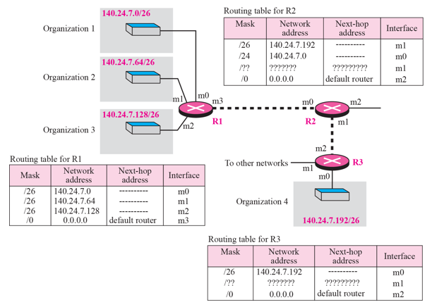
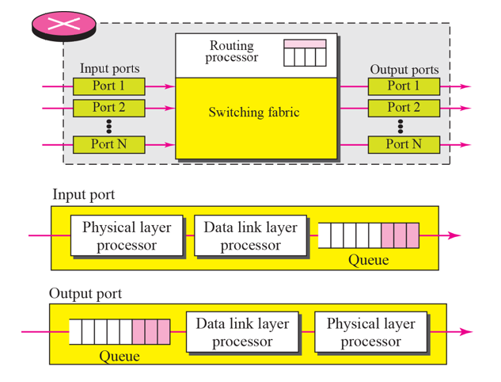

# Chapter 6. Delivery and Forwarding of IP Packets

+ IP 고유의 기능(Delivery & Forwarding) 에 대한 내용이 나온다.
+ 어떤 원칙으로 Router들은 Delivery를 하고, Routing Table을 어떻게 관리하는지 나온다.

### Delivery

+ Direct Delivery
  - A 가 B로 바로 보내는 것.(router 경유 안하고) 
  - ex : LAN 안에서 통신할 때, router 안 거쳐도 된다. 

+ Indirect Delivery 
  - 반드시 Router를 경유해서 보내는 것. 
  - "간접적" Delivery.
  - ex : 보내려고 하는 것이 router 바깥에 있으면, router 를 경유할 수 밖에 없다. 

### Forwarding(전달)

+ next hop 으로 전달하는 것.
+ hop : 출발지와 도착지 사이에 있는 network 장비를 총칭.
+ 3가지 원칙이 존재한다
+ Routing Table entry를 어떻게 꾸미는지에 관한 내용이다. 

+ 1번째 원칙 : Next Hop Method (Next Hop Routing)
  - A에서 B로 보내려고 하는데 router가 두개 존재한다. 
  - 위의 각 Routing Table에서는, 가야 할 Route가 다 적혀 있는데 반해, 아래의 Routing Table 에서는 그냥 다음 가야할 Hop만 적혀 있다. 
  - 아래의 Routing Table 대로 적는 것이 좋다! 만약에 중간에 거쳐가야 할 Hop이 10개라면, 10개 다 적어버리면 메모리의 낭비가 발생할 것이다. 
  - 다음 Hop 정보만 들고 있으면, table size가 확 줄어들 것이다.
  - 그냥 다른거 다 필요 없고, 다음 Hop 정보만 갖고 있자! Full route는 필요 없다!
  
  
  
+ 2번째 원칙 : Network-Specific Method
  - 보내려고 하는 도착지 A,B,C,D가 다 같은 LAN에 존재한다. 
  - Host Address를 다 쓰지 말고, Network 단위로 관리하면 한방에 쓸 수 있을 것이다. 
  - 위의 사례의 경우, 그냥 N2라는 Network이 있으면, 다 R1으로 보내라고 하면 된다.
  - 그다음 것은, N2가 고민할 문제로 바꿔버리면 되는 것이다.
  - Routing Table의 Entry에는, Host Level 로 하지말고 Network Level로만 관리해 쓰자!
  
+ Host Specific Routing(Optional)
  - 가끔씩 Host-Specific 하게 Routing 하기도 한다. 
  - 특정 DNS가 있는, 특정 서버에 보내는 경우가 이에 해당한다. 
  - Network 레벨이 아닌, 매우 중요한 Host 특징이 있을 때는 Optional 하게 사용하는 것이다. 
  - 그래도 기본적으로는 Network-Specific 한 방법대로 간다!
  
   
  
+ 3번째 원칙 : Default Routing  
  - Default : 나머지
  - 위의 그림에서 Host A Table에서, N2로 가는 애는 R1으로 가면 된다. 
  - 나머지 필요한 것들 다 쓰고, 여기 없는 경우, 모두 Default Router(Default Gateway 라고도 부름)인 R2로 보내라고 쓰면 된다. 
  - 그냥 여기 적혀 있는 애들은 다 알겠고, 나머지는 Default Router(Gateway) 가 알아서 하라고 던지는 격.
  - 이렇게 하면, 해당 컴퓨터에 있는 routing table의 Entry 갯수가 확 줄어들 수 있다. 
    - 기본을 다 Default Gateway에 보내고, LAN으로 묶여 있는 애들만 특징지어서 Routing Table 안에 적어 주면 된다. 
    - ex) 단대에 있는 애들은, 그 안에 LAN으로 같이 묶여 있는 애들의 entry만 갖고 있으면 되고, 다 나머지는 경북대 router(default router)(상위 router, 큰 router) 로 떠넘기면 된다.
  - 이렇게 하면, entry가 당연히 팍팍 줄게 된다. 
  
+ 이렇게 하면 전반적인 router table 이 확 줄어들 수 밖에 없다. 
+ router table을 줄이는 이유
  - 계속 router가 lookup을 해야 한다!
  - entry가 줄어들면, lookup 하는데 걸리는 시간이 당연히 확 줄어든다. 그러면 delay도 당연히 줄어들 것이다.
  
 
  
+ 위의 3 원칙을 적용한 예시
  - 패킷을 받으면 헤더 중 목적 주소 부분을 떼어내어 본다
  - 목적 주소의 클래스를 확인한다. 
  - 목적지의 네트워크 주소를 보고, 네트워크가 어디인지 본다.
  - Next-hop Address 와 interface number 확인 후, search table을 확인한다
    - 1번 원칙 : Next-hop Method
    
  - Search Table을 확인하면서, next hop이 어디인지 계속 찾아들어가면서 아래로 내려간다. 
  - 목적지에 도달하면, 111.0.0.0/8 여기서 8bit 가 network 주소 아이디인것을 확인.(classless)
  - 그림 맨 아래 표처럼, table을 꾸밀 수 있다.(2,3번째 원칙)
    - 네트워크 장비를 하나로 써 놓은 것이, 2번째 원칙인 Network-Specific Method
    - Default 따로 써놓은것이, 3번째 원칙인 Default Routing

+ Classful 에서는 Routing Table이, 3개의 정보를 관리한다
  - Subnet Address
  - Next-hop Address
  - Interface Number
  
+ Classless에서는 Routing Table이 하나의 정보를 추가로 더 관리한다 
  - Mask(Prefix Number)
  
   
  
+ Routing Table 예시 2
  - 그림에서 중앙 Router는 4개의 network 장비와 연결되어 있다. 
  - 그림에서 참고해서 만드는 Routing Table은 그림아래의 표와 같다. 
  - interface 어디를 거치면 해당 network 으로 갈수 있다는 정보도 있다. 
  - Default로는, Network Address가 Defalut인 것은 똑같다
    - 다른 것들은, 해당 네트워크에 연결되어 있는 애들에게 가고 싶다는 말과 같다. 막상 연결될 때  Network Address 가 어디로 연결되면 되는지 가르쳐주는 것이고. Default는 다른 애들일 때 그냥 Default로 가는 것이다.
    
  - Next Hop에 '-'(dash) 라고 붙어 있는 것은, router에게 바로 붙어 있다는 것을 의미한다(해당 router의 관할 안에 있다). 
  - Dash 아닌 다른 것이 쓰여져 있으면, 다음 router도 지나가야 한다는 의미이다. 
  - interface 정보는 주로 MAC Address이다. 
    - 앞의 주소들은 IP Address 였다. Interface는 그에 대응하는 MAC Address

 
    
+ Longest Mask Matching
  - 어떤 것의 network 주소가 위에 것도 해당되는 경우도 있고, 밑에 것이 해당되는 경우도 있다. 
  - 이럴 때는 prefix length가 긴 것이랑 매칭되는 것으로 무조건 가야 한다. 그게 더 정확도가 높다.
  - 기본은 Network-Specific 인데, Host-Specific으로도 한번 더 볼필요가 있다.(더 정확하니까)

 

+ Router의 구조는 어떻게 되어 있는가?
  - Input Port 와 Output Port 가 있다. 
  - 가운데에 Switching Fabric 이라는 것이 존재한다. 
    - 들어온 패킷을 하나씩 정렬해서 처리해 나가는 부분.
    
  - Input Port & Output Layer
    - L1,L2 Layer가 역시 존재한다(Physical, DataLink)
    - 순차 처리를 위한 Queue도 역시 존재한다.
  
