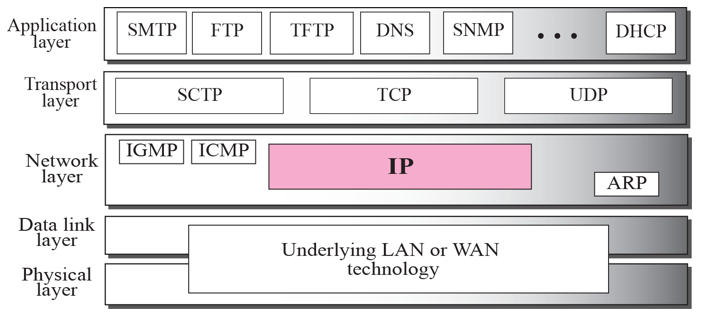
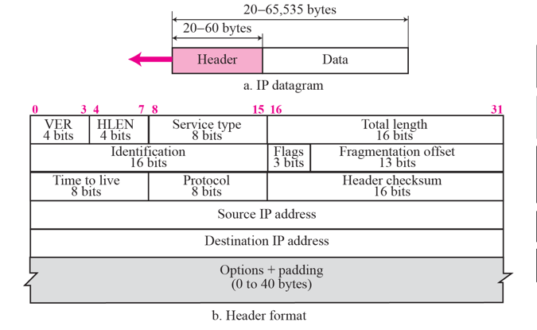
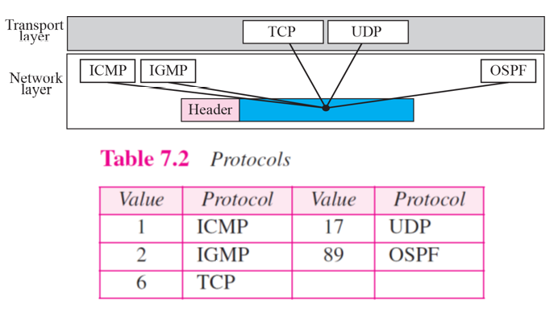
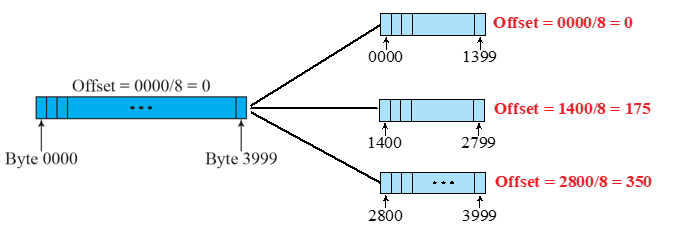
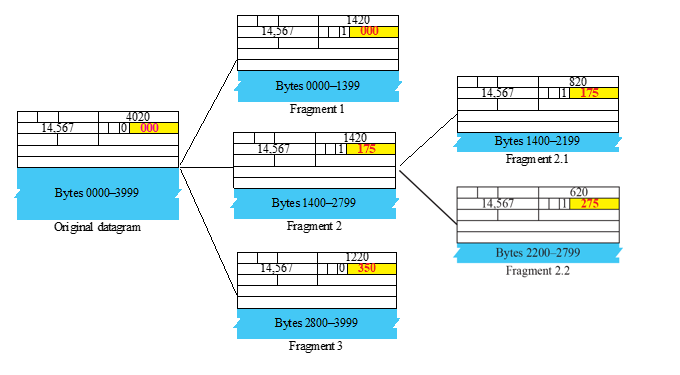
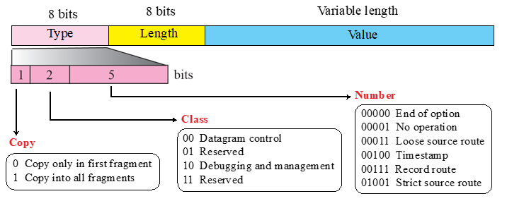
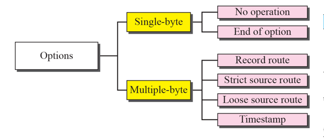
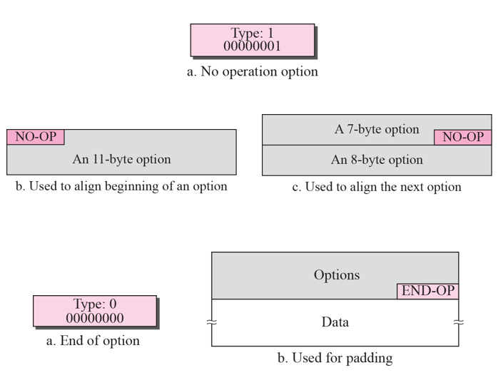
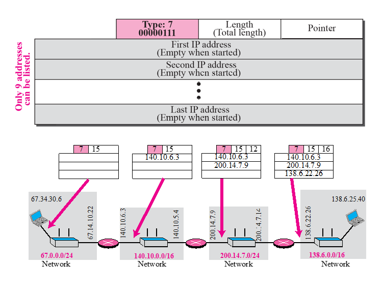
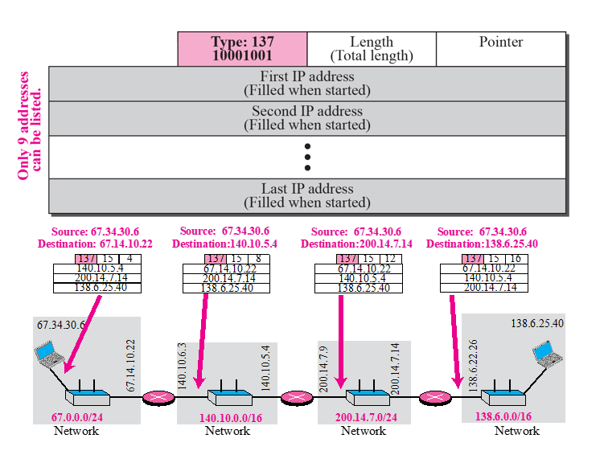

# Chapter 7. Internet Protocol Version 4(IPv4)

### Introduction 

+ Internet Protocol(IP)는, network layer(L3) 에서 진행되는 TCP/IP protocol 이 사용하는 Protocol이다.

### Datagrams

+ Network Layer 상의 패킷을 보고 Datagram 이라고 한다.
+ Datagram은 헤더와 데이터 두 부류의 가변형 길이를 가지는 패킷이다.
+ header는 20~60 바이트 사이의 길이를 가질 수 있고, routing과 delivery에 필수적인 정보들을 담고 있다.
+ TCP/IP 에서는 헤더를 4 byte section 안에 나누는 것이 일반적이다. 

+ IP Datagram의 구조
  - VER : IP 버전을 나타내기 위한 버전 영역.(4bit 차지)
  - HLEN : 4 byte를 기본 단위로 하는 헤더의 길이를 규정해 놓은 것. 헤더 크기.(4bit 차지)
    - HLEN = 5 : 5*4byte = 20 byte
    - Header의 크기가 20~60 byte 사이여야 하기 때문에, HLEN은 20/4 = 5. 5 보다는 커야 한다. 아니면 잘못된 정보이다. 
    
  - Service Type : 네트워크를 통해 데이터를 전송하고자 할 때 사용자의 데이터마다 우선권을 부여할 수 있는, 그러한 것들을 표시해 놓은 것.(8bit 차지)
    - Routing 할때 중요하게 보는 것.
    - D,T,R,C
      - D : 지연시간 최소화
      - T : 처리율 최대화
      - R : 신뢰성 최대화
      - C : 비용 최소화

  - Total Length(16bit) : 전체 패킷 길이. IP 데이터그램의 총 길이를 나타낸다. 
    - byte 단위!! 패킷의 끝이 어디인지를 확실히 알 수 있다.
    - Header를 더한, Datagram의 전체 Length.

  - Identification ,Fragmention, flag : fragmentation과 관련 있는 애들이다.
    - 패킷이 지나가는 네트워크가 다양하다.(이더넷, 이동통신, 블루투스 등).
    - 그러므로, 네트워크를 지나갈 때마다, 해당 네트워크마다 맞는 size가 존재한다.
    - MTU : Maximum Transmitting Unit
    - 처음에 2000byte를 보내도, 쪼개져서 여러 갈래로 나뉠 수가 있다. 그럼 도착하면 다시 정렬해줘야한다. 그와 관련된 정보가 2번째 줄에 있다. 

  - Identification : 16bit. 패킷의 id이다. 
    - 패킷 id가 있어야 그 뒤에 다시 합칠 때 아이디가 같은것들끼리 뭉칠 수 있다. ID 숫자는 65536개까지 가능함. 

  - Flag : 3bit. Fragmentation 되었는지 안되었는지 확인하는데 사용되는 애.
    - 실상은 2bit만 쓴다.
    - 처음에는 3bit 다 사용할 줄 알고 할당해 두었다고 하는데, 안써서 하나가 낭비되고 있다고 한다. 
    - 실제로 쪼개진 것인지 안된것인지/쪼개어도 되는지 안되는지 두 개를 나타낸다. 

  - Fragmentation Offset(13bit) : 
     - "차감하다" 라는 의미를 가지고 있다.
     - 쪼개었을때 상대적으로(3개로 쪼개었다고 가정하면), 첫번째 쪼갠 것인지 두번째 쪼갠것인지 그런내용을 가르쳐 준다. 
     - 그리고 다시 모았을때 몇 번째 fragmentation인지 가르쳐 주는 역할도 한다.
     - 패킷이 잘 쪼개지지는 않긴 하지만, 이동통신망 등을 이용할때나 v6로 가면 쪼개어서 보내기도한다. 

   - TTL(Time To Leave) : 패킷 생존기간. 8bit
     - 패킷이 얼마나 생존할 수 있는가를 가르쳐주는 애로, 몇 개의 hop을 지날 수 있는지 체크해주는애. 
     - 일정 수치 이상의 hop을 지나면 해당 패킷을 폐기한다.
     - Ex) TTL = 10 >> 11개째 HOP을 지나려고 하면 폐기된다. 수명을 다한 것이라고 보아도 된다.
     - 왜 수명을 정해두느냐?  : router에서 routing table이 바뀔때가 있다. 이때 packet 이 이동중이었다면 중간에 꼬일 수 있다. 이때 자칫 무한 loop 에 빠져 버렸는데, 이런 것들이 여러 수억 개 만들어 버렸다면, 망이 다운될 수 있다. 그래서 망 관리 차원에서 만들어 둔 것이다. 
     - 중간에 만약에 정말 Packet이 사라졌다면, ICMP라는 애가 일단 packet 을 없애버린 후, 어떤 이유 때문에 패킷이 없어졌다고 최초로 보낸 컴퓨터에게 알려주는 역할을 한다. 
     - 0부터 255까지 나타낼 수 있긴 하지만, 어지간하면 20개 이내에서 끊는다. 어지간하면 20개 이내에서 전달이 끝나기 때문. 이 hop 갯수가 넘도록 못 가고 있다는 이야기는 문제가 생겼다는 의미이다. 
     
  - Protocol(8bit) : TCP, UDP 등 어떤 Protocol을 사용하고 있는지 알려주는 애.
    - Protocol이 다 표준 번호가 있는데, 그 번호를 보고 어떤 Protocol이 사용되고 있는지 알 수 있다. 
  
  - Header Checksum(16bit) : Header 에 대해서 Checksum 해주는 애. 
    - 전부다 더한 후, 1의 보수 연산을 통해 나오는 숫자. 
    - Header에 있는 것을 전부다 더한 후, Checksum 까지 더한 합이 0이 나와야 하는데, 나오지 않으면 중간에 무엇인가가 바뀌었다는 것을 암시한다. 
    - 간단하게나마, 문제가 생겼는지 안생겼는지 파악할 수 있다. 
  
  - Source IP Address / Destination IP Address
  - Option : 들어갈 수도 있고 안들어갈수도 있음. 
          
+ Service Type : CodePoint라고 있는데, 지금은 잘 안쓰인다고 한다. 
  - 이 Packet의 Payload가 어떤 종류의 Service인지 알려줌. 
  
  

+ About Eternet Frame 
  - MAC에서 L2 Trailer, L2 Header가 있는데, 그 사이에 size가 보통 정해져 있다. 
  - 위의 그림에서 적혀 있는 46 byte. 저 값의 Maximum Size가 MTU(Maximum Transmitting Unit) 이다. 
  - 이동통신망은 MTU가 몇 byte인지, Ethernet은 MTU가 몇 byte인지 다 정해져 있다. 
  - 이 MTU 정보로 Fragmentation 할지말지 결정하는 것이다.
  
 

+ About Protocol Info in Packet 
  - Header 의 Protocol Field에서, 어떤 Protocol이 올 수 있는지 에 대한 부분.
  - TCP, UDP, ICMP, IGMP, OSPF 등 올 수 있다. 
  - 각 Protocol 마다 숫자가 정해져 있다. 
  - Header 내의 Protocol Field 정보를 바탕으로, Router도 해당 패킷의 Protocol 정보를 알 수 있음. 
 
+ 연습문제 
  - 01000010 은 에러이다
    - 0100 : Version 정보. 4면 ㄱㅊ
    - 0010 : 최소한 Header Length 가 5 이상으로 나와야 하는데, 2면 안된다. 2면, header length가 2*4 = 8byte라는 소리다. 에러라서 폐기.
    
### Fragmentation

+ Network 마다 MTU 정보가 있어서, 그것에 따라서 Packet이 쪼개질 수 있다!(Fragmentation)
+ MTU :
  - 위의 그림에서 적혀 있는 46 byte. 저 값의 Maximum Size가 MTU(Maximum Transmitting Unit) 이다. 
  - 이동통신망은 MTU가 몇 byte인지, Ethernet은 MTU가 몇 byte인지 다 정해져 있다. 
  - 이 MTU 정보로 Fragmentation 할지말지 결정하는 것이다.
  - MTU에 맞출려면, Packet을 쪼갤 수 밖에 없음. 그렇게 Packet을 쪼개는 것이다. 
  - 물론 Header값은 쪼개질 수 없다. Data 부분만 쪼개진다고 생각하면 된다. 
  - Data 길이가 MTU 보다 클 때 쪼개는 것이다. 
   
  
  
+ Flags Field
  - D(DO NOT) : 쪼개어도 되는지 안되는지? 
    - 쪼개지면 의미가 사라지는 경우, 1로 표기 해 둔다.
    - 만약에 쪼개어야 하는 상황인데, 쪼개지 말라고 표기된 경우, 해당 Packet을 없애버리고, 발신 컴퓨터에 알려준다. 
    - 보내는 애가 이 D 값을 세팅한다. 
  - M(More) : 1로 세팅 된 경우. "쪼개졌다!" 라는 것을 의미한다. 
    - M 값이 1이라는 이야기는, 뒤에 정보가 더 있다는 의미이다. 
  
  - 해당 값은 11이 올 수 없다.
    - 1이 쪼개지 말라는 의미인데, 뒤에 1은 쪼갰다는 의미이니까, 오면 에러이다. 
   
  - 반면, 당연히 00은 올 수 있다. 
    - 쪼개어도 된다고 해 두었는데, 쪼갤 필요가 없어서 00이 올 수 있다. 

 

+ Fragmentation Example 
  - 위 그림에서는 Header를 뺀 것을 보여주고 있음. 
  - 총 4000 byte 크기이다.
  - 어떤 Router에 왔는데, MTU 크기 때문에 3개로 쪼개는 상황이다. 그래서 1400 byte 2개, 나머지 용량으로 쪼갠 상황이다. 
    - 쪼개고 나면, Offset에 저 값이 들어간다. (두번째 line의 맨 마지막에)
    - Offset 에는, data 크기에 8로 나눈 값을 쓴다고 한다.
    - 13 bit 에 맞출려다 보니, 16-13 = 3bit, 즉 8로 나눠서 저장한다고 한다. 
    - 극단적인 경우, total length가 가장 큰 경우라도 커버를 해야 하니, 16bit 짜리를 13 bit에 mapping 하는 것이라고 한다. 
    - 초기값, 시작값을 써주는 것이다. 
    - 상대적 위치니까, 원래 Packet(0으로 시작하는)에서 어느 정도 떨어진 위치에 있는 것인지 알 수 있다. 
    
  - 필요하면, 쪼갠 것에서 더 쪼갤 수 있다! 
  -  

    - Fragment ID는 똑같음. 
    - Flag에서 M 값이 0이라는 것은 맨 마지막 것이라는 것을 의미.
    
    
### OPTIONS

+ Options 는 없을 수도 있고, 최대 40byte까지 있을 수 있다. 

 

+ Option 이 온다면, 위의 format으로 온다!
  - Type, Length, Value 라서 TLV Format이라고 함. 
  - 이렇게 3개로 나뉘어서 의미를 지니고 있음. 

+ Header Option으로 올 수 있는 것들.

  - 
  
  - No Operation : 그냥 의미 없는 것.
    - 그냥 넣어주는 애이다.(그냥 채우려고 하는 것)
    - Header는 4byte 단위로 나와야 하다 보니, 4byte 단위를 채워 주려고 넣음. (byte가 4의 배수가 되도록 채워주는 것, 이 작업을 padding 이라고 부른다.)
    
  - End of Option : 이 옵션이 끝이고, 더 없다! 바로 데이터가 온다는 의미.   
  
  - 실제 의미 있는 것들
    - Loose Source Route
    - Timestamp
    - Record Route
    - Strict Source Route
  
  - Single-Byte : 오게 되면 1byte 단위로 오게 된다. 
  - Multiple-Byte : 오게 되면 4byte 단위로 오게 된다. 
  
  - 
  
  - Record Route 
    - 말그대로 경로를 기록함. 
    - Router를 진행할때마다 Router의 주소를 채워준다.
    - IP(Rounter) Address가 4byte니까, Multiple-Byte
    - Option MAX : 40 byte이니까, Router를 10개 정도 기록할 수 있다. (10개째는 안된다! 기본적으로 Time-Length 값을 채우는 게 있다고 함. 그래서 실질적으로는 9개 쓸 수 있다. )
    
  -   
    
  - Strict/Loose Source Route
    - Source Routing : 원래는 Router가 Routing 하는데, 이 Option이 들어있으면, 어떤 Router로 갈지 미리 다 정해놓는 것이다. Source 가 Route를 다 결정해 놓은 것이다. 
    - 보통은 Source가 이렇게 안하고, 망 관리자가 결정하는 문제이다. 
    - 망 관리자가, 망 관리 용도로 일부러 저렇게 보내볼 수 있다. 
    - routing table을 대놓고 위배하는 것이라, 일반 사용자가 막 쓰면 위험하다. 
    - Strict Source Route : 두번째 보내려고 봤는데, 그런 Router가 없다고 한다. 그럼 그냥 Packet을 없애버리는 경우. (엄격하게 적용)
    - Loose Source Route : 두번째 보내려고 봤는데, 그런 Router가 없다고 한다. 그럼 다른 방법을 찾아보는 경우(좀 loose하게 적용)
    - 당연히 최대 9개까지 Router를 지정할 수 있다. 
    - 엄격하게 적용하면 strict, 대략적으로 적용하면 loose
    - 아래 그림에서, 처음에는 140. 으로 시작했던 애가 첫번째 router 지나고 나면 67. 로 바뀌어 있는데, 이는 지나온 router를 그 자리에 덮어쓰면서 기록하는 것이다. 
    
    
  - TimeStamp
    - 시간 재는 것이 필요할 때가 있다. 그때 사용하는 것.
    
### CHECKSUM

