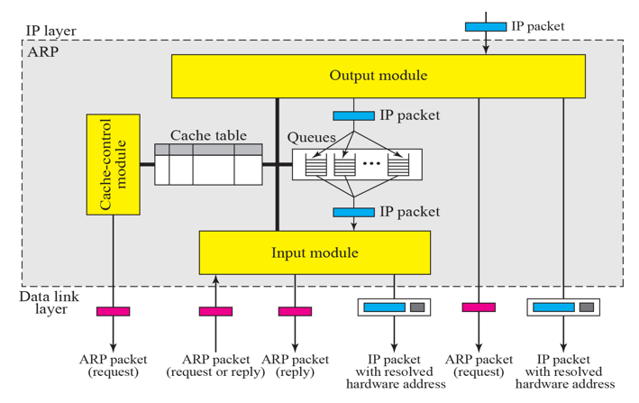

# Chapter 8. Address Resolution Protocol(ARP)

### Address Mapping

+ 같은 Layer(L3)이기는 함.
+ IP Header를 쓰지 않고, MAC Layer(Physical Adress)와 직접 통신하는 Protocol.
+ IP Address / MAC Address 가 있으면, Router는 어떤 IP가 어떤 MAC Address 와 Mapping 되는지 알아야 함. 
  - 이 Mapping 정보를 알아내는 것이 ARP가 하는 역할이다! 
  - arp -a 를 cmd 에 입력하면, 같은 LAN 안에서 IP와 MAC Mapping 정보를 알아올 수 있다.

+ ARP가 어떻게 동작하는지?
  - System A 에서 IP Addressfh Request를 해당 네트워크의 모든 애들한테 다 보낸다(Broadcast). 
  - 이후, 그 IP를 사용하는 컴퓨터가 응답하며(물론 응답 안할수도 있음), unicast로 arp로 reply
  - 이런 과정들이 수시로 컴퓨터들 사이에서 주고받게 된다. 
  - request 이후 reply!
  
  

+ ARP Packet의 format
  - 위 그림의 분홍색 부분을, 처음 reply에서는 빈칸으로 만들어 보낸다. 
  - 응답할 때는 채워서 보내주는 것임. 
  - 이런 식으로 상대방의 IP와 MAC
  - 이 ARP 자체는 IP Header를 쓰지 않는다!
    - L2 Frame에서는 IP Header가 없음. L2 Frame 안에 ARP가 바로 들어간다고 한다. 
    - 어차피 MAC 주소를 몰라서 못쓰는 것도 있음.

  

+ ARP 쓰는 4가지 case
  - Host - Host
  - Host - Router
  - Router - Host
  - Router - Router

+ ARP 주고받는 Example

   

+ Proxy ARP

  -  
  
  - Proxy : 위임받는다 라는 한글 뜻이 있다. 
  - ARP 기능을 위임받아서 다른 애가 대신 해준다. 
  - 여기서는 요청을 보내는 router나 host가 ARP 주소를 물어서 ARP Router까지 BroadCast를 보낸 경우이다.
  - Proxy ARP Router는, 자신과 연결되어 있는 subnetwork에 그 broadcast를 보내지 않고, "대신" 해당 IP 주소를 가지고 있는 컴퓨터의 MAC Address를 대신해서 unicast를 보냄.(해당 정보를 다 알기 때문에,대행해준 것이다)
  - 추가 그림설명 
    - 동그라미 : Router
    - 네모박스 : LAN Cable Network
    
 

+ ARP FlowChart
  - 개발할 때 필요한 흐름도이다. 
  - 그와 관련된 기능(모듈) 과 코드가 다 있다.

 

+ ARP Table
  - 수시로 관리되고 있는 것이다. 
  - 어떤 주소를 누가 사용하고 있는지, ARP로 확인했는지 등 정보가 나와 있는 table 이다.
  - 거의 1분에 한번씩 확인되고 있는 정보들이다. 
  - State
    - P : Pending(확인 중)
    - R : Replied(이미 받은 것)
    
  - 이것을 알고 있어야, 데이터를 보낼 일이 있으면 바로 보낼 수 있을 것이다. 
  
  
  
