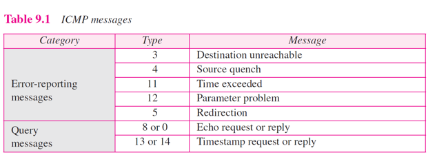
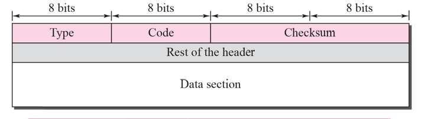
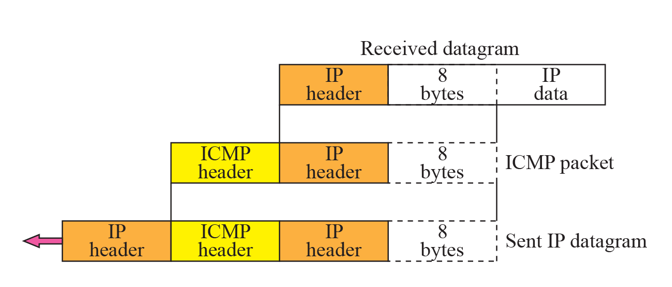
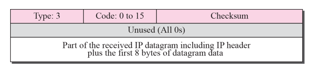
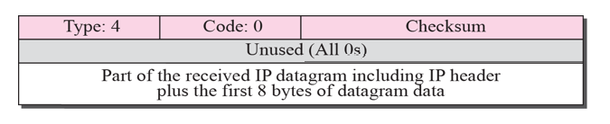
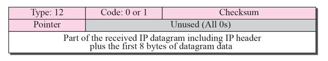
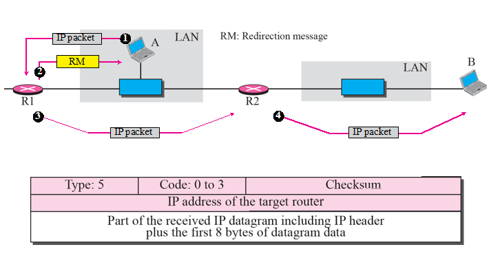
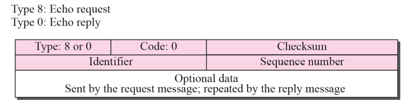

# Chapter 9. Internet Control Message Protocol Version 4(ICMPv4)

+ 원래 IP에는 Control 기능이 없다. 그저 Packet 보내고 잘 가기만을 바랐던 것.
+ 유일하게 Control 기능을 채워준 것이 ICMPv4 이다. (version 6는 따로 있다)
+ ICMP Packet은, IP Header 뒤에 온다. 

+ ICMP가 control 용도인데, 두 가지가 있다. 
  - 1. Error-Reporting 용도
    - Packet을 보냈는데, 잘 가면 좋은데 어떤 것은 못 갈수도 있다. 
    - 이런 상황이 오면, 해당 Packet을 폐기하고 보낸 컴퓨터에 알려준다. 
    - 에러가 생겼을 때 패킷을 없애버리고 보낸 컴퓨터에 알려주는 역할을 해서, Control 되었다는 것이다. 
    - 알려만 주는 것이고, 해결책을 제시하지는 않기 때문에, 보낸 컴퓨터가 다시 보내던지 해야함.
    
  - 2. Query
    - 진단용 or 시간 잴 때(TimeStamp) 사용
    - ex) Ping.(Echo request or reply)
    - 살아있는지 확인하는 용도로 사용된다. 
    - TimeStamp : 몇초 걸리는지 확인. 

### Messages

+ ICMP 가 메세지 보내는 것(Table)

1. Destination Unreachable(Type 3) 
    * 목적지에 도달 못한 경우
    * 목적지에 갔는데 없는 경우.

2. Source Quench(Type 4)
    * Packet을 과도하게 보내는 애한테, Packet 보낼 것을 자제하라고 보내는 것. (억누르는것)
    * 해킹을 약간 막아주는 용도?
    * 에러는 아니고, 단순히 알려주는 용도.
    
3. Time Exceeded(Type 11)
    * TTL 다 없어져서 못 보냈다고 메세지 보내 주는 것.
    * Router 단에서 없애버린다. 
    
4. Parameter Problem(Type 12)
    * Parameter 가 20byte ~ 60byte 크기의 Header의 Field 값을 해석하는 과정에서 오류가 나는 경우.
    * 이때도 Packet을 폐기하고, 새로 알려 준다. 
    * 무슨 말인지 모르겠다는 내용이다.
    
5. Redirection(Type 5)
    * "당신이 상대하고자 하는 컴퓨터는 다른 Router에 있다" 라는 내용을 전달함. 
    * 역시 에러는 아니고, 그냥 알려주는 용도.
    * 여기가 아니다! 라는 내용이다. "앞으로 나에게 보내지 말 것!"
    

+ ICMP Message의 Protocol Format
 - Protocol 이다보니, Header가 있고 Data가 있다. 
 - 한 줄당 4byte(32bit), 2줄이라 8byte 짜리 header를 가진다. 
 - Type, Code, Checksum, Rest of the header 가 있고, Rest 부분은 Type마다 다르다. 
 
+ ICMP는 언제나 에러 메세지를 Original Source에게 알려주는 역할을 한다. 

+ 어떻게 알릴 것인가?
  - 패킷 전체를 다 돌려보내려니까, 내용이 너무 많아서 문제가 된다. 
  - 사실은, 다 알려줄 필요 없고, 꼭 필요한 내용만 보내면 된다. 
  - 과정
    - 위 그림의 맨 위 Received Datagram을 수신함.
    - IP Header + 8byte를 내용으로 해서, 앞에 ICMP Header 를 붙인다. 
    - 왜 8byte 짤라서 더하는가? : IP data 맨 앞부분에, Port 번호가 있어서 그렇다고 한다. UDP가 8byte, TCP가 20byte 를 IP Header 뒤에 Data 부분에서 쓰는데, UDP 까지는 Cover하기 위해서 그렇다고 한다. TCP 도 앞 8byte에 중요한게 다 모여 있어서 ㄱㅊ.
    - 결론 : IP Header와 Port 번호를 포함시킨 것이다. 
    - 그래서 IP Header와 뒤 8byte 만 봐도, 다시 받는 쪽에서 적절한 조치를 취할 수 있다. 
    - 그다음에 ICMP Header 붙이고, 그 앞에 IP Header 붙여서 다시 보낸다. 

    
+ Destination-Unreachable
  - 목적지 Host에 의해서 발생되는 것.
    - Packet이 갔는데, Port 번호 같은 것이 없었다.
  - 다른 Destination-Unreachable Message 는, Router에 의해서 만들어진다. 
  - Packet이 Delivery 되는 도중 생기는 문제를 Router가 모두 다 아는 것은 아니다. 
    - 모르는 이유로 삭제된 Packet도 존재한다. 
    
+ IP Protocol에는, Flow Control, Congestion Control이 없다. 
  - 유일하게 있는 Control은 ICMP 뿐이다. 
  - Flow Control, Congestion Control 은 오직 TCP 가 한다고 한다. 
  - IP Protocol 은, Delivery 를 수천만개 시켜야 하는 까닭에 이런 control 기능을 넣지 못한다. 
  - TCP는 처음과 끝에만 있는 것. IP는 전달만 해준다. 
  - 유일하게 있는 Control 이, ICMP Reporting 하는 정도이다. 
  
  
  
+ Source-Quench
  - 그만 보내라고 하는 경우.(이때는 router 단계에서 packet 버리고 통보한다)
  - 보통 network에서 congestion(혼잡) 이 발생하면(상황이 안좋아지면), 그만 보내라고 하는 경우.

+ Time-Exceeded
  - router가 TTL 값 체크해서 TTL 이 0이 되면 time-exceeded message를 보낼 수도 있다.
  - Time-Exceeded 에서 Code 가 0이 있고 1이 있는데, 0일 경우에는 TTL 값, 1인 경우에는 시간을 의미한다. 
  - code가 1인 경우에는, fragment가 된 애를 받는데 assemble 시간이 너무 오래 걸리는 경우이다.
    - 처음 것으로부터 1분(예시, 각 정해진 시간이 있다) 지났는데도 나머지 fragment가 안 오고 있는 경우가 있으면, 계속 기다릴 수 없으니 그냥 다시 보내라고 하고 폐기하는 경우이다.

  

+ Parameter Problem
  - 해석하다가 이해 안되어서 다시 보냄.
  - router 나 destination host에서 만들어 보낼 수 있다. 

 

+ Redirection
  - 오류가 아니지만, 앞으로는 저기에 보내라! 지금거는 내가 친절하게 저쪽으로 전송해 줄게! 하고 보내는 경우. 
  - 앞으로 어디에다가 보내라고 다시 ICMP 로 메세지 날려 줌. 

+ Query(Echo-Request and Echo-Reply Message)
  -  
  - Echo Request와 Echo-Reply가 쌍으로 존재한다. 
  - 상대방이 살아 있는지 확인할 때 ICMP를 사용한다. 
  - Ping Command 에서 Echo Request,Reply 사용한다. 

+ TimeStamp
  - 시간 잴 때 쓰지만, 잘 안쓰인다. 

### Debugging Tools

+ 코딩한 다음 디버깅할 때, 혹은 망관리할 때 쓰는 Tool들이 있다.
+ Ping
  - 살아 있는지 확인하는 것
  
+ Traceeroute
  - 중간 router를 파악하는 것.    
