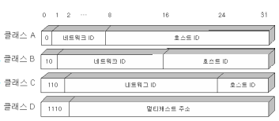
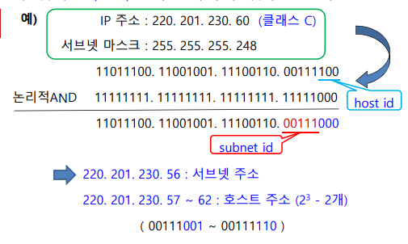
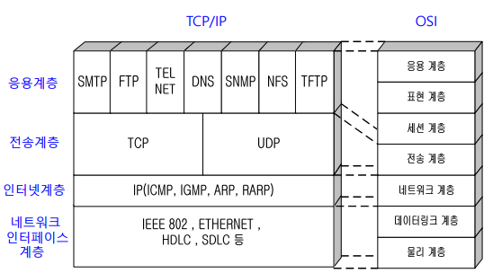
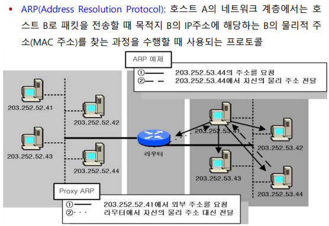

# Chapter 10. 컴퓨터 네트워크와 월드와이드웹

### 컴퓨터 네트워크 

+ 컴퓨터 네트워크 : 전송매체(유선/무선)를 통해 연결된 컴퓨터들이 상호간 정보를 교환하는 시스템
  - 송신자와 수신자의 데이터 전송은, 프로토콜에 따라 이루어짐
  - 프로토콜(Protocol) : 통신을 하는 두 개체 간에 데이터 전송 방식을 정한 절차 또는 규약(메세지의 형식, 전달방법, 교환절차, 에러시의 처리방법 등)
    - 사람이 서로 의사소통 하는것도 같은 "언어"를 쓰기 때문임. 
    - 프로토콜은 사람의 언어와 마찬가지로, 통신 규약을 약속해 놓고 소통하는 것이다.

### 네트워크의 역사

+ 1837년 새뮤얼 모스의 모스 부호는 최초의 전기통신
+ 1876년 알렉산더 벨의 전화 발명
  - 초창기 때는 전화를 연결해 주기 위해 교환수를 사용함.
+ 1878년 교환기 등장, 전화망은 아날로그 신호 이용
  - 아날로그 신호로 전송하다 보니 왜곡/잡음이 발생하여 중간중간에 증폭기 사용
  - 초기 컴퓨터 네트워크는 전화망을 사용함
+ 1969년 ARPANET, 1974년 제록스가 이더넷(Ethernet) 개발
  - 미 국무성을 중심으로 알파넷이 형성됨. 
  - 주변에 있는 연구소, 대학교 기관들을 연결하는 것으로 시작.
  - 이것을 시작으로 전 세계 LAN들이 연결되어 인터넷이 발달했다.
+ 1982년 인터넷 프로토콜인 TCP/IP 가 만들어짐
+ 1992년 www 가 개발되어 인터넷의 급격한 확산이 이루어짐.

### OSI(Open System Interconnect) 7계층 모델

+ 현재 인터넷이 개발되어 사용되는 프로토콜은 TCP/IP Protocol 이다.
+ 국제표준화기구(ISO)에서, 통하기 위한 여러 가지 참조 모델로 만든 것이 OSI 7 Layer 모델이다.
  - 꼭 따라야 하는 의미가 아닌, 그저 참조하라는 의미로 만든 것이지만, 현재는 거의 모든 컴퓨터가 통신을 하기 위해 이 프로토콜을 사용하고 있다.

+ 데이터 통신을 하기 위해, 송신측 컴퓨터와 수신측 컴퓨터를 각각 7개 층으로 나누었음.
  - 각 계층에서 해당 계층에서의 일을 하면, 거기에 해당되는 같은 layer에 있는 수신 계층이 그것을 받아 적절한 처리를 할 수 있도록 하는 모델이다. 
  - 그렇게 아래와 같은 8계층으로 만들어, OSI 7 Layer가 만들어지게 되었다.
  

+ 위 두 컴퓨터는 네트워크 상으로 멀리 떨어져 있는 것이라고 가정하자. 
+ 두 컴퓨터가 통신하기 위해서는, 여러 개의 네트워크를 거쳐 연결이 된다. 
  - 중간에 있는 것이 router 이다. 
  - 원래 많이 떨어져 있으면, 여러 개의 router를 거쳐야 하지만, 여기서는 편의상 하나만 함.
  - 컴퓨터에서는 그냥 간단하게 마우스 클릭 한방이면 되지만, 속에서는 여러 개의 단계를 거친다.

+ 응용 계층 : "사용자에게 응용 서비스 제공"
  - 제일 위에 있는 계층.
  - '응용' 은, 컴퓨터에서 사용하고 있는 응용 소프트웨어를 가리키는 것이다.
  - 사용자와 상호작용하는 계층
    - 카카오톡이라는 응용프로그램에서, 전송하는 메세지는 응용 계층에서 처리한다.
  - 강의에 나왔던 응용프로그램 예시
    - FTP(File Transfer Protocol), Skype, Outlook

+ 표현 계층 : "전송 정보의 표현방식 관리, 암호화/압축 등"
  - 응용 계층 바로 아래 있는 계층
  - 제대로 네트워크를 거쳐서 전달되기 위해서는, 중간에 다른 사람이 메세지를 보지 못하도록 암호화하거나 압축하는 등의 과정이 필요하다. 
  - 표현 계층에서는, 응용 계층에서 보내려고 하는 메세지가 다른 사람의 네트워크를 거쳐서 가기 때문에, 다른사람이 보지 못하도록 암호화하거나, 압축(용량이 너무 큰 파일의 경우) 하고, 암호화에 관련된 헤더를 덧붙여서 보내는 역할을 담당한다 
    - 우편물을 보낼 때도, 알맹이만 보내는 것이 아니라 남이 해당 물건을 보지 못하도록 포장함.
    - 암호화 관련 헤더를 보내는 이유는, 수신계층에서 암호화되어 받아본 애를 풀어야 하기 때문이다.
    - 헤더를 덧붙여 보내면, 수신 측에서 그것을 토대로 적절한 처리를 해서 알맹이 메세지를 보게 될 것이다.

+ 세션 계층 : "두 종단의 프로세스 사이의 접속(session)의 설정/유지/종료 담당"
  - 세션(Session) : 송수신 간의 논리적 연결.
    - 지식백과에서의 세션 : 
    - 1. 망 환경에서 사용가 간, 또는 컴퓨터 간의 대화를 위한 논리적 연결
    - 2. 프로세스들 사이에서 통신을 하기 위해, 메세지 교환을 토애 서로를 인식한 이후부터 통신을 마칠 때까지의 시간.

  - 세션 계층에서는, "세션"에 관련된 정보를 덧붙여서 아래로 내린다. 

+ 보내려고 하는 알맹이는 7계층 데이터가 전부인데, 자꾸 살을 덧대는 식으로 내려간다고 생각하면 된다.(암호화 헤더, 세션 정보 등)
 
+ 전송 계층 : "전체 메세지의 종단간 전성을 책임짐"
  - 종단간(end-to-end) 흐름 제어 및 오류 제어기능
  - 송신측에서 수신 측까지 정보가 제대로 전송이 되었는지 체크하고, 관련된 것들을 제어하는 계층이다.
  - 송신/수신 컴퓨터 간에 router를 여러 개 거치게 되는데, router를 제대로 잘 거쳐 도착했는지를 체크하는 계층
  - 그에 관련된 정보도 역시 헤더에 들어간다.

+ 네트워크 계층 : "송신측과 수신측간의 패킷(packet)이 전송되는 경로 설정(routing)"
  - 논리적인 IP 주소를 헤더에 포함하여 전송
  - 네트워크 계층에서 하는 기능, 부가정보들을 헤더에 덧붙이게 되는데, 네트워크 계층까지 내려오면서 헤더가 다 붙고, 네트워크 계층에서도 헤더를 붙이면 이것을 보고 "패킷"이라고 한다. 
  - 패킷의 헤더에는, 송신/수신 측 IP 주소가 들어간다. 
    - 패킷 헤더 부분을 보고 "논리 주소"라고도 이야기한다. 
    - 마치 우편물을 보낼 때, 보내는 사람/받는 사람 적는것과 같음.
  - routing(경로 설정) 을 하는 장치를 보고 router라고 부른다. 

+ 데이터 링크 계층 : "인접한 노드 간에 전송하는 역할. 프레임이라는 논리적 단위를 구성(인접 노드 주소 포함)"
  - 프레임 흐름 제어(flow control), 오류 제어(error control) 기능도 담당한다.
    - router가 되게 바쁠 때는, 프레임을 보내자마자 또 보내는 등 너무 자주 보내게 되면 프레임이 폐기처리 되게 된다
    - 그런 것을 막기 위해, 프레임을 천천히 보내라는 메세지를 보내면서 흐름을 제어할 수 있다.
    - 오류 제어 : 링크를 통해 전송되는 동안, 오류 체크를 해 보니 오류가 발생했다면, 프레임을 다시 보내라는 신호를 되돌려줄 수도 있다.
  - 데이터링크 계층에서 하는 기능에 관련된 부가정보를 헤더 부분과 트레일러 부분에 붙인다. 
  - 데이터 링크 계층에서, 이러한 형태로 앞뒤로 붙여서 합친 데이터를 보고 "프레임" 이라고도 부른다.
  - 프레임의 헤더에는, 인접한 node의 48bit mac 주소(물리 주소가 아니다. 1:1 치환된다고 생각하면 된다)가 들어가게 된다. 
  - 물리 주소는 왜 필요한가?
    - 데이터 링크 계층에서는 멀리 보는 것이 아닌, 인접해 있는 node 까지만 바라본다. 
    - node와 node 사이의 link를 하나하나 통과해서 데이터가 나아가게 된다. 
    - 인접해져 있는 node로, link를 통해 프레임을 전송하게 된다. 
    - 이렇게 node 간에 정보를 전달하기 위한 계층이 데이터 링크 계층이 하는 일이 된다.
    - 단순히 다음 router까지 프레임이 제대로 전송이 되게끔만 하는 계층이다.
    - 데이터 링크는 오로지, 연결되어 있는 링크들만 살핀다. 

  - 전달받은 주소와 전달할 주소 두가지만 있으면 되겠다.
    - 마치, 우체국 직원이 다음 장소로 보내기 위해서 받은 집중국, 보낼 집중국 정보를 스티커로 붙여놓은 것 같은 구조이다.(여기서의 집중국이 곧 router가 되겠다)

+ 왜 라우터에는 네트워크 계층, 데이터링크 계층, 물리 계층 3개만 있는가?
  - 네트워크 계층에서, 송신/수신 측 IP를 받아오게 되는데, 이것을 읽고 데이터링크 계층에서 어디로 보낼지 판단하면서 보내게 된다.
  - 중간에 있는 router들은, 전송 계층까지의 알맹이는 볼 필요가 없다. 그냥 보내는 역할을 할 뿐이다. 
  - 그래서 네트워크 계층의, 송/수신 IP만 보고 관련 알고리즘을 활용해 다른 쪽 router나 컴퓨터로 보내게 되는 것이다.
  
+ 물리 계층 : "데이터를 물리 매체 상으로 전송하는 역할."
  - 사용자 장비와 네트워크 종단 장비 간의 물리적/전기적 인터페이스 구성
  - 실제로는, 0 아니면 1로 모든게 구성되어 있다. 
  - 물리적으로, 정보를 보내려고 하면 0 아니면 1 로 이루어져 있는 signal로 정보를 바꿔야 한다. 
  - 0 아니면 1로 정보를 모두 바꾸는 작업을 물리 계층에서 수행한다. 
  - router에서도, 수신측에서도 해당 0 아니면 1 시그널을 해독하여 정보를 취합하고, 다시 바꿔서 보내는 등의 역할을 수행한다. 
  - 최종적으로는 물리 계층에서 받아온 애를, 하나하나 head, trailer를 다 떼고 다시 위로 올라가면서 응용 계층에서 해당 정보를 파악하게 된다.

### 캡슐화 & 역캡슐화

+ 각 계층에서 하는 헤더나 트레일러 붙이는 작업을 "캡슐화" 라고 부르며, 다시 헤더를 떼어내면서 정보를 해독하는 것을 "역캡슐화" 라고 부른다. 

+ 우리가 대화할 때도, 문법 체계에 맞춰 대화하듯, 컴퓨터가 데이터를 통신할 때에도 체계적인 규칙같은 것들을 맞춰 원활하게 전송이 이루어지게 된다.

+ 보내려고 하는 메세지는 조그맣지만, 거기에 붙는 부가 정보들이 되게 앞뒤로 많이 붙어서 전송되게 된다. 

### 전송 매체 

+ 각 매체는 대역폭(bandwidth), 전송 지연 등 고유한 특성을 가진다 
  - 대역폭이 클수록, 단위 시간당 더 많은 데이터를 전송함. 

+ 전송 매체에는 유선/무선 매체가 있음. 
+ 각 매체는 대역폭, 전송지연 등의 특성들이 모두 다르다. 
+ 대역폭 : 전기적 signal
  - signal 에는 주파수 성분이 여러개이다.(공수에 나오던대로, 주파수 겹쳐서 보낼 수 있는 느낌)
  - 주파수가 큰 것도 있고, 작은것도 있음. 
  - 주파수 성분 중 가장 높은 frequency와 가장 낮은 frequency 까지 그 폭을 대역폭(bandwidth)이라고 부른다. 
  - 대역폭이 크면 클수록, 단기간(단위 시간 당) 더 많은 데이터를 전송할 수 있게 된다. 
  - 피복 안에 8개의 구리선이 들어가 있는데, 두개씩 선을 꼬아 놓았다. 
  - 구리선 전선에 전류가 흐르면, 주변에 자기장이 생기고, 신호에 영향을 주기 때문에, 이러한 간섭을 줄이기 위해 두개씩 선을 꼬아놓은 것이다. 
  - 서로의 두 선을 서로 꼬아서, 간섭을 상쇄시키는 효과를 가지고 오기 위해 꼬아놓은 것이다. 

+ 꼬임선 종류 : 
  - UTP(Unshielded Twisted-Pair) 케이블 : 두개씩 그냥 단지 선을 꼬아놓은 것.
    - RJ-45 커넥터를 사용해 설치가 쉬우며, 가격이 싸고 사용하기 쉽다. 
    - UTP 케이블의 경우, 설치가 쉽고 가격이 싸며, 사용하기 쉽다.
    - 전화선, ADSL, LAN선의 전송매체로 많이 사용한다.
  - STP(Shielded Twisted-Pair) 케이블 : 두 선을 꼬아놓고, 금속 박막을 얇게 감싸놓은 것.
    - 외부신호에 대한 간섭을 더 막을 수 있다(차폐)
    - 금속 박막을 덧씌우기 때문에 UTP보다는 가격이 더 비싸며, UTP보다 더 특별한 커넥터를 사용해 설치가 복잡하다.

+ 동축 케이블 
  - TV의 유선 케이블 선으로 많이 사용한다. 
  - 금속 막으로 중간에 덧씌워 놓아서, 외부에서 들어오는 signal에 대한 간섭 현상이 적다.(차폐성이 좋다)
  - 꼬임선에 비해, 더 높은 주파수에서 signal 을 전송할 수 있기 때문에, 더 좊은 주파수에서의 대역폭이 크다. 
  - LAN 근거리 통신망, 또는 유선방송 등의 전송매체로 사용되고 있다. 

+ 광 케이블
  - 속이 구리선이 아닌, 아주 얇은 유리 섬유로 이루어져 있다. 
  - 유리 섬유를 이용해, 전기적 신호를 흘려보내는 것이 아닌, 빛 신호를 보내게 된다. 
  - 전기적 신호를 흘려보내는 것이 아니기 때문에 전자기파의 간섭을 받지 않는다. 
  - 전송 속도가 대단히 높다(빛이니까)(10Gbps 이상)
    - bps(bit per second) : 초당 몇 비트 지나가는지
  - 유선 매체 중 대역폭이 가장 넓고 신호 감소율이 적다. (repeater 불필요)
    - repeater : 디지털 signal을 전송하는데, 중간중간에 감쇠되는 신호를 다시 증폭시켜서 보내주는 것,
  - 신호 감소율이 적기 때문에 보안성이 우수하고, 크기가 작고 가볍다.
  - 단점 : 비용이 많이 든다. 설치할 대 고도의 기술과 장비가 요구된다. 

+ 위성(satelite)
  - 하늘에 떠 있는 위성이 지상국과 메세지를 주고받으며 서로 중개해주는 것. 
  - transponder가 위성에 탑재되어, 지상국과 서로 신호를 전달해 주는 중계역할을 수행할수 있다.
  - 전송 지연이 크며, 점대 점(point to point) 네트워크만 구성이 가능하다는 단점이 있다. 
  - 주파수가 높은 signal 일수록 장애물 높은 산이나 빌딩 등의 장애에 영향을 많이 받는다. 
  - 주파수가 낮으면 지형적인 장애가 있어도 영향을 적게 받는다.
  - 국내, 방송과 통신용으로 사용되고 있다.

### 네트워크 장치 

+ 컴퓨터와 컴퓨터를 연결하기 위해서는, 단순히 그 사이에 케이블만 연결해서는 안된다. 
  - 네트워크를 형성하기 위한 장치가 필요하다. 
  
+ MODEM : 'Mo'dulation(변조) + 'dem'odulation(복조)
  - 옛날에 사용하던 네트워크를 형성하던 장치
  - 전화 통신망을 가지고 사용을 했다.
  - 디지털 신호를 아날로그로 바꾸는 장치가 필요했었고, 그래서 Modem을 통해서 디지털 신호를 아날로그로 바꿔서 보내고, 그 신호를 다시 디지털로 변환해서 받는 식으로 사용했다.
  - 요즘은 초고속 통신망의 사용으로 인해, 거의 사용하지 않는다. 

+ 네트워크 인터페이스 카드(NIC : Network Interface Card) 
  - 컴퓨터와 외부 네트워크를 연결해 주는 장치
  - LAN 카드나, 이더넷 카드 또는 이더넷 어댑터가 필요하다. 
  - 디지털 신호를 직접 전송하고 받으며, IEEE 802.3 표준이 정의되어 있다. 
    - IEEE 802.3 : LAN 카드에 대한 표준규격 등을 정의해 놓은 표준
    
    
+ 허브(Hub) : 인접해져 있는 이러한 컴퓨터들을 연결 할 때, 컴퓨터끼리 허브 장치를 다 연결해 두고  사용할 수 있다.
  - 중간에 있는 bus를 통해, 네트워크 형성이 가능하고 상호 통신할 수 있다. 
  - 더미(dummy) 허브 : 각각 컴퓨터들마다 사용할 수 있는 주파수 대역을 분할해 놓고, 분할한 것들을 하나하나 컴퓨터에 매칭시켜 주며 사용함. 
    - A 컴퓨터가 어떤 컴퓨터에게 메세지를 보낼 때, 해당 주파수 대역에 해당하는 signal을 통해 정보를 보낸다.
    - dummy hub의 경우, 직접적으로 point to point 연결이 되지 않고, 모든 컴퓨터들에 다 신호를 보냄.
    - 정보를 받아야 할 B만, 그 정보가 자신에게 오는것임을 인지하게끔 되어 그 정보를 열람하고, 나머지 컴퓨터들은 해당 signal을 폐기한다. 
    - post가 많아지면, 그만큼 주파수들이 분할되고 속도도 저하된다. 

  - switching hub : 만약 특정 어떤 컴퓨터에게 메세지를 전송하고 싶을 때, 허브가 해당 컴퓨터의 물리 주소를 이용해 point to point로 전송할 수 있게 해주는 hub.
    - 단순 전달 기능을 넘어, 목적지 주소로 switching을 할 수 있게 해줌. (마치 전화 교환수 시대 그때처럼)
    - point to point로 접속이 가능하기 때문에 망 효율이 증가되지만, 가격이 비싸다는 단점이 있다. 
  
  - repeater(리피터) :  디지털 신호가, 가야할 거리가 멀어지면 멀어질수록 신호가 감쇠되는데 그 신호를 다시 또렷하게 더 키워 다시 해당 경로로 내보내는 것. 
    - OSI 7 layer 중 물리 계층에만 동작한다. 

+ Bridge(브릿지)
  - 물리 계층, 데이터 링크 계층(2계층) 으로 이루어져 있다.
  - Host 컴퓨터 4대씩, bus 형태던지 ring 형태던지 묶여져 있는 것을 segment 라고 하는데, segment끼리 연결할 때 bridge가 이들 segment들을 연결시킬 수 있다.
  - Bridge는 2계층으로 작동하기 때문에, frame을 다룰 수 있다.
  - Bridge가 48bit mac 주소를 보고 우리 쪽으로 오는 프레임인지, 그렇지 않은 프레임인지 판단할 수 있다.
  - Bridge는 자신과 연결되어 있는 host computer들의 LAN 카드 주소를 다 기억하고 있어, 프레임 헤더 부분을 보고 그 주소가 자신이 담당하는 segment들의 주소 중 하나인지 아닌지 판단한다. 맞으면 통과시키고 아니면 통과시키지 않는 식으로 필터링을 할 수 있다. 
  - 이런 방식을 통해서, 네트워크에 떠돌아다니는 프레임들을 더 이상 돌아다니지 않도록 방지할 수 있어 전체 네트워크의 트래픽을 감소시킨다.
  - 불필요한 데이터의 broadcasting을 방지한다. 

  - Unicast : 네트워크 안에 Host Computer가 있는데, Host computer가 다른 한대의 컴퓨터에 1:1로 메세지를 전송할 수 있는 것을 보고 Unicast라고 함. 
  - Multicast : 한대의 컴퓨터 뿐만 아니라 다른 컴퓨터에도 동시에 메세지를 보내는 것을 Multicast라고 함. (1:4 로 메세지 보내기)
  - BroadCast : 해당 네트워크 안에 있는 모든 Host에 다 메세지를 뿌리는 것을 BroadCast라 함. 
  
+ Router : 3계층으로 구성되어 있음
  - 패킷의 IP(논리) 주소를 기반으로 어느 쪽으로 패킷이 가야 하는지 판단하고 경로를 설정함.
  - Routing Table 안에 들어 있는 정보를 토대로 경로를 선택한다. 
  - 네트워크가 여의치 않을 때는, 해당되는 패킷을 다른 쪽으로 보낸다.
  - 네트워크의 상태에 대한 정보들이 저장되어 있어서, Routing Table을 계속해서 업데이트 시켜줘야 함.
  - 위와같은 업데이트로, 서로 연결되어 있는 Router들 간에 서로 정보를 주고받음으로 인해 네트워크의 상태를 동적으로 Routing 정보가 변경되어 패킷을 어디로 보내야 될지 경로 선택을 하게 된다.

+ Gateway : 네트워크와 네트워크 사이의 수문장 역할을 함. 
  - OSI 7 Layer 에서, 7계층 전 계층에 걸쳐 동작한다. 
  - 만약 이쪽 네트워크와 저쪽 네트워크의 Protocol이 다른 경우, 중간 gateway가 통역관처럼 protocol 변환기로써 역할을 하기 때문에 통신이 원활하게 이루어질 수 있다.
  - 네트워크 간에 Proxy 서버로써 역할을 할 수도 있고, 방화벽 기능을 수행하기도 한다.
    - Proxy : "컴퓨터 네트워크에서 다른 서버 상의 자원을 찾는 클라이언트로부터 요청을 받아, 중계하는 서버. 인터넷에 한번 요청된 데이터를 대용량 디스크에 저장해 두고, 반복 요청 시 저장된 데이터를 제공해 주는 서버." 
    - 사전적 의미로, 대리인이라는 의미를 갖고 있다. 
    - 한쪽은 웹 서버, 한쪽은 클라이언트 라고 한다면, 서로 다른 네트워크 상에 접속을 하려고 한다면 gateway를 통해 연결되어야 함. 
    - 중간 gateway가 한 쪽 정보를 모두 저장해 두고, 클라이언트에게 요청이 왔을 때 정보를 대신 보내줄 수 있을 것이다.
    - 이유 : 다른 쪽 네트워크에 자꾸 접근해 보안이 취약해지는 것을 막기 위함. 
    - 웹 서버 접속시 인증절차도 웹 서버가 해야 하지만, gateway가 대신 인증해 줄 수 있어, 해당 네트워크에 깊숙하게 접근하는 것을 막아주기 때문에 정보보안 차원에서 더 낫다고 볼 수 있다.

+ Router도 방화벽 역할을 일부 수행할 수 있다 
  - 3개 계층밖에 없지만, 패킷의 행동을 분석해 보면 일반적인 패킷과 행동패턴이 다르다고 판단할 수 있음. 그때는 해당 패킷의 이동을 차단함. 

### 교환 방식(Switching)

+ 연결하는 방식에 따라, 회선 교환 방식과 패킷 교환 방식 두 가지 형태로 나눌 수 있다. 

+ 회선 교환 방식(Circuit Switching)
  - 옛날 전화망과 그 방식이 흡사하다.
  - 송수신 간에 물리적인 연결을 먼저 확립해, 송신 측과 수신 측이 회선을 독점적으로 사용하는 방식.
  - 보내려고 하는 데이터가 많을 때는 대단히 효율적이다. (선을 독점적으로 사용하기 때문.)
  - 하지만 보내려고 하는 데이터가 많지 않을 경우, 망 자원을 비효율적으로 사용하게 되는 것이다.
  - 실시간 데이터 전송이나, 대량의 데이터 전송에는 좋지만, 전송했다가 말았다가 하는 전송에는 적합하지 않다.

+ 패킷 교환 방식(Packet Switching) 
  - 보내려고 하는 데이터를 패킷 단위로 잘라서 보내는 것.
  - 보내려고 하는 메세지를 잘라서, 헤더 부분을 덧붙여 보내는 교환 방식이다. 
  - 전송할 데이터를 패킷으로 분할해서, 목적지 주소, 패킷 순서, 제어 정보 등을 모두 보내게 된다. 
  - 운송장 붙어서 보내지는 식이라고 생각하면 편하다. 
  - 망의 자원을 효율적으로 사용할 수 있다. 
  - 패킷의 목적지를 다르게 해서 같이 뿌려주면, 각기 다른 목적지로 어차피 가기 때문에, 어디로 가는 애던지 다 섞어서 하나의 채널에 보내어 활용할 수 있다. 
  - 망 활용 측면에서, 효율적으로 사용할 수 있다.
  - 동일한 경로를, 다른 목적지로 다는 패킷들이 공유하는 식. 데이터 트래픽이 없을 때 낭비되는 대역폭을 효율이용 가능.

+ 데이터 그램(Datagram) 방식 : 비연결형(connectionless) 데이터 전송(패킷 교환방식)
  - 보낼 때 송신 측과 수신측에 아무런 연결 설정을 하지 않는다. 
  - 타겟들이 시시각각 따로 이동하는 것이 datagram 방식이다.
  - 목적지로 1,2,3번 패킷을 보냈는데, 순차적으로 도착할 것이라 장담할 수 없기 때문에, 수신쪽 노드가 패킷의 순서롤 재구성해서 읽어들여야 한다. 
  - 패킷에 번호가 붙어 있기 때문에, 패킷이 독립적으로 가는 것.(어차피 뒤에서 합치면 되니)

+ 가상 회선(Virtual Circuit) 방식 : 연결형(connection-oriented) 데이터 전송(패킷 교환 방식)
  - 데이터를 보내기 전에 송수신 노드를 설정해 준다. 
  - 어떻게 가는지 경로 설정을 해 두고 보낸다. (논리적 전송경로 설정)
  - 가상 회선 방식과 회선 교환 방식이 비슷하다. 
  - 다만, 가상 회선 방식은 여전히 패킷 교환 방식이기 때문에, 패킷으로 잘라서 보내는 식임.
  - 회선 교환 방식은 패킷으로 자르지 않고 그냥 바로 보내는 것.
  - 어떤 식으로 갈지 미리 정해서 순차적으로 패킷들이 이동하고, 어차피 중간에 패킷들이 섞여도 상관없으니 대역폭 낭비 없이 채널을 효율적으로 사용해 데이터 전송을 할 수 있다. 

### 네트워크 분류

+ LAN(Local Area Network) : 비교적 가까이에 있는 컴퓨터들 간에 연결하기에 좋다.
  - 전송 지연 적고 오류 낮으며, 품질이 우수함. 
  - 회사 건물 안에 있는 컴퓨터들을 연결한다던지, 공장 안에 있는 컴퓨터들을 연결, 혹은 대학캠퍼스 안에 있는 컴퓨터들을 연결하며 LAN을 형성할 수 있다.
  - LAN의 형태 중 가장 보편적으로 많이 사용하는 형태 : 기가비트 이더넷, FDDI, 무선랜 등
  - 이더넷 : 1976년 제록스 개발, IEEE 802.3 표준으로 채택. 다양한 형태의 이더넷이 있다/
    - 대체적으로 bus 형태를 통해 Host Computer들이 연결되게 된다. 
    - 하나의 bus를 같이 사용하다 보니, 메세지 전송 데이터를 보내고 사용하는 방식은 CSMA/CD 사용을 한다.

  - FDDI(Fiber Distributed Data Interface) : 광섬유를 사용해 통신함. 
    - LAN 안의 backbone 망에 주로 구축한다.
    
+ MAN(Metropolitan Area Network) : 도시규모 범위에 해당하는 네트워크

+ WAN(Wide Area Network) : 국가와 국가 간에 연결하는 아주 큰 네트워크.
  - 해저 케이블을 통해 네트워크 연결할 수 있다.

### 네트워크 활용

+ 단순히 LAN 카드만 설치해서는 네트워크를 활용할 수 없다. IP 주소를 할당받아야 한다!
  - IP 주소는 전 세계적으로 유일한 IP 주소를 사용해야 인터넷에 연결할 수 있다.
  - A와 B가 똑같은 IP주소를 사용할 경우, 인터넷에 연결할 수 없다. 
  - 네트워크 설정 : 제어판-트워크 및 인터넷-댑터 옵션변경-TCP/IPv4 속성
  - 고정 IP 설정 : 회사나 학교의 LAN을 사용하는 경우
    - IP 주소를 네트워크 관리자에게 물어보아 IP를 할당받아야 함.
    - 서브넷 마스크, 게이트웨이 주소, DNS 서버 주소 설정 등 네트워크 관리자에게 물어보아 넣어주면 된다. 
    - DNS 서버는 최소 4개는 반드시 넣어줘야 한다고 한다. 
  - 유동 IP 설정 : 
    - 만약 집에서 사용하는 경우, 집에 가입되어 있는 통신사업자 서버 족에서 인터넷을 사용할 때마다 그때마다 IP 주소가 자동으로 할당된다. 
    - DNS 서버 또한 자동할당된다. 
    - 그때그때 인터넷을 사용할 때마다 IP 주소가 다르다. 

 
+ DNS(Domain Name System/Domain Name Service) 서버 : 
  - url 주소를 입력했을 때 통신이 되려면, 도메인 주소만 알고 있는 것이 아닌 송수신 컴퓨터의 IP주소가 들어가야 한다. 
  - url 주소를 치는 것은, url 주소에 해당되는 웹 서버에 정보를 요청한 것이다. 
  - 그러면 여기에 해당되는 웹 서버 컴퓨터의 IP 주소를 알아야지만 실질적인 통신이 가능하다. 
  - 도메인 주소를 입력했을 때, 해당 IP를 반환하는 역할을 하는 것이 DNS 서버이다.
  - 내 IP주소와 도메인에 해당하는 IP 주소가 패킷의 헤더 부분에 들어가야 실질적인 통신이 되는 것이다.
  - cmd 창 : ipconfig/all
    - 컴퓨터에 설치되어져 있는 LAN 카드 주소(48bit LAN card 물리주소)를 나타내준다.
    - 16진수로 표기(ex : 00-13-02-0C-0D-60)(문자 하나하나가 16진수)
    - 각 LAN card마다 고유한 주소를 부여받는다.
    - DHCP(Dynamic Host Configuration Protocol) 서버 : 어떤 건물에서의 무선LAN을 통해 접속할 때, IP 주소들을 그때그때 DHCP 서버가 할당하고 관리해 준다. 
    - nslookup www.naver.com : 도메인 주소에 해당되는 저쪽 컴퓨터의 IP 주소를 가르쳐 준다.
    - tracert www.naver.com : 내 컴퓨터에서, 저쪽에 해당되는 웹 서버 컴퓨터까지 라우터 거치는 경로를 보여준다. 때로는 보안사항에 해당되기 때문에, 정보가 전혀 나타나지 않고 asterisk(*)로 나타나는 경우도 있다.
    
+ IP 주소 : 인터넷 계층에서 네트워크와 호스트를 식별하기 위해, InterNIC 라는 국제센터에서 IP를 부여하게 된다.
  - IP 주소는 네트워크 아이디와 Host 아이디로 표현되어진다. 
  - TCP/IPv4의 경우, IP주소를 32bit로 나타내지만, 차츰 IPv6로 바뀌면서 128bit 를 사용하는 쪽으로 바뀌고 있다고 한다.
  - 공공기관에서도 IPv6를 사용하고 있는 곳이 몇 있다고 한다. 

+ IP 주소 할당하는 법 : 
  - 네트워크의 규모에 따라 Class A B C D로 구분한다. 
  - ex) 경북대의 네트워크는 Class B로, 모두 155.230.XXX.XXX이다.
    - Class B에 해당하는 컴퓨터는 Host ID로 본인들의 다름을 표현할 수 있다.
    - Class B의 경우, 네트워크 ID 앞에 모두 10 로 시작한다. 
  
  - Class D에 해당하는 컴퓨터들은, 1110으로 시작한다. 
  - Class C에 해당하는 컴퓨터들은, 110으로 시작한다. 
  - Class C에 해당하는 컴퓨터들은 Class D보다 네트워크 규모가 더 작기 때문에, Host ID를 표현하는데 8bit를 사용함.
  -  Class B에 해당하는 네트워크 규모보다 더 큰 클래스 A의 경우 Host 갯수도 그만큼 더 많이 표현해야 하기 때문에 Host ID를 표현하는데 24bit를 사용함. 

+ Subnet : 큰 네트워크를 몇 개의 작은 논리적인 네트워크로 분할하는 방법
  - ex) 경북대 안에서, 공대 쪽/IT대 쪽/인문대 쪽 컴퓨터들을 연결해, 단대별 Subnet을 구성할 수 있다.
  - 하나의 큰 네트워크 안에 몇 개의 작은 논리적인 네트워크로 분할하는 조그마한 네트워크 하나하나를 보고 서브넷(subnet)이라고 부른다. 
  - Subnet Mask : IP 주소로부터 서브넷 주소만을 식별

+ 서브넷 주소 파악 방법 : 

  - 

  - 논리 AND 로, 비트 곱셈으로 파악할 수 있다.
  - 다 8bit 이진으로 펼쳐, 처리한다. 
  - 앞의 8bit 3개는 전부다 255로 처리.(다 1)
  - 논리곱 하면, 앞의 8bit 3개는 전부다 원래 갖고 있던 값으로 나타날 것이다.
  - 서브넷 마스크는, host id를 몇개로 할 것인가에 따라 다르다. 8bit를 모두 host id로 쓰고자 한다면, 255.255.255.0 으로 표현되어 subnet id를 볼 수 있을 것이다. 
  - 예시에서는 255.255.255.248로 했다. 248을 이진으로 펼치니, 11111000(1 5개, 0 3개) 이다. 
  - 논리곱을 하면, 맨 끝 8 bit 앞 5개를 통해 subnet ID를 알 수 있었다.
  - 맨 끝 8bit 앞 5자리는 subnet id, 뒤 3자리는 host id로 처리해 받아들이면 되겠다(위의 subnet mask 대로라면!)
  
  - 뒤의 3자리로 나타낼 수 있는 번호는 8가지이다(000~111)
  - 모두 0이면, subnet id를 표현하는 번호이다
  - 모두 1이면, 해당 subnet 안에 있는 모든 host에 broadcast 용도로 사용된다.
  - 그래서 남은 번호는 총 6개이다! 그래서 뒤의 3자리로 나타낼 수 있는 host의 최대 갯수는 8-2 = 6이다.
    - Class B 였다면, host id가 16bit를 사용하는데, subnet 에 포함되어져 있지 않은 것이라고 한다면, 255.255.0.0으로 처리하면 된다. 
     - 255.255 까지가 subnet id를 표현하는 것이고, 0으로 표현되어져 있는 곳이 host id를 표현하는 곳이 되겠다!
     - Class A B C D에 해당하는 host id를 더 쪼개서 subnet의 id와 host id를 표현한다!
     - Subnet mask를 사용하는 이유 : subnet 주소를 식별하기 위함. 어떤 패킷이 들어왔을 때 어떤 subnet에 들어가야 하는지 식별할 수 있다.

### 인터넷의 역사 (그냥 한번 훑어보기)

### 인터넷 응용 서비스

+ www(world wide web) : 클라이언트 쪽에서 어떤 요청을 하면, 해당 정보를 웹 서버에 저장해 두었다가, http protocol을 이용해 문서 안의 응용 계층에서 클라이언트에 전달하게 된다.
  - 해당되는 웹 문서(html)을 읽어 컴퓨터에 나타내게 된다.

+ 전자우편(웹메일 아님)
  - 보통 사용하는 웹메일은, 웹 서비스에 해당된다. 
  - outlook 프로그램이 전자우편에 해당한다고 한다. 
  - 해당 프로그램에 컴퓨터 메일을 보내는 통신 서버와 수신 서버를 설정해 두고, 그 서버에 대한 계정이 었으며, 계정 비밀번호를 입력한다. 
  - 프로그램을 통해 통신 서버에 접속해서 메일을 보내게 된다.
  - 보낼 때는, SMTP(Simple Mail Transfer Protocol) 프로토콜을 사용하고, 받을 때는 POP(Post Office Protocol)을 사용해서 받는다. 
    - 보낼 때와 받을 때의 protocol이 다르다. 
    - 일반적으로 POP 서버와 SMTP 서버는 같은 서버로 지정한다고 한다.

+ FTP(File Transfer Protocol) 서비스 : 파일을 인터넷 상에서 주고받는 서비스
  - 인터넷을 통해, 한쪽 컴퓨터는 FTP 서버로 설정하여 파일을 업로드하고, 때로는 파일을 다운로드 받을 수 있다.

### TCP/IP(Transmission Control Protocol/Internet Protocol) 

+ 유닉스와 윈도우에서의 기본 프로토콜, 컴퓨터 HW, SW와 망 종류에 무관함.
+ 인터넷에서 사용되고 있는 Protocol. 
+ TCP/IP Protocol은, 알파 네트워크(인터넷의 시초)가 만들어졌을 때부터 사용했다.
  - TCP/IP Protocol이 먼저 나오고 나서 OSI 7 layer가 나오게 됨.
  - TCP/IP Protocol : OSI 7 layer (대응 관계)
     - 응용 계층 : 위의 3계층(응용 계층, 표현 계층, 세션 계층)
     - 전송 계층 : 전송 계층
     - 인터넷 계층 : 네트워크 계층
     - 네트워크 인터페이스 계층 : 데이터링크 계층, 물리 계층
     
    
    
+ TCP/IP 
  - 응용 계층 : 응용 프로그램에 해당된다.
    - 응용 프로그램이 네트워크에 접근가능하도록 인터페이스의 기능을 수행함(HTTP, SMTP, FTP 등)
    - 사용자가 응용 계층에 해당되는 응용프로그램을 통해, 다른 네트워크와 통신하는 interface 기능을 수행한다.
  
  - 전송 계층 : TCP/UDP 2가지 Protocol로 나뉜다. 각 계층에서도 계층 간 전송에 관련된 여러 가지 Protocol 통신 규약을 정의하는데, TCP를 사용할 수도 있고, UDP 프로토콜을 사용할 수도 있다.
     - 송수신 node간에 원활한 통신이 제대로 되는지(메세지 router를 여러 개 거쳐 제대로 갈 수 있게끔, end to end 전송이 원활하게 이루어지도록) 체크하고 확인하는 역할을 하는 것이 전송 계층이다.
     - 전송할 때의 데이터 특성에 따라 TCP 혹은 UDP Protocol로 나뉜다. 
     - TCP(Transmission Control Protocol) : 확실히 데이터가 수신 측으로 전송이 필요한 경우 TCP를 이용한다. TCP는 연결 지향형. TCP의 경우 연결 설정을 해서 데이터를 쭉 보내게 된다.(가상 회선 방식과 같은 방법으로 데이터를 보냄)
     - UDP(User Datagram Protocol) : 데이터그램(비연결 형태)로 이루어진다. 송수신 간의 연결 설정하지 않고 데이터를 보낸다. 
     - 패킷으로 보내는 방식. 데이터의 정확한 전달을 보장하지는 않는다.
     - TCP 뿐 아니라 UDP도 많이 사용한다. 
     - 전송 계층의 대표적인 Protocol은 TCP이다.
  
  - 인터넷 계층 : OSI 7 layer의 네트워크 계층에 해당한다.
    - IP(Internet Protocol), Internet Protocol을 보조해 주는 몇가지 Protocol도 있다.
    - Host의 Network 주소(논리주소)를 관리하고, 패킷을 routing하는 역할을 수행하는 계층이다.
    -    
    - ARP(Address Resolution Protocol) : 인터넷 계층 Protocol에서, IP(protocol 아님)를 보존해 주는 Protocol
    - 통신을 하려고 하면, 송수신 node의 IP만 알아서는 안된다. (인접에 있는 node의 물리 주소를 알아야 한다)
    - ARP Protocol을 이용해, 어떤 특수한 패킷(메세지 패킷)을 보내어, 특정 IP주소에 해당하는 컴퓨터와 통신을 하고 싶다고 요청을 보내면, 연결되어 있는 컴퓨터들에 메세지를 퍼뜨린다. 
    - 다른 IP Host들은 자신이 해당되지 않으니 무시하고, 해당되는 IP 주소를 가진 host는 송신측에 자신의 물리 주소를 알려주게 된다. 그렇게 하여 메세지를 주고받을 수 있다.
    - 라우터 건너편의 컴퓨터와 통신을 하고 싶으면, 라우터들에게도 ARP 패킷을 보낸다. 그때는 라우터가 자신의 물리 주소를 전송해 알려주게 된다.
    - 이때는, 라우터가 다시 송신 역할을 담당해서 해당 컴퓨터들에 뿌리게 되고, 위의 경우를 반복한다.
    - ARP는, 논리 주소를 바탕으로 해, 논리 주소에 다른 물리 주소(MAC(Media Access Control) 주소)를 알아내는, 찾아내는 과정을 수행할 때 사용되는 프로토콜이다.
    - RARP(Reverse Address Resolution Protocol) : 물리 주소를 기반으로 하여, IP 주소를 알아내고자 할 때 사용되는 프로토콜이다.
    - 자신의 보조기억장치가 없어, 자신의 IP(논리 주소)를 모르는 경우, RARP 서버에 자신의 물리 주소를 알려주고, 그 주소를 기반으로 해서 컴퓨터의 LAN card의 IP 주소를 받아올 수 있게 된다.
    
    
  - 네트워크 인터페이스 계층 : 데이터링크 계층과 물리 계층에 관련된 내용
    - 전송 매체나, 전송률 신호의 방식에 따른 특성을 정의하고, 전송 매체의 프레임을 송수신하는 역할을 함.
  
  - TCP(전송 계층의 대표적인 Protocol), IP(인터넷 걔층의 대표적인 Protocol) 을 묶어 TCP/IP Protocol이라고 이야기한다. 
  - 4 계층으로 표현되어 있음.

### IP 주소 

+ IPv4 : 32bit 의 경우, Internet Protocol Version 4에 해당함.
+ IPv6 : 점점 인터넷 계층에서의 프로토콜이 v4에서 v6로 바뀌는 중이다.
  - v4의 경우, IP주소가 점점 고갈되어 전세계의 모든 모바일 기기, PC 기기의 IP주소를 모두 감당하기 곤란해졌다.
  - 취약한 보안도 문제점 중 하나이다. 
  - IPv6의 경우, 주소를 표현하는데 128bit를 사용하기 때문에, 충분히 ip 주소 부족을 해결할 뿐 아니라 서비스 품질도 보장해 준다.
  - QoS(Quality of Service) : 인터넷을 사용하며, 각 서비스들의 원하는 서비스품질을 보장해 줄 수 있다.(동영상, 문서, 오디오 등 특성이 다 다른데, 그에 맞게끔 해준다)
  - 보안 : IPv4 보다 보안이 강화되어, 인증(그사람이 맞는지)/무결성(전송되는 동안 데이터가 변질되지 않고 그대로 전달되는지)/기밀성(권한있는 사람만 그 메세지를 보는지)를 지원하도록 해 준다. 패킷도 IPv4 보다 심플한 format을 가진다. 
  - 서비스에 따라 각기 다른 대역폭을 확보하도록 지원해줌.

+ 우리나라에서는 좀 더디게 IPv6로 바뀌고 있다고 한다. 
+ 도메인 주소 : 실질적으로 통신되기 위해서는 IP주소로 통신해야 하는데, 우리나라에서는 인터넷 진흥원에서 관리를 한다고 한다. 
