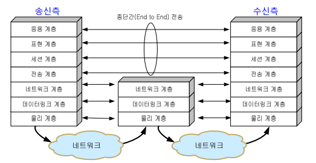
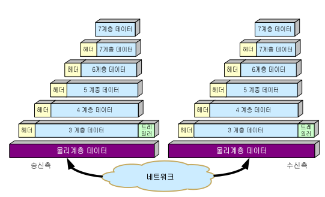
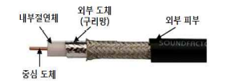
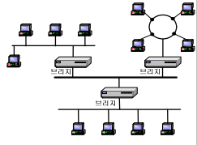

# Chapter 9. 컴퓨터 네트워크와 월드와이드웹

### 컴퓨터 네트워크 

+ 컴퓨터 네트워크 : 전송매체(유선/무선)를 통해 연결된 컴퓨터들이 상호간 정보를 교환하는 시스템
  - 송신자와 수신자의 데이터 전송은, 프로토콜에 따라 이루어짐
  - 프로토콜(Protocol) : 통신을 하는 두 개체 간에 데이터 전송 방식을 정한 절차 또는 규약(메세지의 형식, 전달방법, 교환절차, 에러시의 처리방법 등)
    - 사람이 서로 의사소통 하는것도 같은 "언어"를 쓰기 때문임. 
    - 프로토콜은 사람의 언어와 마찬가지로, 통신 규약을 약속해 놓고 소통하는 것이다.

### 네트워크의 역사

+ 1837년 새뮤얼 모스의 모스 부호는 최초의 전기통신
+ 1876년 알렉산더 벨의 전화 발명
  - 초창기 때는 전화를 연결해 주기 위해 교환수를 사용함.
+ 1878년 교환기 등장, 전화망은 아날로그 신호 이용
  - 아날로그 신호로 전송하다 보니 왜곡/잡음이 발생하여 중간중간에 증폭기 사용
  - 초기 컴퓨터 네트워크는 전화망을 사용함
+ 1969년 ARPANET, 1974년 제록스가 이더넷(Ethernet) 개발
  - 미 국무성을 중심으로 알파넷이 형성됨. 
  - 주변에 있는 연구소, 대학교 기관들을 연결하는 것으로 시작.
  - 이것을 시작으로 전 세계 LAN들이 연결되어 인터넷이 발달했다.
+ 1982년 인터넷 프로토콜인 TCP/IP 가 만들어짐
+ 1992년 www 가 개발되어 인터넷의 급격한 확산이 이루어짐.

### OSI(Open System Interconnect) 7계층 모델

+ 현재 인터넷이 개발되어 사용되는 프로토콜은 TCP/IP Protocol 이다.
+ 국제표준화기구(ISO)에서, 통하기 위한 여러 가지 참조 모델로 만든 것이 OSI 7 Layer 모델이다.
  - 꼭 따라야 하는 의미가 아닌, 그저 참조하라는 의미로 만든 것이지만, 현재는 거의 모든 컴퓨터가 통신을 하기 위해 이 프로토콜을 사용하고 있다.

+ 데이터 통신을 하기 위해, 송신측 컴퓨터와 수신측 컴퓨터를 각각 7개 층으로 나누었음.
  - 각 계층에서 해당 계층에서의 일을 하면, 거기에 해당되는 같은 layer에 있는 수신 계층이 그것을 받아 적절한 처리를 할 수 있도록 하는 모델이다. 
  - 그렇게 아래와 같은 8계층으로 만들어, OSI 7 Layer가 만들어지게 되었다.
  

+ 위 두 컴퓨터는 네트워크 상으로 멀리 떨어져 있는 것이라고 가정하자. 
+ 두 컴퓨터가 통신하기 위해서는, 여러 개의 네트워크를 거쳐 연결이 된다. 
  - 중간에 있는 것이 router 이다. 
  - 원래 많이 떨어져 있으면, 여러 개의 router를 거쳐야 하지만, 여기서는 편의상 하나만 함.
  - 컴퓨터에서는 그냥 간단하게 마우스 클릭 한방이면 되지만, 속에서는 여러 개의 단계를 거친다.

+ 응용 계층 : "사용자에게 응용 서비스 제공"
  - 제일 위에 있는 계층.
  - '응용' 은, 컴퓨터에서 사용하고 있는 응용 소프트웨어를 가리키는 것이다.
  - 사용자와 상호작용하는 계층
    - 카카오톡이라는 응용프로그램에서, 전송하는 메세지는 응용 계층에서 처리한다.
  - 강의에 나왔던 응용프로그램 예시
    - FTP(File Transfer Protocol), Skype, Outlook

+ 표현 계층 : "전송 정보의 표현방식 관리, 암호화/압축 등"
  - 응용 계층 바로 아래 있는 계층
  - 제대로 네트워크를 거쳐서 전달되기 위해서는, 중간에 다른 사람이 메세지를 보지 못하도록 암호화하거나 압축하는 등의 과정이 필요하다. 
  - 표현 계층에서는, 응용 계층에서 보내려고 하는 메세지가 다른 사람의 네트워크를 거쳐서 가기 때문에, 다른사람이 보지 못하도록 암호화하거나, 압축(용량이 너무 큰 파일의 경우) 하고, 암호화에 관련된 헤더를 덧붙여서 보내는 역할을 담당한다 
    - 우편물을 보낼 때도, 알맹이만 보내는 것이 아니라 남이 해당 물건을 보지 못하도록 포장함.
    - 암호화 관련 헤더를 보내는 이유는, 수신계층에서 암호화되어 받아본 애를 풀어야 하기 때문이다.
    - 헤더를 덧붙여 보내면, 수신 측에서 그것을 토대로 적절한 처리를 해서 알맹이 메세지를 보게 될 것이다.

+ 세션 계층 : "두 종단의 프로세스 사이의 접속(session)의 설정/유지/종료 담당"
  - 세션(Session) : 송수신 간의 논리적 연결.
    - 지식백과에서의 세션 : 
    - 1. 망 환경에서 사용가 간, 또는 컴퓨터 간의 대화를 위한 논리적 연결
    - 2. 프로세스들 사이에서 통신을 하기 위해, 메세지 교환을 토애 서로를 인식한 이후부터 통신을 마칠 때까지의 시간.

  - 세션 계층에서는, "세션"에 관련된 정보를 덧붙여서 아래로 내린다. 

+ 보내려고 하는 알맹이는 7계층 데이터가 전부인데, 자꾸 살을 덧대는 식으로 내려간다고 생각하면 된다.(암호화 헤더, 세션 정보 등)
 
+ 전송 계층 : "전체 메세지의 종단간 전성을 책임짐"
  - 종단간(end-to-end) 흐름 제어 및 오류 제어기능
  - 송신측에서 수신 측까지 정보가 제대로 전송이 되었는지 체크하고, 관련된 것들을 제어하는 계층이다.
  - 송신/수신 컴퓨터 간에 router를 여러 개 거치게 되는데, router를 제대로 잘 거쳐 도착했는지를 체크하는 계층
  - 그에 관련된 정보도 역시 헤더에 들어간다.

+ 네트워크 계층 : "송신측과 수신측간의 패킷(packet)이 전송되는 경로 설정(routing)"
  - 논리적인 IP 주소를 헤더에 포함하여 전송
  - 네트워크 계층에서 하는 기능, 부가정보들을 헤더에 덧붙이게 되는데, 네트워크 계층까지 내려오면서 헤더가 다 붙고, 네트워크 계층에서도 헤더를 붙이면 이것을 보고 "패킷"이라고 한다. 
  - 패킷의 헤더에는, 송신/수신 측 IP 주소가 들어간다. 
    - 패킷 헤더 부분을 보고 "논리 주소"라고도 이야기한다. 
    - 마치 우편물을 보낼 때, 보내는 사람/받는 사람 적는것과 같음.
  - routing(경로 설정) 을 하는 장치를 보고 router라고 부른다. 

+ 데이터 링크 계층 : "인접한 노드 간에 전송하는 역할. 프레임이라는 논리적 단위를 구성(인접 노드 주소 포함)"
  - 프레임 흐름 제어(flow control), 오류 제어(error control) 기능도 담당한다.
    - router가 되게 바쁠 때는, 프레임을 보내자마자 또 보내는 등 너무 자주 보내게 되면 프레임이 폐기처리 되게 된다
    - 그런 것을 막기 위해, 프레임을 천천히 보내라는 메세지를 보내면서 흐름을 제어할 수 있다.
    - 오류 제어 : 링크를 통해 전송되는 동안, 오류 체크를 해 보니 오류가 발생했다면, 프레임을 다시 보내라는 신호를 되돌려줄 수도 있다.
  - 데이터링크 계층에서 하는 기능에 관련된 부가정보를 헤더 부분과 트레일러 부분에 붙인다. 
  - 데이터 링크 계층에서, 이러한 형태로 앞뒤로 붙여서 합친 데이터를 보고 "프레임" 이라고도 부른다.
  - 프레임의 헤더에는, 인접한 node의 48bit mac 주소(물리 주소가 아니다. 1:1 치환된다고 생각하면 된다)가 들어가게 된다. 
  - 물리 주소는 왜 필요한가?
    - 데이터 링크 계층에서는 멀리 보는 것이 아닌, 인접해 있는 node 까지만 바라본다. 
    - node와 node 사이의 link를 하나하나 통과해서 데이터가 나아가게 된다. 
    - 인접해져 있는 node로, link를 통해 프레임을 전송하게 된다. 
    - 이렇게 node 간에 정보를 전달하기 위한 계층이 데이터 링크 계층이 하는 일이 된다.
    - 단순히 다음 router까지 프레임이 제대로 전송이 되게끔만 하는 계층이다.
    - 데이터 링크는 오로지, 연결되어 있는 링크들만 살핀다. 

  - 전달받은 주소와 전달할 주소 두가지만 있으면 되겠다.
    - 마치, 우체국 직원이 다음 장소로 보내기 위해서 받은 집중국, 보낼 집중국 정보를 스티커로 붙여놓은 것 같은 구조이다.(여기서의 집중국이 곧 router가 되겠다)

+ 왜 라우터에는 네트워크 계층, 데이터링크 계층, 물리 계층 3개만 있는가?
  - 네트워크 계층에서, 송신/수신 측 IP를 받아오게 되는데, 이것을 읽고 데이터링크 계층에서 어디로 보낼지 판단하면서 보내게 된다.
  - 중간에 있는 router들은, 전송 계층까지의 알맹이는 볼 필요가 없다. 그냥 보내는 역할을 할 뿐이다. 
  - 그래서 네트워크 계층의, 송/수신 IP만 보고 관련 알고리즘을 활용해 다른 쪽 router나 컴퓨터로 보내게 되는 것이다.
  
+ 물리 계층 : "데이터를 물리 매체 상으로 전송하는 역할."
  - 사용자 장비와 네트워크 종단 장비 간의 물리적/전기적 인터페이스 구성
  - 실제로는, 0 아니면 1로 모든게 구성되어 있다. 
  - 물리적으로, 정보를 보내려고 하면 0 아니면 1 로 이루어져 있는 signal로 정보를 바꿔야 한다. 
  - 0 아니면 1로 정보를 모두 바꾸는 작업을 물리 계층에서 수행한다. 
  - router에서도, 수신측에서도 해당 0 아니면 1 시그널을 해독하여 정보를 취합하고, 다시 바꿔서 보내는 등의 역할을 수행한다. 
  - 최종적으로는 물리 계층에서 받아온 애를, 하나하나 head, trailer를 다 떼고 다시 위로 올라가면서 응용 계층에서 해당 정보를 파악하게 된다.

### 캡슐화 & 역캡슐화

+ 각 계층에서 하는 헤더나 트레일러 붙이는 작업을 "캡슐화" 라고 부르며, 다시 헤더를 떼어내면서 정보를 해독하는 것을 "역캡슐화" 라고 부른다. 

+ 우리가 대화할 때도, 문법 체계에 맞춰 대화하듯, 컴퓨터가 데이터를 통신할 때에도 체계적인 규칙같은 것들을 맞춰 원활하게 전송이 이루어지게 된다.

+ 보내려고 하는 메세지는 조그맣지만, 거기에 붙는 부가 정보들이 되게 앞뒤로 많이 붙어서 전송되게 된다. 

### 전송 매체 

+ 각 매체는 대역폭(bandwidth), 전송 지연 등 고유한 특성을 가진다 
  - 대역폭이 클수록, 단위 시간당 더 많은 데이터를 전송함. 

+ 전송 매체에는 유선/무선 매체가 있음. 
+ 각 매체는 대역폭, 전송지연 등의 특성들이 모두 다르다. 
+ 대역폭 : 전기적 signal
  - signal 에는 주파수 성분이 여러개이다.(공수에 나오던대로, 주파수 겹쳐서 보낼 수 있는 느낌)
  - 주파수가 큰 것도 있고, 작은것도 있음. 
  - 주파수 성분 중 가장 높은 frequency와 가장 낮은 frequency 까지 그 폭을 대역폭(bandwidth)이라고 부른다. 
  - 대역폭이 크면 클수록, 단기간(단위 시간 당) 더 많은 데이터를 전송할 수 있게 된다. 
  - 피복 안에 8개의 구리선이 들어가 있는데, 두개씩 선을 꼬아 놓았다. 
  - 구리선 전선에 전류가 흐르면, 주변에 자기장이 생기고, 신호에 영향을 주기 때문에, 이러한 간섭을 줄이기 위해 두개씩 선을 꼬아놓은 것이다. 
  - 서로의 두 선을 서로 꼬아서, 간섭을 상쇄시키는 효과를 가지고 오기 위해 꼬아놓은 것이다. 

+ 꼬임선 종류 : 
  - UTP(Unshielded Twisted-Pair) 케이블 : 두개씩 그냥 단지 선을 꼬아놓은 것.
    - RJ-45 커넥터를 사용해 설치가 쉬우며, 가격이 싸고 사용하기 쉽다. 
    - UTP 케이블의 경우, 설치가 쉽고 가격이 싸며, 사용하기 쉽다.
    - 전화선, ADSL, LAN선의 전송매체로 많이 사용한다.
  - STP(Shielded Twisted-Pair) 케이블 : 두 선을 꼬아놓고, 금속 박막을 얇게 감싸놓은 것.
    - 외부신호에 대한 간섭을 더 막을 수 있다(차폐)
    - 금속 박막을 덧씌우기 때문에 UTP보다는 가격이 더 비싸며, UTP보다 더 특별한 커넥터를 사용해 설치가 복잡하다.

+ 동축 케이블 
  - TV의 유선 케이블 선으로 많이 사용한다. 
  - 금속 막으로 중간에 덧씌워 놓아서, 외부에서 들어오는 signal에 대한 간섭 현상이 적다.(차폐성이 좋다)
  - 꼬임선에 비해, 더 높은 주파수에서 signal 을 전송할 수 있기 때문에, 더 좊은 주파수에서의 대역폭이 크다. 
  - LAN 근거리 통신망, 또는 유선방송 등의 전송매체로 사용되고 있다. 

+ 광 케이블
  - 속이 구리선이 아닌, 아주 얇은 유리 섬유로 이루어져 있다. 
  - 유리 섬유를 이용해, 전기적 신호를 흘려보내는 것이 아닌, 빛 신호를 보내게 된다. 
  - 전기적 신호를 흘려보내는 것이 아니기 때문에 전자기파의 간섭을 받지 않는다. 
  - 전송 속도가 대단히 높다(빛이니까)(10Gbps 이상)
    - bps(bit per second) : 초당 몇 비트 지나가는지
  - 유선 매체 중 대역폭이 가장 넓고 신호 감소율이 적다. (repeater 불필요)
    - repeater : 디지털 signal을 전송하는데, 중간중간에 감쇠되는 신호를 다시 증폭시켜서 보내주는 것,
  - 신호 감소율이 적기 때문에 보안성이 우수하고, 크기가 작고 가볍다.
  - 단점 : 비용이 많이 든다. 설치할 대 고도의 기술과 장비가 요구된다. 

+ 위성(satelite)
  - 하늘에 떠 있는 위성이 지상국과 메세지를 주고받으며 서로 중개해주는 것. 
  - transponder가 위성에 탑재되어, 지상국과 서로 신호를 전달해 주는 중계역할을 수행할수 있다.
  - 전송 지연이 크며, 점대 점(point to point) 네트워크만 구성이 가능하다는 단점이 있다. 
  - 주파수가 높은 signal 일수록 장애물 높은 산이나 빌딩 등의 장애에 영향을 많이 받는다. 
  - 주파수가 낮으면 지형적인 장애가 있어도 영향을 적게 받는다.
  - 국내, 방송과 통신용으로 사용되고 있다.

### 네트워크 장치 

+ 컴퓨터와 컴퓨터를 연결하기 위해서는, 단순히 그 사이에 케이블만 연결해서는 안된다. 
  - 네트워크를 형성하기 위한 장치가 필요하다. 
  
+ MODEM : 'Mo'dulation(변조) + 'dem'odulation(복조)
  - 옛날에 사용하던 네트워크를 형성하던 장치
  - 전화 통신망을 가지고 사용을 했다.
  - 디지털 신호를 아날로그로 바꾸는 장치가 필요했었고, 그래서 Modem을 통해서 디지털 신호를 아날로그로 바꿔서 보내고, 그 신호를 다시 디지털로 변환해서 받는 식으로 사용했다.
  - 요즘은 초고속 통신망의 사용으로 인해, 거의 사용하지 않는다. 

+ 네트워크 인터페이스 카드(NIC : Network Interface Card) 
  - 컴퓨터와 외부 네트워크를 연결해 주는 장치
  - LAN 카드나, 이더넷 카드 또는 이더넷 어댑터가 필요하다. 
  - 디지털 신호를 직접 전송하고 받으며, IEEE 802.3 표준이 정의되어 있다. 
    - IEEE 802.3 : LAN 카드에 대한 표준규격 등을 정의해 놓은 표준
    
    
+ 허브(Hub) : 인접해져 있는 이러한 컴퓨터들을 연결 할 때, 컴퓨터끼리 허브 장치를 다 연결해 두고  사용할 수 있다.
  - 중간에 있는 bus를 통해, 네트워크 형성이 가능하고 상호 통신할 수 있다. 
  - 더미(dummy) 허브 : 각각 컴퓨터들마다 사용할 수 있는 주파수 대역을 분할해 놓고, 분할한 것들을 하나하나 컴퓨터에 매칭시켜 주며 사용함. 
    - A 컴퓨터가 어떤 컴퓨터에게 메세지를 보낼 때, 해당 주파수 대역에 해당하는 signal을 통해 정보를 보낸다.
    - dummy hub의 경우, 직접적으로 point to point 연결이 되지 않고, 모든 컴퓨터들에 다 신호를 보냄.
    - 정보를 받아야 할 B만, 그 정보가 자신에게 오는것임을 인지하게끔 되어 그 정보를 열람하고, 나머지 컴퓨터들은 해당 signal을 폐기한다. 
    - post가 많아지면, 그만큼 주파수들이 분할되고 속도도 저하된다. 

  - switching hub : 만약 특정 어떤 컴퓨터에게 메세지를 전송하고 싶을 때, 허브가 해당 컴퓨터의 물리 주소를 이용해 point to point로 전송할 수 있게 해주는 hub.
    - 단순 전달 기능을 넘어, 목적지 주소로 switching을 할 수 있게 해줌. (마치 전화 교환수 시대 그때처럼)
    - point to point로 접속이 가능하기 때문에 망 효율이 증가되지만, 가격이 비싸다는 단점이 있다. 
  
  - repeater(리피터) :  디지털 신호가, 가야할 거리가 멀어지면 멀어질수록 신호가 감쇠되는데 그 신호를 다시 또렷하게 더 키워 다시 해당 경로로 내보내는 것. 
    - OSI 7 layer 중 물리 계층에만 동작한다. 

+ Bridge(브릿지)
  - 물리 계층, 데이터 링크 계층(2계층) 으로 이루어져 있다.
  - Host 컴퓨터 4대씩, bus 형태던지 ring 형태던지 묶여져 있는 것을 segment 라고 하는데, segment끼리 연결할 때 bridge가 이들 segment들을 연결시킬 수 있다.
  - Bridge는 2계층으로 작동하기 때문에, frame을 다룰 수 있다.
  - Bridge가 48bit mac 주소를 보고 우리 쪽으로 오는 프레임인지, 그렇지 않은 프레임인지 판단할 수 있다.
  - Bridge는 자신과 연결되어 있는 host computer들의 LAN 카드 주소를 다 기억하고 있어, 프레임 헤더 부분을 보고 그 주소가 자신이 담당하는 segment들의 주소 중 하나인지 아닌지 판단한다. 맞으면 통과시키고 아니면 통과시키지 않는 식으로 필터링을 할 수 있다. 
  - 이런 방식을 통해서, 네트워크에 떠돌아다니는 프레임들을 더 이상 돌아다니지 않도록 방지할 수 있어 전체 네트워크의 트래픽을 감소시킨다.
  - 불필요한 데이터의 broadcasting을 방지한다. 
