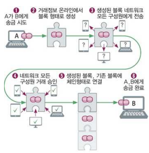
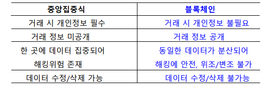
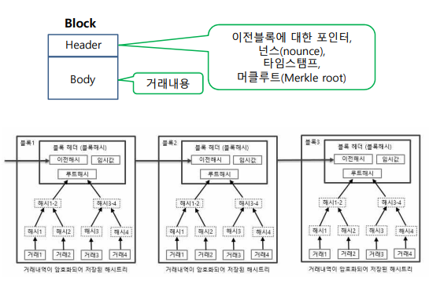

# Chapter 11. 제 4차 산업혁명과 첨단기술

### 제 4차 산업혁명 

+ 인공지능/IoT/빅데이터 등 첨단 정보통신 기술이 경제,사회 전반에 융합되어 혁신적인 변화가 나타나는 차세대 산업혁명.

### 인재상
+ 적극적 자기주도와 컴퓨팅 사고 기반의 문제해결 능력
  - 큰 문제를 작은문제로 분해, 문제에 나타나는 패턴 인식 유사점 등을 찾아내 패턴을 인식하고, 핵심 코어만 간추려 간결화하는 추상화 능력이 필요함.
  - 단계별 해결책, 규칙 알고리즘 잘 생각하기. 
  - 평상시에 어떠한 문제들을 잘 해결할 수 있는 능력

+ 창의 융합 사고능력
  - 전통적인 틀에서 벗어나 새로운 관계 창출
  - 비일상적인 아이디어를 산출하는 능력(다른사람이 생각지 못한 것)
  - 융합 : 한 분야의 전문성을 바탕으로, 다른 분야의 기술적 연계성을 꼼꼼히 설계하는 역량
  - 다른 분야(인문,사회,상식 등)을 알아서, 서로 연결시켜 생각해보는 것.

+ 의사소통능력과 협업 능력
  - 다른사람의 생각을 잘 경청하고 의사표현을 분명히 하기
  - 문서를 보고 이해하고, 문서를 남이 보기 쉽도록(이해하기 쉽도록) 작성하기.
  - 협업 : 다른사람들과 소통, 팀워크를 잘 맞춰서 이끌어나갈 수 있는 리더십
  - 다른사람을 존중하는 배려심

### 단기교육 & 코딩교육의 급부상

+ 대학은 연구중심 학교로 돌아감.
+ MicroCollege : 직업교육을 위한 교육들을 단기집중적으로 하는곳이 늘어날 전망
+ NanoDegree : 특정 전문 직업 분야의 훈련을 집중적으로 할 수 있는 교육
+ Singularity 대학 : 창업을 위한 단기 교육과정
  - 창업을 하기 위해서는 정보기술 뿐 아니라 경영 등 두루두루 알아야 함. 그런 교육을 제공한다.

### 사물인터넷(IoT)

+ 사물들을 모두 네트워크로 연결하는 것
+ 사물들마다 IP 주소가 부여되어, 사물들을 서로 식별할 수 있게 함.
+ 사람이 직접 개입하는 것이 아닌 사물 자체가 데이터들을 생성해내고 통신을 이끌어내는 것이 핵심 기술이다.

### 초연결사회

+ IoT에 따라, 우리사회가 초연결 사회가 될 것이라는 소리를 누군가 함.(사회학자)
+ 사물들이 사물인터넷(네트워크) 로 연결되어 있기 때문에, 거기에서 나온 자료를 통해 의미있는 가치가 창출되는 사회.
+ 사회학과 관련된 용어이다(초연결사회)

### 모바일 기기의 진화 & 모바일 보안
(그냥 11장 3/8 ~ 4/8 한번 읽어보기)

### 클라우드 컴퓨팅

+ 일일이 USB에 넣고 다니는 것이 아닌, 파일을 클라우드에 집어넣고 필요할 때마다 인터넷에 접속해서 사용하는 것.
  - ex) 네이버 클라우드, 구글 드라이브
  
+ 소프트웨어 개발하는 개발 플랫폼까지 다 넣어 두고, 필요할 때마다 접속해서 자원을 사용할 수 있는 서비스

+ 원래는 기업들마다 웹 서버를 다 구축해야 되는데, 관리하려면 돈이 많이 든다 
  - 하드웨어적인 인프라 서버도 서비스해 줄 수 있다.

+ AWS(Amazon Web Service) : 현재 웹서버 시장의 33%를 차지함.
  - 일정 돈을 AWS 에 지불하고 웹 서버를 관리해 줌.

+ 서비스되는 제품 분류 3가지
  - IaaS(Infra as a Service) : 서버, 저장장치 등의 인프라 서비스
  - Paas(Platform as a Service) : 개발도구, 테스트 등의 컴퓨터 플랫폼을 서비스
  - SaaS(S/W as a Service) : 웹 기반의 전자메일, 문서작성도구, 일정관리 등의 소프트웨어를 서비스

### 웨어러블 인터넷 

+ Wearable Device를 이용해, 사물 인터넷으로 연결되어 정보를 생성하고 서비스에 활용되는 응용프로그램까지 다 포함한 모든 것을 Wearable Internet이라고 한다.
+ 웨어러블 디바이스 
  - 스마트 콘텍트 렌즈와 같은 신체부착형
  - 스마트 셔츠와 같은 의류일체형
  - 시계, 밴드 등의 손목, 팔 착용형
  - 안경 등의 머리 착용형
  - 스마트 약 등의 생체이식,복용형

(5/8 보기)

### 로봇 

(5/8 보기)

### 빅데이터 

+ 일반적인 DB로는 처리하기 어려운 큰 규모의 데이터, 정수/실수의 정형적인 데이터는 물론 텍스트/음성/이미지/동영상 등의 비정형적 데이터를 생성/수집/분석하여 가치를 추출하고 결과를 표현하는 기술.
+ 빅데이터는, 양도 많고 생산속도도 빠르며, 다양한 형태를 띠고 있는 특징이 있다.
+ 빅데이터를 통해 트렌드, 미래를 예측할 수 있고, 마케팅, 의사결정 등에 활용 가능하다.

+ 빅데이터 처리기술 : Hadoop, R, 분산 병렬 처리기술, 클라우드 컴퓨팅 활용
  - 하둡 : 슈퍼컴퓨터를 필요로 하는것이 아닌, 일반 컴퓨터들을 여러 대 모아놓고 하나의 컴퓨터처럼 저비용으로 대용량의 데이터를 빠르게 분석,처리할 수 있는 기술이다.

### 3D 프린터 & 3D 스캐너

+ 3D 프린터 : 아래에서부터 한 층씩 적층하여, 시제품을 만드는 것. 
+ 3D 스캐너 : 부피가 큰 물체에 대해 일일이 수치를 재는 것이 아닌, 3D 스캐너를 이용해 빛으로 측정하는 방식
  - 접촉식, 비접촉식이 있다. 
  - 비접촉식 : 레이저나 백색광을 물체 표면에 비추어, 되돌아오는 시간을 측정해 구하는 방식
  
### 블록체인(BlockChain)

+ 어떤 사람에게 돈을 송금할 때, 원래는 은행 ATM이나 인터넷을 통해 돈을 보낸다.
  - 돈을 보내면, 거래 내역이 은행 중앙서버에 거래 내역(기록)이 남는다. 

+ 블록체인 방식을 통하면, 컴퓨터 내에 있는 프로그램을 사용해 송금을 함
  - 거래 생성 시, A가 B에게 얼마 보내는지 기록이 블록 형태로 생성되면서 거래가 된다.
  - 그 거래에 대해, 그 프로그램을 사용하는 다른 컴퓨터들에 peer to peer network를 통해서 다른 네트워크 구성원들에게 거래 내역을 모두 보낸다. 
  - 그 peer network 안에 있는 구성원들에게, 프로그램을 통해서 승인받는 식이다. 

  - 전체 거래 장부에다가 그 거래가 들어가게 된다.
  - 이 "거래 장부"가 blockchain이 된다. 
  - 거래 내역이 블록처럼 꼬리에 꼬리를 물고 연결되어 있는 것이다.

+ 블록체인은, 한 군데만 저장시켜 놓는 것이 아니라 그 거래내역 정보(블록체인)을 여러 컴퓨터에 똑같이 저장해 놓는다. 
  - peer to peer network에 있는 모든 구성원들의 컴퓨터에 거래장부가 저장되기를 반복한다. 
  - 한 군데에 저장되어 있으면 누군가 해킹해서 수정하기 쉬울 수 있다.
  - 모두가 똑같은 장부를 저장해 놓았다면, 모든 컴퓨터를 들어가서 해킹해 정보를 수정한다는 것은 불가능에 가깝다. (해킹 위조/변조가 불가능하다)
  - 모두가 거래 내역/장부를 투명하게 볼 수 있다. 
  - 금융감독원의 규제 등이 필요없는 시스템이다. 
  - 중앙 서버에 저장해 놓은 것이 아닌, 분산 저장이다(탈중앙화)(분산형 시스템)
  - 정보가 모두 익명으로 사용된다.
  - 각 참여자는, 장부와 거래내역이 일치하는지 수시로 확인할 수 있다.(투명성)
  - 4차 산업혁명의 핵심기술 중 하나이다. 

+ 블록체인은 금융 분야에만 적용할 수 있는 것이 아닌, 보험, 가상화폐, 개인인증, 유통물류 쪽에도 적용할 수 있다. (+ 예술경매, 경매, 전자투표,농산물 경매 등 다방면 사용가능)

### 비트코인

+ 블록체인을 적용한 최초의 결과물, 최초의 암호화폐
  - 개발자 : 나카모토 사토시(익명)
  - 무한정 생성되는 것이 아니라 희소가치가 있어 가격이 비싸짐
  - 채굴한 양이 많아질수록, 문제 난이도가 올라가도록 설계되어 있다 
  - 거래 내역을 사용자가 모두 공유함. 10분마다 장부검사가 이루어지게 된다.

### 가상화폐

+ 이더리움/리플/라이트코인/기타등등의 코인들이 있다. 
+ 제도권 바깥에 있어 투자하는데 신중(실체가 없다)
+ 카카오페이, 네이버페이, T-money, 비트코인 등이 가상화폐라고 불린다. 
+ 공인기관이 아닌, 개인이나 기업이 개발하고, 최초의 화폐를 개발하는 주체가 정한 규칙에 따라 발행된다.
+ 암호화폐에 다라, 규칙이 똑같지 않다. 
+ 수요와 공급에 따라 화폐가치가 결정되고, 유통되게 된다. 
+ 채굴 : 채굴을 통해 가상화폐를 획득할 수 있다. 
  - 거래가 성사되면, 블록에다가 거래 내역을 실어야 하는데, 비트코인의 경우 10분마다 한번씩 블록이 생긴다. 
  - 유효한 블럭이 만들어지면 거래 내역을 실을 수 있는 방식이다. 
  - 블록 헤더와 바디 부분으로 나뉘어지는데, 헤더 부분에 "nounce"라는 값이 있다. 
  - nounce라는 수치 값을 계산해서 어떤 값인지 알아내고, 구성원들에게 이것이 유효한 블록이다 하는 승인을 받아야 한다.
  - 유효한 블럭이라는 승인이 떨어지면, 그 블럭에다가 거래 내역을 실을 수 있다. 
  - 거래 내역을 실어야지만 거래가 성사되는 것이다. 
  - 이런 블럭들이 모두 체인으로 연결되어 있는데, 유효한 블럭이면 거래내역이 들어가 블록체인에 끼워지는 것이다. 
  - 이렇게 nounce 값을 알아내어 그 부분에 거래내역을 실어 블록체인에 끼운 채굴자에게 암호화폐를 수수료로 지급하게 된다. 

+ 해시 함수(Hash Function)
  - 그냥 아는걸로 하자 ㄹㅇㅋㅋ
  - 중요 : 해시 함수는 역함수가 존재하지 않는다. 

