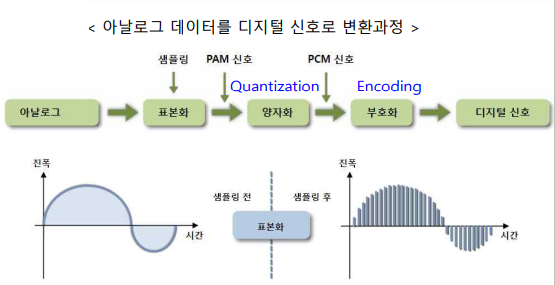

# Chapter 12. 멀티미디어 개론

(나올것같은것만 다 정리)

+ 멀티미디어 : 음향/정지영상/동영상/문서 를 포함하는 다중 전달매체, 특징은 대화형

+ 멀티미디어 데이터 
  - 텍스트 : ASCII, 유니코드 등
  - 사운드 :
    - WAV(Wave form) : 소리를 파형으로 저장
    - MIDI(Musical Instrument Digital Interface) : 악기/신디싸이저/컴퓨터 간의 음악정보를 교환하는 표준형식
    - MP3 : 독일 Fraunhofer Institute 에서 개발한 MPEG-1 의 Audio Layer 3 codec을 이용한 압축파일.
    - 높은 압축률, CD 수준의 음질, 현재 오디오 압축에서 많이 사용
    - codec : coder + decoder (인코딩하고, 디코딩함)

+ 이미지 : 컬러의 경우, RGB 세 종류의 2차원 데이터로 표현

+ 애니메이션 : 여러 장 그림을 연속촬영, 조작하여 움직이게 보이는 영화

### 압축

+ 무손실 압축, 손실 압축
  - 무손실 압축 : 원래 데이터로 복원가능. 문자데이터에 이용
    - Run-Length 코딩 : 반복 횟수와 반복되는 데이터로 기록. 
    - ex)paaaabbbbcddddd : p!4a!4bc!5d (!+ 숫자 가 문자보다 먼저 붙는다)

    - 허프만 코딩 : 발생빈도가 높은 문자를 작은 비트로 표시
    - PriorityQueue 써서 하면된다. 할줄알지?

  - 손실 압축 : 원래 데이터에서 적합한 부분과 부적합한 부분을 나누고, 부적합한 부분을 제거하고 압축
    - 오디오 MP3 파일 : 인간이 감지 못하는 영역의 데이터를 제거한 후, 압축하는 방식, 변환코딩 등이 존재.
    - 이산 코사인변환
    - 웨이브릿 코딩

### 멀티미디어 보안

+ 디지털 저작권 관리(DRM : Digital Right Management)
  - 복사/접근의 제한으로 불법적인 디지털 컨텐츠의 사용을 제한, 디지털 컨텐츠 보호, 안전한 배포가능

