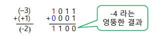
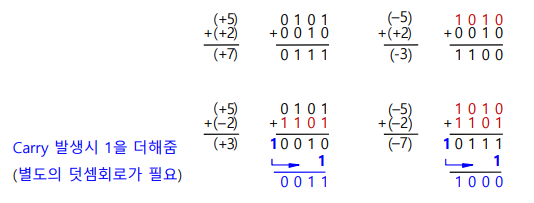
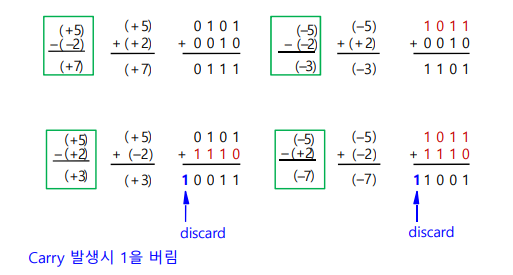
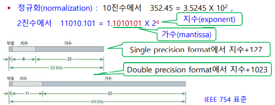
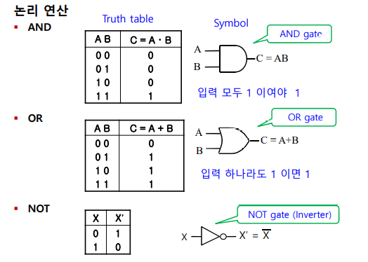
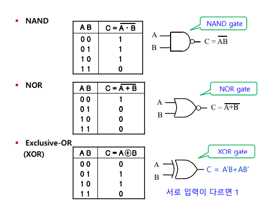
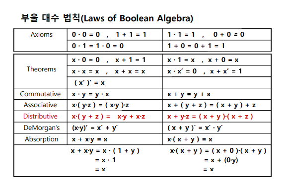

# Chapter3. 정보의 표현

**중요한 부분만 정리하고, 계산하는 부분은 제외**

#### 컴퓨터의 자료 표현
+ bit (**bi**nary digi**t**) : 이진 숫자. 0이나 1을 가질수 있는 최소값. 그냥 이진수 한 자리라고 생각하면 된다.
+ nibble : 4개의 bit가 모여서 생김. 4bit = 1 nibble
+ byte = 8개의 bit가 모여서 생김. 8bit = 1 byte
+ word : 1 word는 컴퓨터에 따라 다름. 
    - 32bit 컴퓨터에서는 1 word = 32 bit이므로, 1 word = 4 byte
    - 64bit 컴퓨터에서는 1 word = 64 bit이므로, 1 word = 8 byte
    - 명령이나 데이터들을 가져올 때, 한 번에 가져올 수 있는 데이터의 최고 크기를 1 word 라고 한다.

#### 저장 용량 
+ 저장 용량 : 파일이나 주기억장치, 저장장치의 크기는 byte 단위로 표기한다.

+ 단위
  - 1 B  (Byte)      = 1 Byte(2^0)       -> 8bit
  - 1 KB (KiloByte)  = 2^10 Byte(1024B)  -> 1/2 페이지 분량
  - 1 MB (MegaByte)  = 2^20 Byte(1024KB) -> 책 한권 분량
  - 1 GB (GigaByte)  = 2^30 Byte(1024MB) -> 영화 한 편 분량
  - 1 TB (TerraByte) = 2^40 Byte(1024GB)
  - 1 PB (PetaByte)  = 2^50 Byte(1024TB)
  - 1 EB (ExaByte)   = 2^60 Byte(1024PB)
  - 1 ZB (ZettaByte) = 2^70 Byte(1024EB)
  - 1 YB (YottaByte) = 2^80 Byte(1024ZB)

#### Sign and Magnitude
+ Sign-and-Magnitude 표현 : 부호만 다르고 양수크기와 같도록 처리하는 것
  - +3 = 0011
  - +5 = 0101
  - -5 = 1101 
  - 컴퓨터에서 부적합
    - 피연산자 부호 다를때, 크기비교/뺄셈 회로 피료하다. 컴퓨터에서 사용하지 않는다.
    

+ 1's Complement : 관련된 양수에서 부호 포함하여 단순히 2진 표현을 반전처리함.
  - -3 = (0011)->(1100)
  - -5 = (0101)->(1010) 
  - 산술 연산에서 추가 덧셈회로가 필요하다.
    - 계산해줄 때, Carry 발생시 1을 더해줘야 하는 번거로움이 있다.(별도의 덧셈회로가 필요하다)
    

+ 2's Complement : 관련된 양수에서 1의 보수표현 + 1 해줌.
  - -3 = (0011) -> (1100) -> 1101
  - -5 = (0101) -> (1010) -> 1011
  - 컴퓨터에서 실제 사용
    - 계산시 음수를 2의 보수표현으로 바꾸고, 덧셈으로 뺄셈을 대신한다. 
    

#### 부호가 없는(Unsigned) 정수표현 
+ Overflow : 표현 범위의 상한치보다 큰 수를 저장하려 할때 나타남
+ Underflow : 표현 범위의 하한치보다 작은 수를 저장하려 할 때 나타남.

#### 부동소수(Floating Point Number)
+ 정수표현 vs 실수표현
    - 2 : 정수표현
    - 2.0 : 실수표현
+ 컴퓨터에서 실수를 표현하는 방법 : 
    1. 10진수를 2진수로 먼저 바꾼다.
    2. 이후 앞에 1만 남도록 하여, 소수점을 옮긴다. 이때, 애초에 1의 자리 숫자는 0 아니면 1이다(2진수)
        - 애초에 0인 경우에는, 그까지 가면 안되기 때문에, 실질적으로 앞자리 숫자는 1이라고 고정시킬 수 있다.
    3. 그런 뒤에, 맨 앞자리는 부호, 중간 지수 자리는 "지수"를 넣을 수 있고, 가수 자리는 "2진수 가수"를 집어넣어 표현할 수 있다.
    
    - 부동소수 : 컴퓨터에서 실수를 표현할 때, 정규화된 표현(지수,가수 조합)으로 표현함. 
    - 소수점을 이동시킨다는 개념에서 Floating Point Number 라는 단어가 나오게 됨.
    - IEEE(시계 전지전자 기술자 협회. I triple E라고 도 부름.) 754 표준!
     
    
    
    - 64비트 쪽이, 32비트 쪽 보다 수위 범위를 더 넓게 표현할 수 있다.
    - 실수를 표현하는데 있어, bit 체계는 한정적이다 보니, 한정된 bit로 더 정밀도 높게 표현하기 위해서 정규화를 하는 것이다. 
    - 왜 지수 + 127 (32bit 기준) / 지수 + 1023 (64bit 기준) 을 해주나?
        - 지수가 음수가 나올 수 있는데, 음수가 나오는 경우 해당 부호비트를 새롭게 만들어 주어야 한다.
        - 그렇게 하지말고, 첨부터 127이나 1023을 더해주어서 아예 모두 양수로 표현할 수 있게 하는 것이다!
        - 그래서 2^4의 경우 지수를 4 + 127 = 131 으로 해서 표현해 줄 수 있다. 해당 숫자를 binary로 바꾸어 놓은 정보가 지수부에 실려지게 된다!

#### 문자 코드 
+ 문자 코드 : 문자는 'a'와 같은 식으로 컴퓨터에 저장되는 것이 아니다. 
    - 10001 와 같이 코드화되어서 저장된다!
    - n bit를 사용하게 되면, 2^n 개의 문자를 표현할 수 있다.

+ ASCII(American Standarrd Code for Information Interchange) Code(아스키 코드) : 
    - 대표적인 문자 전환코드. 미국 표준협회에서 만들었으며, 7비트를 사용할 수 있기 때문에 2^7 = 128개의 문자를 표현할 수 있다.
    
+ EBCDIC(Extended BCD Interchange Code) : 
    - Binary Coded Decimal 이라고 하는 BCD 코드에서, 더 다른 문자 종류들을 확장시켜서 만들어 놓은 코드.    
    - 0에서 9까지는 4bit 범위에서 표현하고, 추가로 앞에 4bit를 붙여서 아라비아 숫자 뿐 아니라 다른 문자들도 코드로 변환해 만들었다.
    - 그래서 총 8bit를 사용하는 체계이다. 

+ Unicode : 
    - 전 세계의 모든 언어를 코드, 체계화하기 위해서 Unicode를 만들었다. (심지어 중국의 한자도 거의 모두 포함)
    - 한 문자당 16bit, 2byte를 사용하게 된다.
    - 국제 표준화 기구에서, 계속해서 Unicode를 수정 보완해 나가고 있지만, 워낙 문자가 많기는 함.

+ UTF-8(Unicode Transforamtion Format 8-bit) : 
    - 워낙 문자가 많다 보니, 유니코드가 포함되어 있는 문서들을 저장할 때 모든 문자를 2byte로 처리하려고 하면 용량이 대단히 커진다.
    - 컴퓨터 안에서 이러한 Unicode가 포함되어 있는 문서들을 처리할 때, 좀 더 간편하게 저장되고 컴퓨터 안에서 처리할 때도 간편하게 처리하기 위해서 각각의 문자들을 2byte씩 균일하게 저장하지 말고, 문자들을 가변적으로(어떤 문자는 1byte, 어떤 문자는 4byte) 컴퓨터 내에서 처리하고 저장히기 위해서 사용되는 문자 인코딩 방식.
    - 문자를 컴퓨터 안에서 조금 더 간편하게 처리되도록 하기 위해서 만든 것이 UTF-8이다!

#### 논리 연산

+ 연산자들

+ 부울 대수 법칙 

+ 부울 대수 법칙의 특징 :
    - 덧셈과 곱셈 할것없이 같은 동일선상 위해서 분배법칙, 교환법칙 모두 가능하다는 쪽으로 보아야 함. 애초에 +와 * 밖에 없다.
    - 더하기 부호는 합집합, 곱셈 부호는 교집합이라고 보면 편하다.
    - 종이에 한번 싹 정리해 놓기!

+ 논리 함수 
    - 종이에 풀어보면서 정리하기
    - 
    
        
