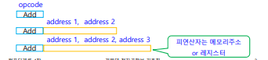
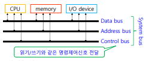
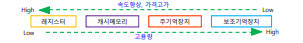
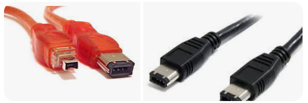
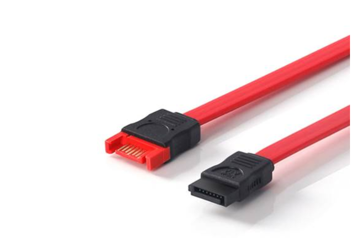

# Chapter 4. 컴퓨터 구조

#### 프로그램 내장 방식 & 구성 명령어
+ 프로그램 내장 방식 : 
  - 헝가리 수학자가 프로그램 내장 방식을 처음 제안함. 
  - 그 이전(에니악 때)에는 프로그램을 실행할 때마다 회로를 모두 뜯어서 다시 연결하는 등의 설정을 해 주어야 했다.
  - 프로그램에 들어가 있는 명령어와 데이터를 모두 이진 코드화하여 주기억 장치에다가 올리게끔 바꿈.
  - "주기억장치를 고도화하여, CPU가 주기억장치 위의 데이터를 하나씩 불러와서 처리를 하자!" 는 개념이 바로 "프로그램 내장 방식" 이다.
    - ex : 프로그램 코드를 짰으면, 그 프로그램을 실행시키기 위해서는 컴파일 과정이 필요하다.

+ 프로그램 구성 명령어
  - 컴파일하게 되면, 컴퓨터가 실행할 수 있는 기계어로 코드가 변환이 된다(.exe)
  - 해당 기계어 파일이 CPU에 들어가서 처리가 되는데, 이 명령어 포맷은 연산자 부분과 피연산자 부분으로 구분된다.
    
    
      -  opcode(Operation Code) : 연산자 
      -  뒷부분 : 피연산자
  - 이런 format으로 주기억 장치에 저장되어 있다가, CPU에 순서대로 들어가서 처리가 되는 방식이다.
  - 컴파일 시에는, 코드 한줄한줄을 해당 명령어 format으로 모두 해독하는 과정임.
  - 피연산자 부분에는, 해당 피연산자가 있는 주소값을 가리키고 있는 식이다. 해당 메모리 주소로 가서 거기에 있는 data를 CPU로 가져와서 처리하게 된다.
  - 명령어의 길이가 고정되어 있는 CPU도 있고, 어떤 CPU는 명령어 포맷의 길이가 다양한 CPU도 존재한다.
    - 명령어 갈이에서, 때로는 피연산자가 전혀 없는 명령어도 있음. 
    - 명령어의 피연산자가 1개 있는 명령어, 2개 있는 명령어, 3개 있는 명령어 등 다양함.

#### 저급 명령어 
+ 저급 언어 : 사람이 이해할 수 있는 언어가 아닌, 컴퓨터가 이해할 수 있는 언어를 "저급 언어" 라고 함.
  - 기계어(0과 1로 이루어짐) 와 어셈블리어(기계어를 기호화한 언어)가 저급언어에 해당한다.
    - 역시 마찬가지로 기계어는 연산자와 피연산자 부분으로 구분해서 볼 수 있다.
    - 어셈블리어는, 기계어와 1대 1로 매칭되어 기호화한 언어이기 때문에 거의 기계어에 가깝다.
  - C로 코딩하는 것은 고급 언어에 해당한다.
  - 어셈블리 연산자 : 앞의 연산자 기계어와 1대 1로 매칭.
    - LDA(Load Address) : 피연선자의 자료를 레지스터에 가져오라는 명령어
    - ADD : 피연산자의 자료(뒤에 오는 애)와 , 레지스터에 이미 있는 자료를 더하라는 명령어
    - STA(STore Address) : 레지스터의 내용을 피연산자의 주소에 저장하라는 명령어
    - HLT : 종료 명령어
  - 어셈블리어로 코딩하기 위해서는, 컴퓨터 동작 같은 것들을 완전히 빠삭하게 다 알고 있어야 프로그램을 어셈블리어로 만드는 것이 가능하다.
  - 해당 어셈블리어가 기계어로 변환되어, 기계어가 CPU에 들어가서 명령 포맷을 읽어들이는 CPU는 해당 내용을 실행하게 된다.
  - 고급 언어에서는 처리할 수 없는 기능이 저급 언어에 있기 때문에, 어셈블리어도 간혹 요즘 사용되기도 한다. 
  - 기계어와 어셈블리어는 CPU 종류마다 내용이 다른 것으로 알려져 있다.
  
+ 고급 언어 : 사람이 생각하는 논리적 수준으로 명령어를 짜는 방식이 고급 언어이다. 

#### 주기억장치(Main Memory)
+ 주기억장치 : CPU가 처리할 프로그램의 명령어와 자료를 저장하고 있는 기억 장치
  - 주로 메모리라고 하면, 주기억 장치를 뜻한다.
  - RAM(Random Access Memory) 형태를 취하게 된다.
  - 한 Byte마다 주소값이 설정되어 있다. 주소값이 설정되어 있어, 해당되는 주소에 가서 데이터를 읽어오고, 해당되는 주소에다 데이터를 읽고 쓰는 식이다.
  
+ 자료 : 주 기억장치와 CPU 사이의 데이터는 Word(32bit 기준 4byte) 단위로 이동한다. 
    - Word : CPU로 데이터를 한번에 가져올 때의 최대 데이터 크기. CPU가 한번에 처리할 수 있는 데이터의 크기이기도 하다.
    - 32bit 기준 4byte, 64bit 기준 8byte.

+ System Bus : 데이터가 이동하는 선(Line)을 Bus라고 부른다. 
  - 컴퓨터 안에서 데이터와 여러가지 명령 신호들이 Bus Line을 타고 이동함.
  - System Bus 내부의 Bus 종류 : 
    - 데이터가 이동하는 Data Bus
    - 주기억 장치에서 "데이터를 읽어와라/써라" 와 같은 명령 제어 신호가 전달되는 Control Bus
    - 메모리 주소를 지정해주기 위한 주소(Address) 버스
    - 데이터 버스와 제어 버스는 양방향 소통이지만, 주소 버스는 단방향 소통이다. 

  
  
+ RAM(Random Access Memory) : 주기억장치로 사용되는 메모리

   - 읽기/쓰기가 가능하며, 메모리 주소가 다 설정되어 있어 데이터에 바로 접근이 가능함.
   - 전원을 끄면, 램 위의 데이터가 모두 사라짐
   - 컴퓨터의 주기억 장치에만 사용되는 것이 아닌, 컴퓨터 주변 단말기기의 기억장치로도 사용된다!(ex : 프린터 RAM)
   - 동적 RAM/정적 RAM (DRAM/SRAM) 으로 종류가 나뉜다.
   - 동적 RAM(DRAM) 같은 경우, 한 비트를 구성하는 회로에 트랜지스터 1개와 Capacitor 한개가 들어간다.
   - 반면 정적 RAM(SRAM)의 경우, 한 비트를 구성하는 회로에 6개의 Transistor가 사용된다. 
      - 당연히 트랜지스터 1개를 사용하는 DRAM이 전력소모가 적고 경제적이다. 
   - 트랜지스터 6개가 들어가는 SRAM은, 당연히 그만큼 높은 가격이 될 수밖에 없다. 하지만, SRAM이 속도가 더 빠르다는 장점이 있다.
      - DRAM의 경우 트랜지스터 하나, 커패시터 하나로 구성되어, Capacitor의 경우 방전될 수도 있음. Capacitor가 방전될 경우, bit에 저장되어 있는 데이터가 사라진다.
      - 그래서 주기적으로 Capacitor가 방전되지 않도록 주기적으로 재충전이 이루어져야 한다. 
      - 반면, SRAM의 경우, 트랜지스터 6개로만 구성되어 있고 Capacitor가 없으므로 재충전이 불필요하다. 
      - 전력소모가 적고 경제적인 DRAM이, SRAM보다 고밀도 집적에 더 유리하다.
   - SRAM의 경우, CPU와 주기억장치 사이에 Cache Memory의 용도로 정적 RAM이 사용될 수 있다.
   - 주로 주기억장치로 사용되는 메모리는, D램 중에서도 Synchronous DRAM이 사용된다. 
      - Synchronous  : 동기화. 타이밍이 "시스템 클럭"의 타이밍과 맞아 떨어지게 되어(동기화되어) Synchronous DRAM이라고 부름.
      - 시스템 클럭 : 컴퓨터 안의 주기적으로 돌아가는 클럭 신호. 컴퓨터 안의 동작들이 "클럭"의 타이밍에 맞춰서 모두 동작한다.
   - DDR (Double Data Rate) : 데이터를 전송하는 "전송률" 이 2배이다. 한 번의 시스템 클럭 안에, 주기억 장치에서 CPU로 데이터를 두번 전송한다!
      - DDR2이면, 클럭 한번에 데이터가 4번 전송되게 된다. 

#### ROM(Read Only Memory)
+ ROM : 오로지 읽기만 할 수 있는 메모리. 쓰기를 할 수 없다.
+ ROM의 장점 : 전원이 꺼져도 데이터가 쭉 남아 있다.
    - BIOS : 컴퓨터 부팅을 하기 위해 ROM에 들어가 있는 펌웨어.
      - 펌웨어 : Software를 Hardware 화 한것임. (BIOS는 ROM을 통째로 잡아먹고, ROM은 BIOS 역할을 함)
    
    - BIOS 프로그램이 컴퓨터 주변의 여러 하드웨어 장치들의 정상작동 여부를 확인하고, 보조기억장치에 있는 운영체제를 주기억장치에다 로드하는 역할을 진행한다.
    
+ ROM의 종류 : 
    - MASK ROM : 공장 제조과정에서 ROM 안의 내용을 다 기억시켜 놓았기 때문에, 내용을 변경할 수 없는 ROM.
    - PROM(Programmable ROM) : 임의로 데이터를 딱 한번 변경 가능한 ROM. 
      - PROM Writer를 이용하여 전류를 흘려 보내, 퓨즈를 끊고/가만히 놔두는 식으로 변형을 일으켜 딱 한번 프로그램을 기억하게 함.
    - EPROM(Erasable Programmable ROM) : 자외선이나, X-Ray를 이용해 유리창처럼 보이는 곳으로 통과시켜 ROM의 내용을 자유자재로 수정할 수 있도록 해 놓은 ROM.
    - EEPROM(Electrically Erasable Programmable ROM) : 전기 회로적으로 이 안의 내용을 마음대로 수정가능한 ROM
      - EEPROM이 당연히 가장 복잡하고, 가격도 제일 비싸다.    

+ Flash Memory : EEPROM을 변형시킨 것이다.(변형되는 EEPROM)
    - Flash라는 이름이 붙은 이유 : 빛(섬광)철럼 반짝이며 데이터를 삭제할 수 있기 때문에 해당 이름이 붙음.
    - RAM의 장점에서, 읽고/쓰고/데이터를 저장할 수도 있으며, 전원이 꺼져도 속의 내용이 지워지지 않는 것이 Flash Memory이다.
    - Flash Memory는, byte 단위로 주소가 지정되지 않고 블록 단위로 주소가 지정된다. 
      - Block : 수백 바이트, 수천 바이트를 묶어서 하나의 Block으로 설정됨.
    - Flash Memory를 사용할 때, 사용 횟수가 제한적이다(영구적으로 변형할 수 있는 것이 아니다.)
    - USB 메모리도 Flash Memory로 구성되어 있는데, 넣고 삭제하는 등의 행동을 여러번 하다 보면, 반도체 메모리이기 때문에 마모된다. 그래서 저장하고 삭제할 수 있는 횟수가 제한적이다.(10만번 ~ 100만번)
      - USB는 셀 구조가 간단해 메모리 소자로 적합하다.

#### 캐시메모리(Cache Memory)
+ Cache Memory : SRAM으로 주로 Cache Memory가 사용된다.
    - 컴퓨터에서 CPU가 제일 속도가 빠르다. 주기억 장치와 속도차이가 약간 발생한다. 
    - 자주 사용하는 명령어나 데이터같은 것들은 계속 주기억장치로 입출력을 진행하다 보면, 물론 보조기억장치에 비하면 입출력이 훨씬 빠르겠지만, SRAM(Cache Memory)에 비하면 느리다. 그래서 중간에 Cache Memory를 두어 속도의 간극을 조금이나마 줄인 것이다.
    - 캐시 메모리에 자주 사용하는 명령어나 데이터를 두게 된다.
    - 캐시 메모리는 L1(Level 1)과 L2(Level 2)로 나뉘어져 있다.
        - 캐시 메모리의 접근속도와 크기에 따라 L1,L2로 나뉘게 된다. 
    - CPU를 사게 되면, L1 Cache Memory가 주로 CPU에 매장되어 있다.
    - 요즘 PC에는 Level 3까지 들어가 있는 PC도 존재한다(없는것도 있음).
        - 캐시 메모리가 많으면 많을수록 컴퓨터 처리 속도는 올라간다. 
        - 명령의 종류에 따라/데이터의 종류에 따라 구분되고, 여러 계층의 캐시메모리를 두기 때문에 훨씬 더 속도가 개선된다. 

+ Disk Cache : 주기억장치와 보조기억장치의 속도 차이를 해결하기 위함. 
    - 한번 부른 프로그램을 임시 메모리(캐시)에다 저장해 두고, 다음에 그 프로그램을 다시 사용하기 위해 디스크 캐시에다 저장해 사용함. 
    - 보조기억장치에 접근해서 다시 불러오는것보다 속도가 더 빨라짐.다시 해당 프로그램을 호출할 때, 보조기억장치 대신 Disk Cache로 접근해 사용하게 된다.
    

+ 버퍼(Buffer) : CPU와 I/O 사이(ex: 프린터) 는 속도차이가 대단히 많이 난다. CPU가 I/O를 기다리기보다는 그냥 특정 영역에 해당 I/O 데이터들을 임시저장해 놓고 다른 일을 하는 것이 훨씬 효율적이다. 
    - 그때, Buffer 용도로 사용하는 것이 앞에 나왔던 프린터의 RAM의 일부가 된다.(I/O Device RAM)
    - RAM의 일부를 Buffer로 사용해서 CPU에서 I/O data를 처리할 때 임시적으로 해당 데이터를 저장함. 

+ 가격과 메모리 :
   
  
  - 그림의 왼쪽으로 가면 갈수록 가격이 비싸지고, 속도도 빨라진다.
  - 그림의 오른쪽으로 가면 갈수록 가격이 저렴해지고, 속도가 떨어지며, 대용량이 된다. 

#### 보조기억장치
+ 보조 기억장치 : 주기억장치보다 데이터 접근 속도가 느리지만, 저렴하며, 대용량의 자료를 저장할 수 있다.
  - 순차 접근(자기 테이프 방식) : 말려져 있는 테이프에서 순차적으로 접근해 데이터를 찾아가는 방식
  - 직접 접근(자기 디스크, 자기 드럼 방식) : 직접적으로 해당 데이터를 찾아갈 수 있는 방식. 

+ HDD (Hard Disk Drive) : 앞에 나왔던, 헤드와 원형 자기 디스크를 활용한 방식. 
+ SSD (Solid State Disk) : 요즘 거의 모든 컴퓨터에 사용되는 보조기억장치. 자기 디스크 형식의 HDD와 다르게, 플래시 메모리 형태의 반도체 메모리로 구성되어 있는 것이 SSD이다.

+ HDD vs SSD 
  - SSD는 데이터 접근속도가 빠르고, 전력소모, 발열소음이 적고, 충격에 강하다. 하지만 HDD보다 비싸다.
  - 반면, HDD는 전력소모도 크고 발열이 심하며, 충격에도 약하지만, 가격이 저렴하다.

+ 외장하드 
  - HDD에 플라스틱 커버를 씌워 놓은 형식. 
  - 수십TB의 대용량 저장이 가능함.
  - 외장하드와 컴퓨터를 연결할 때, USB 인터페이스로 연결하거나, IEEE 1394, E-SATA로 연결할 수 있다.
  
  - IEEE 1394 :
  
  
  - E-SATA : 
  
       

   

