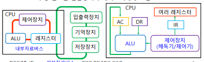
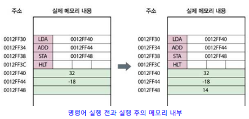

# Chapter 4. 컴퓨터 구조

#### 프로그램 내장 방식 & 구성 명령어
+ 프로그램 내장 방식 : 
  - 헝가리 수학자가 프로그램 내장 방식을 처음 제안함. 
  - 그 이전(에니악 때)에는 프로그램을 실행할 때마다 회로를 모두 뜯어서 다시 연결하는 등의 설정을 해 주어야 했다.
  - 프로그램에 들어가 있는 명령어와 데이터를 모두 이진 코드화하여 주기억 장치에다가 올리게끔 바꿈.
  - "주기억장치를 고도화하여, CPU가 주기억장치 위의 데이터를 하나씩 불러와서 처리를 하자!" 는 개념이 바로 "프로그램 내장 방식" 이다.
    - ex : 프로그램 코드를 짰으면, 그 프로그램을 실행시키기 위해서는 컴파일 과정이 필요하다.

+ 프로그램 구성 명령어
  - 컴파일하게 되면, 컴퓨터가 실행할 수 있는 기계어로 코드가 변환이 된다(.exe)
  - 해당 기계어 파일이 CPU에 들어가서 처리가 되는데, 이 명령어 포맷은 연산자 부분과 피연산자 부분으로 구분된다.
    
    
      -  opcode(Operation Code) : 연산자 
      -  뒷부분 : 피연산자
  - 이런 format으로 주기억 장치에 저장되어 있다가, CPU에 순서대로 들어가서 처리가 되는 방식이다.
  - 컴파일 시에는, 코드 한줄한줄을 해당 명령어 format으로 모두 해독하는 과정임.
  - 피연산자 부분에는, 해당 피연산자가 있는 주소값을 가리키고 있는 식이다. 해당 메모리 주소로 가서 거기에 있는 data를 CPU로 가져와서 처리하게 된다.
  - 명령어의 길이가 고정되어 있는 CPU도 있고, 어떤 CPU는 명령어 포맷의 길이가 다양한 CPU도 존재한다.
    - 명령어 갈이에서, 때로는 피연산자가 전혀 없는 명령어도 있음. 
    - 명령어의 피연산자가 1개 있는 명령어, 2개 있는 명령어, 3개 있는 명령어 등 다양함.

#### 저급 명령어 
+ 저급 언어 : 사람이 이해할 수 있는 언어가 아닌, 컴퓨터가 이해할 수 있는 언어를 "저급 언어" 라고 함.
  - 기계어(0과 1로 이루어짐) 와 어셈블리어(기계어를 기호화한 언어)가 저급언어에 해당한다.
    - 역시 마찬가지로 기계어는 연산자와 피연산자 부분으로 구분해서 볼 수 있다.
    - 어셈블리어는, 기계어와 1대 1로 매칭되어 기호화한 언어이기 때문에 거의 기계어에 가깝다.
  - C로 코딩하는 것은 고급 언어에 해당한다.
  - 어셈블리 연산자 : 앞의 연산자 기계어와 1대 1로 매칭.
    - LDA(Load Address) : 피연선자의 자료를 레지스터에 가져오라는 명령어
    - ADD : 피연산자의 자료(뒤에 오는 애)와 , 레지스터에 이미 있는 자료를 더하라는 명령어
    - STA(STore Address) : 레지스터의 내용을 피연산자의 주소에 저장하라는 명령어
    - HLT : 종료 명령어
  - 어셈블리어로 코딩하기 위해서는, 컴퓨터 동작 같은 것들을 완전히 빠삭하게 다 알고 있어야 프로그램을 어셈블리어로 만드는 것이 가능하다.
  - 해당 어셈블리어가 기계어로 변환되어, 기계어가 CPU에 들어가서 명령 포맷을 읽어들이는 CPU는 해당 내용을 실행하게 된다.
  - 고급 언어에서는 처리할 수 없는 기능이 저급 언어에 있기 때문에, 어셈블리어도 간혹 요즘 사용되기도 한다. 
  - 기계어와 어셈블리어는 CPU 종류마다 내용이 다른 것으로 알려져 있다.
  
+ 고급 언어 : 사람이 생각하는 논리적 수준으로 명령어를 짜는 방식이 고급 언어이다. 

#### 주기억장치(Main Memory)
+ 주기억장치 : CPU가 처리할 프로그램의 명령어와 자료를 저장하고 있는 기억 장치
  - 주로 메모리라고 하면, 주기억 장치를 뜻한다.
  - RAM(Random Access Memory) 형태를 취하게 된다.
  - 한 Byte마다 주소값이 설정되어 있다. 주소값이 설정되어 있어, 해당되는 주소에 가서 데이터를 읽어오고, 해당되는 주소에다 데이터를 읽고 쓰는 식이다.
  
+ 자료 : 주 기억장치와 CPU 사이의 데이터는 Word(32bit 기준 4byte) 단위로 이동한다. 
    - Word : CPU로 데이터를 한번에 가져올 때의 최대 데이터 크기. CPU가 한번에 처리할 수 있는 데이터의 크기이기도 하다.
    - 32bit 기준 4byte, 64bit 기준 8byte.

+ System Bus : 데이터가 이동하는 선(Line)을 Bus라고 부른다. 
  - 컴퓨터 안에서 데이터와 여러가지 명령 신호들이 Bus Line을 타고 이동함.
  - System Bus 내부의 Bus 종류 : 
    - 데이터가 이동하는 Data Bus
    - 주기억 장치에서 "데이터를 읽어와라/써라" 와 같은 명령 제어 신호가 전달되는 Control Bus
    - 메모리 주소를 지정해주기 위한 주소(Address) 버스
    - 데이터 버스와 제어 버스는 양방향 소통이지만, 주소 버스는 단방향 소통이다. 

  
  
+ RAM(Random Access Memory) : 주기억장치로 사용되는 메모리

   - 읽기/쓰기가 가능하며, 메모리 주소가 다 설정되어 있어 데이터에 바로 접근이 가능함.
   - 전원을 끄면, 램 위의 데이터가 모두 사라짐
   - 컴퓨터의 주기억 장치에만 사용되는 것이 아닌, 컴퓨터 주변 단말기기의 기억장치로도 사용된다!(ex : 프린터 RAM)
   - 동적 RAM/정적 RAM (DRAM/SRAM) 으로 종류가 나뉜다.
   - 동적 RAM(DRAM) 같은 경우, 한 비트를 구성하는 회로에 트랜지스터 1개와 Capacitor 한개가 들어간다.
   - 반면 정적 RAM(SRAM)의 경우, 한 비트를 구성하는 회로에 6개의 Transistor가 사용된다. 
      - 당연히 트랜지스터 1개를 사용하는 DRAM이 전력소모가 적고 경제적이다. 
   - 트랜지스터 6개가 들어가는 SRAM은, 당연히 그만큼 높은 가격이 될 수밖에 없다. 하지만, SRAM이 속도가 더 빠르다는 장점이 있다.
      - DRAM의 경우 트랜지스터 하나, 커패시터 하나로 구성되어, Capacitor의 경우 방전될 수도 있음. Capacitor가 방전될 경우, bit에 저장되어 있는 데이터가 사라진다.
      - 그래서 주기적으로 Capacitor가 방전되지 않도록 주기적으로 재충전이 이루어져야 한다. 
      - 반면, SRAM의 경우, 트랜지스터 6개로만 구성되어 있고 Capacitor가 없으므로 재충전이 불필요하다. 
      - 전력소모가 적고 경제적인 DRAM이, SRAM보다 고밀도 집적에 더 유리하다.
   - SRAM의 경우, CPU와 주기억장치 사이에 Cache Memory의 용도로 정적 RAM이 사용될 수 있다.
   - 주로 주기억장치로 사용되는 메모리는, D램 중에서도 Synchronous DRAM이 사용된다. 
      - Synchronous  : 동기화. 타이밍이 "시스템 클럭"의 타이밍과 맞아 떨어지게 되어(동기화되어) Synchronous DRAM이라고 부름.
      - 시스템 클럭 : 컴퓨터 안의 주기적으로 돌아가는 클럭 신호. 컴퓨터 안의 동작들이 "클럭"의 타이밍에 맞춰서 모두 동작한다.
   - DDR (Double Data Rate) : 데이터를 전송하는 "전송률" 이 2배이다. 한 번의 시스템 클럭 안에, 주기억 장치에서 CPU로 데이터를 두번 전송한다!
      - DDR2이면, 클럭 한번에 데이터가 4번 전송되게 된다. 

#### ROM(Read Only Memory)
+ ROM : 오로지 읽기만 할 수 있는 메모리. 쓰기를 할 수 없다.
+ ROM의 장점 : 전원이 꺼져도 데이터가 쭉 남아 있다.
    - BIOS : 컴퓨터 부팅을 하기 위해 ROM에 들어가 있는 펌웨어.
      - 펌웨어 : Software를 Hardware 화 한것임. (BIOS는 ROM을 통째로 잡아먹고, ROM은 BIOS 역할을 함)
    
    - BIOS 프로그램이 컴퓨터 주변의 여러 하드웨어 장치들의 정상작동 여부를 확인하고, 보조기억장치에 있는 운영체제를 주기억장치에다 로드하는 역할을 진행한다.
    
+ ROM의 종류 : 
    - MASK ROM : 공장 제조과정에서 ROM 안의 내용을 다 기억시켜 놓았기 때문에, 내용을 변경할 수 없는 ROM.
    - PROM(Programmable ROM) : 임의로 데이터를 딱 한번 변경 가능한 ROM. 
      - PROM Writer를 이용하여 전류를 흘려 보내, 퓨즈를 끊고/가만히 놔두는 식으로 변형을 일으켜 딱 한번 프로그램을 기억하게 함.
    - EPROM(Erasable Programmable ROM) : 자외선이나, X-Ray를 이용해 유리창처럼 보이는 곳으로 통과시켜 ROM의 내용을 자유자재로 수정할 수 있도록 해 놓은 ROM.
    - EEPROM(Electrically Erasable Programmable ROM) : 전기 회로적으로 이 안의 내용을 마음대로 수정가능한 ROM
      - EEPROM이 당연히 가장 복잡하고, 가격도 제일 비싸다.    

+ Flash Memory : EEPROM을 변형시킨 것이다.(변형되는 EEPROM)
    - Flash라는 이름이 붙은 이유 : 빛(섬광)철럼 반짝이며 데이터를 삭제할 수 있기 때문에 해당 이름이 붙음.
    - RAM의 장점에서, 읽고/쓰고/데이터를 저장할 수도 있으며, 전원이 꺼져도 속의 내용이 지워지지 않는 것이 Flash Memory이다.
    - Flash Memory는, byte 단위로 주소가 지정되지 않고 블록 단위로 주소가 지정된다. 
      - Block : 수백 바이트, 수천 바이트를 묶어서 하나의 Block으로 설정됨.
    - Flash Memory를 사용할 때, 사용 횟수가 제한적이다(영구적으로 변형할 수 있는 것이 아니다.)
    - USB 메모리도 Flash Memory로 구성되어 있는데, 넣고 삭제하는 등의 행동을 여러번 하다 보면, 반도체 메모리이기 때문에 마모된다. 그래서 저장하고 삭제할 수 있는 횟수가 제한적이다.(10만번 ~ 100만번)
      - USB는 셀 구조가 간단해 메모리 소자로 적합하다.

#### 캐시메모리(Cache Memory)
+ Cache Memory : SRAM으로 주로 Cache Memory가 사용된다.
    - 컴퓨터에서 CPU가 제일 속도가 빠르다. 주기억 장치와 속도차이가 약간 발생한다. 
    - 자주 사용하는 명령어나 데이터같은 것들은 계속 주기억장치로 입출력을 진행하다 보면, 물론 보조기억장치에 비하면 입출력이 훨씬 빠르겠지만, SRAM(Cache Memory)에 비하면 느리다. 그래서 중간에 Cache Memory를 두어 속도의 간극을 조금이나마 줄인 것이다.
    - 캐시 메모리에 자주 사용하는 명령어나 데이터를 두게 된다.
    - 캐시 메모리는 L1(Level 1)과 L2(Level 2)로 나뉘어져 있다.
        - 캐시 메모리의 접근속도와 크기에 따라 L1,L2로 나뉘게 된다. 
    - CPU를 사게 되면, L1 Cache Memory가 주로 CPU에 매장되어 있다.
    - 요즘 PC에는 Level 3까지 들어가 있는 PC도 존재한다(없는것도 있음).
        - 캐시 메모리가 많으면 많을수록 컴퓨터 처리 속도는 올라간다. 
        - 명령의 종류에 따라/데이터의 종류에 따라 구분되고, 여러 계층의 캐시메모리를 두기 때문에 훨씬 더 속도가 개선된다. 

+ Disk Cache : 주기억장치와 보조기억장치의 속도 차이를 해결하기 위함. 
    - 한번 부른 프로그램을 임시 메모리(캐시)에다 저장해 두고, 다음에 그 프로그램을 다시 사용하기 위해 디스크 캐시에다 저장해 사용함. 
    - 보조기억장치에 접근해서 다시 불러오는것보다 속도가 더 빨라짐.다시 해당 프로그램을 호출할 때, 보조기억장치 대신 Disk Cache로 접근해 사용하게 된다.
    

+ 버퍼(Buffer) : CPU와 I/O 사이(ex: 프린터) 는 속도차이가 대단히 많이 난다. CPU가 I/O를 기다리기보다는 그냥 특정 영역에 해당 I/O 데이터들을 임시저장해 놓고 다른 일을 하는 것이 훨씬 효율적이다. 
    - 그때, Buffer 용도로 사용하는 것이 앞에 나왔던 프린터의 RAM의 일부가 된다.(I/O Device RAM)
    - RAM의 일부를 Buffer로 사용해서 CPU에서 I/O data를 처리할 때 임시적으로 해당 데이터를 저장함. 

+ 가격과 메모리 :
   
  
  - 그림의 왼쪽으로 가면 갈수록 가격이 비싸지고, 속도도 빨라진다.
  - 그림의 오른쪽으로 가면 갈수록 가격이 저렴해지고, 속도가 떨어지며, 대용량이 된다. 

#### 보조기억장치
+ 보조 기억장치 : 주기억장치보다 데이터 접근 속도가 느리지만, 저렴하며, 대용량의 자료를 저장할 수 있다.
  - 순차 접근(자기 테이프 방식) : 말려져 있는 테이프에서 순차적으로 접근해 데이터를 찾아가는 방식
  - 직접 접근(자기 디스크, 자기 드럼 방식) : 직접적으로 해당 데이터를 찾아갈 수 있는 방식. 

+ HDD (Hard Disk Drive) : 앞에 나왔던, 헤드와 원형 자기 디스크를 활용한 방식. 
+ SSD (Solid State Disk) : 요즘 거의 모든 컴퓨터에 사용되는 보조기억장치. 자기 디스크 형식의 HDD와 다르게, 플래시 메모리 형태의 반도체 메모리로 구성되어 있는 것이 SSD이다.

+ HDD vs SSD 
  - SSD는 데이터 접근속도가 빠르고, 전력소모, 발열소음이 적고, 충격에 강하다. 하지만 HDD보다 비싸다.
  - 반면, HDD는 전력소모도 크고 발열이 심하며, 충격에도 약하지만, 가격이 저렴하다.

+ 외장하드 
  - HDD에 플라스틱 커버를 씌워 놓은 형식. 
  - 수십TB의 대용량 저장이 가능함.
  - 외장하드와 컴퓨터를 연결할 때, USB 인터페이스로 연결하거나, IEEE 1394, E-SATA로 연결할 수 있다.
  
  - IEEE 1394 :
  
  
  - E-SATA : 
  
       
+ 직렬 버스(Serial Bus) : USB의 S가 Serial임. 

+ 직렬 버스 vs 병렬 버스 
  - 직렬 버스 : 한 번에 1bit씩 전송함. 
  - 병렬 버스 : 여러 bit가 동시에 이동하는 방식. 데이터 전송에 있어서는 병렬 버스가 더 빠르다. 하지만, 동시에 여러 bit가 이동하다 보니, 오류가 많다. 시스템 클럭과 타이밍이 맞아야 하는데, 그렇지 않기 때문.
  - 거리가 가까운 경우, 병렬 버스를 사용해 데이터를 전송하지만 오류나 나기 쉽다. 
  - 직렬 버스를 주로 많이 연결에 사용한다. 
  - 그래서 요즘에는 Bus 연결에 E-SATA 케이블을 주로 많이 사용함(직렬).
   

#### CPU(Central Processing Unit)
+ CPU : 메모리에 저장된 프로그램과 자료를 이용해 실제 작업을 수행하는 전자회로 장치 
+ CPU가 동작하는 방식 : 
  - 만약, C로 프로그램을 짰다면, source code를 기계어로 컴파일을 먼저 진행한다. 
  - 컴파일을 하면, 기계어로 프로그램이 변환된다. 
  - 이후 해당 프로그램이 주기억장치로 올라가서, 명령어가 순차적으로 실행된다(연산자/피연산자)
  - 해당 명령어들이 CPU로 불려들어가서, CPU가 해당 명령어들을 순차적으로 수행한다.
  - **모든 컴퓨터에서 실제 작업을 수행하는 장치는 CPU이다!**

+ CPU의 구성
  - ALU(연산 장치)
    - 산술 연산과 논리연산 모듈로 구성되어 잇다. 
    - 피연산자 하나는 누산 레지스터(Accumulator Register, AC)에, 하나는 자료 레지스터(Data Register, DR) 에 저장해서 연산함. 
    - 결과값은 누산 레지스터(AR)에 저장된다. 
  - 제어 장치
    - IR(Instruction Register, 명령어 레지스터) : 주기억 장치에서 명령어들을 읽어와 저장하는 Register.
    - 제어 장치는 IR에서 읽어온 명령어를 제어 장치 내 해독기가 해독한 후, 연산 장치와 다른 레지스터들에게 실행하라고 제어 신호(실행)을 지시하게 된다.
    - 누산 레지스터(AC)에 피연산자 값을 집어넣고 연산해, 결과를 누산 레지스터(AC)에 다시 집어넣게 되는데, 저장한 결과값은 또 다음에 다른 연산할 때 사용될 수도 있음. 혹은 더 이상 필요없으면 주기억 장치에다 그 결과값을 저장해줌. 
    - 이런 모든 명령을 제어기가 수행한다. 
  - 레지스터
 
+ 자료버스
  - 내부 자료버스 : CPU 안에서 돌아다니는 버스
  - 외부 자료버스 : CPU를 기준으로 바깥쪽에서 돌아다니는 버스
  - 외부 자료버스는 I/O device, 주기억장치, 보조기억장치와 연결되어 있음.

+ 레지스터 : CPU가 연산을 하기 위해서 데이터 값들을 레지스터에 저장해 두고 연산함. 다른 기억장치들보다 데이터 접근속도가 빠름.
  - CPU 안에 레지스터들을 많이 둘 수가 없다.(수가 제한적이다.)
  - 컴퓨터 CPU에 따라서, 레지스터 크기가 사이즈도 다르며, 레지스터 갯수도 CPU의 종류에 다라 차이가 나며, 용도도 다르다. 
  - 핵심이 되는 레지스터 : 
    - DR(Data Register) : 연산에 필요한 피연산자를 지정하는 레지스터
    - AC(Accumulator Register) : 누산 레지스터. 연산장치의 입출력 데이터를 임시적으로 기억하는 레지스터
    - AR(Address Register) : 현재 접근할 기억장소의 주소(주기억장치의 주소)를 기억하는 레지스터
    - IR(Instruction Register) : 명령어 레지스터. 명령어를 읽어와 저장하는 레지스터. 해독,수행하기 전에 이 레지스터를 거친다.
    - PC(Program Counter) : 다음 실행할 명령어의 메모리 주소가 저장되어 있는 레지스터.

    - TR(Temporary Register) : 범용 레지스터. 임시로 자료를 저장해 두는 레지스터.

#### 명령어 처리 과정 
+ 주기억장치에 저장된 명령어와, 실행될 데이터들이 저장이 되어 있다. 이런 것들이 하나씩 CPU에 들어와서 처리가 되는 것이다.

+ 인출(Fetch) : 주기억 장치에 저장되어 있는 명령어를 가져와, 명령어 레지스터(IR)에 갖다놓는 단계
+ 해독(Decode) : 해독기가 IR에 있는 명령어를 복사해서 해독한 후, 해당 명령어의 내용대로 다른 레지스터에게 지시사항을 전달함.
+ 실행(Execution) : 명령어 내용에 따라 실행됨.

+ 명령어를 처리할 때의 flow : 
  - 주기억 장치에서 명령을 가져올 때 사용되는 Register : PC(Program Counter)
  - 첫 명령어를 읽으니 4byte 였다면, 다음 가야 하는 곳은 이전 + 4 번째 주소를 찾아가야 함. (PC는, 지금 가져온 명령 + 4byte씩 증가)
  - PC로부터 받아온 명령어를 IR(Instructional Register) 에 저장함. 이후 해독하고 실행함.
  - 명령어의 피연산자 부분이 메모리 주소로 설정되어 있으면, 주소 레지스터(AR)에다 해당되는 메모리 주소를 복사해 둔다.
  - 실행할 때, 여기에 있는 데이터 값을 가져오라고 하면, 해당 피연산자 부분에 메모리 주소에 접근함. 
  - 외부 주소 버스와 연결되어 있어서, 해당 주소값에 접근하면, 데이터값을 가져와 데이터 버스를 타고 DR(Data Register)에 저장한다.
  - 인출->해독->실행을 종료될때까지 돌게 된다.(Machine Cycle)

#### 프로그램 실행 과정(Ex)
+ 두 정수를 더하는 과정 ( C = A + B )
  - A = 32, B = -18 이라고 가정
  
  - 과정
    - LDA A : 메모리 주소 A의 내용을 AC에 저장
    - ADD B : 메모리 주소 B의 내용을 AC의 값과 더해 AC에 다시 저장
    - STA C : AC의 값을 메모리 주소 C에 저장
    - HLT : 종료

  - 세부과정 : 
    0. 주기억장치에 해당 명령어들이 들어가게 된다.
    1. PC에서 해당 명령어를 읽어, 복사해 IR에 집어넣는다. 
    2. IR에서 명령어를 해독하며, 해당 명령어의 byte를 파악한 후, PC에는 그 다음에 해당하는 명령어 주소를 저장한다.
    3. 피연산자에 있는 것이 메모리 주소값이므로, 해당 메모리 주소를 AR(Address Register) 에 복사한다.
    4. 해독결과, 해당되는 메모리 주소로 가서 메모리를 하나 가져와 AC에 가져다 놓으라는 명령어 확인.
    5. AR이, 외부 주소버스와 연결되어 있음. AR이 가리키고 있는 주소에 가서 확인
    6. 데이터가 있는 것을 확인함. 데이터가 외부 자료버스로 이동해서 DR(Data Register)로 이동 (외부 자료버스는 DR에 연결되어 있음)
    7. 이후, DR에 있는 값이 AC로 이동함. 그래서 A = 32가 AC에 저장되었다.
    8. 이후, PC로 다음 명령어를 읽음. 해당 명령어 IR로 이동.
    9. 피연산자 부분이 메모리 주소값이므로, AR에 복사함. PC에는 +4 한만큼의 주소값 저장.
    10. 명령어 해석. 주기억장치 피연산자에 있는 주소값의 데이터를 ADD하라는 명령어 확인.
    11. AR이 주소버스로 연결되어. 해당 주소에 가서 확인하고, 있는 데이터를 외부 자료버스를 통해 DR로 이동시킴. DR = -18
    12. ADD 명령어 수행. AC에 있는 값과 DR에 있는 값이 ALU에 들어가 계산되고, 결과값이 AC에 저장됨.
    13. PC에서 다음 명령어 접근해 다시 IR에 저장.
    14. 피연산자 부분이 메모리 주소값으로 되어 있는것 확인. AR에 저장. 
    15. 명령어 해독. STORE ADDRESS(STA) 확인. AR에 저장되어 있는 주소값에 AC에 있는 값을 저장하라!
    16. AC 에 있는 값이 DR에 옮겨지고, DR에서 외부 자료버스를 타고 AR이 가리키는 주소에 저장된다. 
    17. 다음 PC에 있는 명령어 확인. HLT. 종료
  
  

#### 마이크로프로세서
+ CPU의 처리속도에 영향을 주는 요인
  - 클럭 시그널의 속도
    - 시스템 클럭에 따라 CPU, 출력장치 등등이 맞춰서 동작하기 때문에, 클럭 속도가 빠르면 컴퓨터 속도도 빠르다.
    - 클럭 속도가 무한정 빠를 수는 없다. 너무 빠르면 회로에 열이 나기 때문에, 제한적으로 특정 Hz 이상은 힘들다.
  - 자료버스의 폭
    - 32bit 보다 64bit 일때 성능이 좋다.
    - 자료버스의 폭이 넓으면, 한번에 많은 자료를 가져와서 CPU가 처리할 수 있기 때문에 CPU의 성능이 올라간다.
    - 자료버스의 폭은 컴퓨터 시스템의 word 크기보다 같거나, 아니면 더 커야함. (중간에 덜 읽어올수는 없으니까)
  - 레지스터 수와 크기
    - 레지스터를 많이 두면 둘수록, 연산값들을 CPU가 많이 갖다놓고 있으니 성능이 올라간다.
    - "word 크기와 레지스터의 크기는 같다" -> 주기억 장치에서 데이터를 최대한 읽어, 워드 크기만큼 데이터를 가져와 레지스터에 저장함.  
    - 레지스터에 최대 저장될 수 있는 크기는, 32bit Architecture 상에서 32bit의 크기임.
    - 주소 레지스터의 경우, 0번지부터 2^32 - 1 번지까지만 저장할 수 있다(4GB?)
  - 캐시메모리 크기
    - 캐시메모리가 넓으면, 그만큼 주기억장치까지 가는 횟수가 줄어들기 때문에 CPU 처리속도가 올라간다.
  - 병렬 처리 
    - 한 컴퓨터(CPU) 안에 여러 개의 프로세스가 들어가 있어서, 동시에 여러 개의 명령어를 처리할 수 있으므로, 처리속도가 빨라진다.
    
+ 주요 마이크로프로세서 
   - 인텔
      - 1971. 마이크로프로세서 4004 처음 출시한 이후, 마이크로프로세서 8088을 16bit IBM 호환 컴퓨터 위에 탑재해 출시.
      - 눈부신 성장을 시작하며, 286,386,486,586 에 해당하는 마이크로프로세서가 나옴.
      - 요즘 나오는 것들은 아이코어(i-core) 시리즈들이다.

   - 무어의 법칙 : 프로세스 칩의 처리능력은 1년 반마다 2배씩 증대된다! (요즘은 워낙 빨라져서 지켜지고 있지는 않음)

#### 명령에 따른 프로세서 분류
+ 사용하는 명령어에 따라 프로세스를 CISC(Complex Instruction Set Computing) / RISC(Reduced Instruction Set Computing) 로 분류함.
 
+ CISC : 고급 언어로 프로그래밍하고 컴파일 했을 때, 명령어 구조(가짓수)가 되게 많이 나오고, 명령어의 길이도 다양하다.
  - 우리 컴퓨터에서 사용하는 CPU의 경우, CISC를 많이 채택한다.
  - 직접 메모리의 데이터를 읽고 쓰고, 참조하는 연산도 주로 CISC에 많이 들어간다.
  - RISC에 비해 명령어가 대단히 짧게 컴파일될 수 있음.
  - CISC의 경우, 명령어 구조가 복잡한 것이 CPU에 들어가서 실행되기 때문에, 구조가 복잡하다 보니 처리할 것도 많아진다.
    - CPU 칩 회로가 복잡해진다. 
    - 전력 소모가 크고 열이 발생된다. 그렇기에 쿨링팬이 들어가야 함. 생산단가도 비싸다.
  - 사용 예시 : 인텔 계열의 프로세서

+ RISC : 축소 명령어 집합으로 구성
  - 명령어 가짓수도 적고, 명령어 길이도 고정되어 있음.
  - 명령어 가짓수가 작다 보니, 기계어로 컴파일 시 명령어가 길게 여러 개 나올 수 있음.
  - CPU 구조가 단순하다. CISC에 비해서 명령어 한줄 처리하는 속도가 빠르다. 구조가 단순하다 보니, 가격이 저렴하다.
  - 주기억 장치에 가서 데이터를 가져오고, 다시 주기억장치에 데이터를 집어넣는 일이 아주 극히 제한적이다.
    - 대부분의 정보를 CPU 안에 있는 레지스터에다 저장해 놓고, 연산을 수행하게 된다.
    - CPU 안에 많은 레지스터를 요구하며, 필요로 한다. 
  - 사용 예시 : 라즈베리파이의 ARM 프로세서. 옛날에 모토로라 파워PC에 처음 구현됨. 8~90년에 워크스테이션 컴퓨터의 프로세서에 해당되었음.
  
