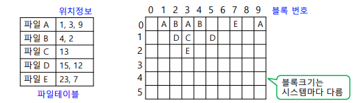
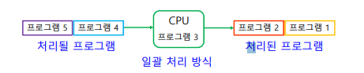
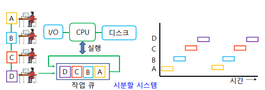

# Chapter 5. 운영체제와 활용

**키워드 위주로 정리**

#### 운영체제
+ 운영체제 : 사용자와 인터페이스를 담당하고, 시스템 전반적인 동작을 제어/조정하며, 사용자에게 편리성을 제공하고, 자원을 효율적으로 관리하는 시스템 프로그램의 집합.
  - 하드웨어 시스템 안에서 운영프로그램이 실행되기 위해 사용자와 컴퓨터 사이 중간매개체 역할을 함.
  - 컴퓨터 시스템을 사용할수 있게끔 편리성을 제공, 사용자와 컴퓨터 간의 인터페이스 담당
+ 커널 : 주기억장치에 상주, 하드웨어를 제어하고 여러 자원을 배분하는, 내가 생각하고 있던 OS의 실체.
  - OS의 가장 핵심인 모듈

+ 쉘 : 외부사용자와 커널 사이의 인터페이스 역할. 
  - OS의 가장 바깥부분에 위치
  - 사용자가 내리는 명령을 해석하는 역할을 한다.
  - 인터페이스 방식에 따라 GUI, CLI(Command Line Interface)로 나뉜다.
    - CLI : 키보드로 명령어 입력, 명령어 숙지해야 하며 아직 많이 쓰인다.
    - GUI : 아이콘이나 메뉴를 마우스로 선택, 사용자에게 있어 편리하다. 1970년에 제록스에서 처음 개발됨.

+ 컴퓨터의 동작을 구동(booting), 컴퓨터의 자원을 관리함.
  - BIOS도 운영체제 안에 들어 잇는 작은 모듈 프로그램으로 간주함.
  
+ 작업의 순서를 정하고, 입출력 연산을 제어함.
+ 프로그램 실행을 제어하며, 데이터와 파일의 저장도 운영체제가 관리함.

+ 운영체제 종류
  -  개인 컴퓨터 : MS_DOS, Windows, OS/2, Linux, MacOS
  -  중대형 컴퓨터 : Unix 계열, Windows Server 계열, VMS(HP 유닉스 서버 운영체제)
  -  스마트기기 : iOS, Android, Windows Phone

+ 운영체제의 목적 : 컴퓨터 시스템 자원을 편리하게 사용하도록, 환경을 제공하고 이를 효율적으로 관리하여 시스템 성능을 최적화하는 것.
  - 초기화 : 컴퓨터 시스템 초기화 설정가능
    - 시스템 초기값 설정(제어판)
  - 자원관리 : CPU, 메인메모리, 보조기억장치, I/O, 네트워크 장치, 파일 시스템
  - 기타 : 사용자와 인터페이스, 오류검사/복구기능,보안기능, 계정관리, H/W 자원공유
    - ex : 여러 컴퓨터들이 하나의 프린터와 연결되어 있을 때(H/W 자원공유)

#### 운영체제 자원 관리
+ 기억장치 관리자, 프로세스 관리자, 장치 관리자, 파일 관리자
  - 자원의 상태 파악, 자원의 할당 및 회수 등의 기능 수행

+ 기억장치(메모리) 관리 
  - 메인 메모리의 공간이 있으면, 어느 프로세스를 넣을지 결정해 적재하고, 프로세스가 메인메모리를 필요로 하지 않으면 다시 메모리 공간 회수
    - 단일 프로그램 방식 : 메인메모리에 한 프로그램만 적재하여 실행 (ex:MS_DOS)
    - 다중 프로그램 방식 : 메인메모리에 하나 이상의 프로그램을 적재하여, 동시에 프로그램을 실행. 현재 모든 운영체제에서 지원
    

+ 다중 프로그램 방식
  - 고정 분할할당 : 메인메모리의 사용자 영역을 여러 개의 고정된 크기로 분할해 사용. 단편화(Fragmentation) 문제 있음. 현재 사용X
  - 가변 분할할당(동적할당) : 프로그램을 주기억장치에 적재하는 순간, 필요한 크기의 영역을 분할해 할당함.
    - 여전히 빈공간이 발생하지만, 고정 분할할당보다는 낫다.(External Fragmentation)(외부 단편화)
    - 고정 분할할당에 비해, 동적할당이 할당 관리가 복잡하다.(단점)
    

+ 프로세스 스케쥴러 : 프로세스 상태를 한 상태에서 다른 상태로 이동시키는 모듈, 실행 상태라도 OS에 의해 다시 Ready Queue, Waiting Queue로 이동할 수 있다.

+ CPU 스케쥴링 : CPU 할당받을 프로세스 결정
  - FIFO(FCFS) 
  - Priority : 프로세스 중요도에 따라 우선순위 결정해 CPU 할당. Starvation 상태 유의.
  - RR(Round Robin) 

+ 입출력 장치관리 : 입출력 장치의 효과적인 할당과 회수 등
  - FIFO (ex:프린터 출력)

+ 인터럽트(Interrupt) :  당장 처리해야 할 작업이 생겼을 경우,OS가 실행 중인 프로그램을 그 자리에서 인터럽트 신호를 보내 중단하고, 해당 작업이 종료되면 다시 예전 프로그램으로 돌아가는 것. 
  - ex : 정전
    - 정전이 되면 모든 프로그램에 인터럽트 걸고, 다 저장한 뒤 컴퓨터를 안전하게 종류할 수 있도록 함.
+ 장치제어기 : 장치 관리자와 H/W인 I/O device 사이의 인터페이스를 담당하는 프로그램.

+ 파일 관리 : 보조 기억장치에 저장되는 파일을 관리.
  - 사용자와 보조기억장치 사이의 인터페이스 제공
  -  기억장치에 대한 사용자의 Logical Address 와 Physical Address를 연결해 준다.
      - 파일의 접근제어, 파일의 생성/삭제/수정 기능
      - 파일을 디스크의 어디에 저장할지, 폴더 구조 제공하고 관리
      - 파일을 여러 사용자가 공유하는 기법 제공

  - FAT(File Allocation Table) 32 : USB, 휴대폰, 캠코더, 디지털 카메라에 사용
  - NTFS(New Technology File System) : 윈도우 NT 계열의 OS 파일시스템
  
  
#### 운영체제의 형태
+ Batch Processing(일괄처리 방식) : 일정량의 프로그램을 모두 모아놓았다가, 한 시점에 순서대로 일괄처리하는 방식.
  - ex : 천공카드 입력
  - 장점 : 시스템의 효율적 사용
  - 단점 : 
    - CPU의 idle time(유휴 시간) 발생. (I/O 처리시간에 CPU가 쉰다)
    - 작업이 시작된 후 중간에 문제발생시 처리 어려움
    - Turnaround Time(작업 제출~ 작업 완료시간)이 길어 확인이 느리다
    
    
+ Time Sharing(시분할) System : CPU의 여유시간을 잘게 분할해, 작업을 순환하면서 수행하는 방식. Time-Slice로 구현
  - 장점 
    - CPU idle time(유휴 시간) 감소
    - 짧은 작업일 경우 수행을 빨리 환료가능
  - 단점 : 메인메모리 관리 기법과 CPU 스케쥴링 기법 필요. OS가 복잡해짐.  
    
