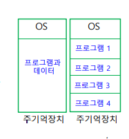

# Chapter 5. 운영체제와 활용

**키워드 위주로 정리**

#### 운영체제
+ 운영체제 : 사용자와 인터페이스를 담당하고, 시스템 전반적인 동작을 제어/조정하며, 사용자에게 편리성을 제공하고, 자원을 효율적으로 관리하는 시스템 프로그램의 집합.
  - 하드웨어 시스템 안에서 운영프로그램이 실행되기 위해 사용자와 컴퓨터 사이 중간매개체 역할을 함.
  - 컴퓨터 시스템을 사용할수 있게끔 편리성을 제공, 사용자와 컴퓨터 간의 인터페이스 담당
+ 커널 : 주기억장치에 상주, 하드웨어를 제어하고 여러 자원을 배분하는, 내가 생각하고 있던 OS의 실체.
  - OS의 가장 핵심인 모듈

+ 쉘 : 외부사용자와 커널 사이의 인터페이스 역할. 
  - OS의 가장 바깥부분에 위치
  - 사용자가 내리는 명령을 해석하는 역할을 한다.
  - 인터페이스 방식에 따라 GUI, CLI(Command Line Interface)로 나뉜다.
    - CLI : 키보드로 명령어 입력, 명령어 숙지해야 하며 아직 많이 쓰인다.
    - GUI : 아이콘이나 메뉴를 마우스로 선택, 사용자에게 있어 편리하다. 1970년에 제록스에서 처음 개발됨.

+ 컴퓨터의 동작을 구동(booting), 컴퓨터의 자원을 관리함.
  - BIOS도 운영체제 안에 들어 잇는 작은 모듈 프로그램으로 간주함.
  
+ 작업의 순서를 정하고, 입출력 연산을 제어함.
+ 프로그램 실행을 제어하며, 데이터와 파일의 저장도 운영체제가 관리함.

+ 운영체제 종류
  -  개인 컴퓨터 : MS_DOS, Windows, OS/2, Linux, MacOS
  -  중대형 컴퓨터 : Unix 계열, Windows Server 계열, VMS(HP 유닉스 서버 운영체제)
  -  스마트기기 : iOS, Android, Windows Phone

+ 운영체제의 목적 : 컴퓨터 시스템 자원을 편리하게 사용하도록, 환경을 제공하고 이를 효율적으로 관리하여 시스템 성능을 최적화하는 것.
  - 초기화 : 컴퓨터 시스템 초기화 설정가능
    - 시스템 초기값 설정(제어판)
  - 자원관리 : CPU, 메인메모리, 보조기억장치, I/O, 네트워크 장치, 파일 시스템
  - 기타 : 사용자와 인터페이스, 오류검사/복구기능,보안기능, 계정관리, H/W 자원공유
    - ex : 여러 컴퓨터들이 하나의 프린터와 연결되어 있을 때(H/W 자원공유)

#### 운영체제 자원 관리
+ 기억장치 관리자, 프로세스 관리자, 장치 관리자, 파일 관리자
  - 자원의 상태 파악, 자원의 할당 및 회수 등의 기능 수행

+ 기억장치(메모리) 관리 
  - 메인 메모리의 공간이 있으면, 어느 프로세스를 넣을지 결정해 적재하고, 프로세스가 메인메모리를 필요로 하지 않으면 다시 메모리 공간 회수
    - 단일 프로그램 방식 : 메인메모리에 한 프로그램만 적재하여 실행 (ex:MS_DOS)
    - 다중 프로그램 방식 : 메인메모리에 하나 이상의 프로그램을 적재하여, 동시에 프로그램을 실행. 현재 모든 운영체제에서 지원
    

+ 다중 프로그램 방식
  - 고정 분할할당 : 메인메모리의 사용자 영역을 여러 개의 고정된 크기로 분할해 사용. 단편화(Fragmentation) 문제 있음. 현재 사용X
  - 가변 분할할당(동적할당) : 프로그램을 주기억장치에 적재하는 순간, 필요한 크기의 영역을 분할해 할당함.
    - 여전히 빈공간이 발생하지만, 고정 분할할당보다는 낫다.(External Fragmentation)(외부 단편화)
    - 고정 분할할당에 비해, 동적할당이 할당 관리가 복잡하다.(단점)
    

