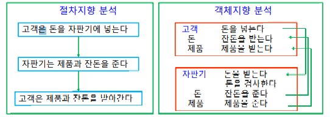

# Chapter 8. 프로그래밍 언어

+ 프로그래밍 언어 : 사람과 컴퓨터가 서로 의사교환을 하기 위한 언어. 
  - 저급 언어 : 컴퓨터 친화적 언어
    - 기계어 : 0과 1로 표현되어, 컴퓨터가 직접 이해하는 언어, 사람에게 있어서 접근하기 매우 어렵다.
    - 연산코드(operation code)와 피연산자(operand)로 구성된다. 

    - 어셈블리어 : 기계어를 간략하게 기호형태로 "일대일 대응" 시킨 언어 
    - 컴퓨터 하드웨어에 대한 강력한 통제 기능이 있는 언어이다. 기계어보다는 간략해서 쉽지만, 여전히 접근하기 까다로운 언어이다. 
    - 기계어와 어셈블리어는 CPU(컴퓨터 시스템)마다 명령어가 다르다! 그래서 호환 문제가 계속 발생함.
    - ex) 기계어와 어셈블리어    
      
      
  - 고급 언어 : 인간에게 친근한 언어.
    - ex) 포트란, 코볼, C, C++, Java 등      
    - 

### 세대별 언어 분류
+ 갑자기 튀어나온 것이 아닌, 중간에 발전에 발전을 거듭하여 지금 우리가 사용하는 고급 언어가 나옴.

+ 1세대 : 1945년, 기계어만을 이용한 세대
+ 2세대 : 1950년 중반, 어셈블리어와 어셈블러(Assembler) 개발. 프로그램 개발 생산성이 높아졌지만, 시스템마다 어셈블리어가 달라 계속 호환 문제가 발생했다.
+ 3세대 : FORTRAN, ALGOL, BASIC, Pascal 같은 고급 언어들에 대한 컴파일러가 개발됨.
  - 컴파일러 : 소스 코드로 작성한 것을 기계어로 변환해 주는 프로그램
  - 초창기 고급 언어들은 절차 중심의, 절차지향 언어였다.
    - 절차지향언어 : 논리식으로, 절차를 따라 실행되는 언어(Like C)
  - 시스템 독립적인 프로그램을 개발함으로 인해, 프로그램 개발 생산성 향상됨.

+ 4세대 : 비절차 중심의 언어(객체 지향 언어) 가 개발됨. 
  - Visual Basic : 객체지향 개념과 Visual Programming 환경을 추가해서 만들어낸 언어.
    - 버튼, 체크박스 등을 세팅할 때 속성값을 사용해 세팅할 수 있는 언어.
    - GUI 같은 Visual한 프로그래밍 환경 요소를 제공하고 있음. 
  - Delphi : Pascal 에 객체지향 특성과 Visual Programming 환경이 더 추가되어 만들어 놓은 프로그래밍 언어.
  - 데이터베이스 질의 언어(Structured Query Language, SQL)

+ 5세대 : 직접 사람이 코딩하지 않고, 블록을 사용해서 프로그래밍하는 것.
  - ex) Scratch
  - 연구중인 부분 : 사람이 자연어로 말하면 코드가 작성되어 만들어지는 시스템.(Like 알파코드)

### 프로그램 개발 환경
+ 프로그래머 : 프로그램 만드는 사람
+ 개발자 : 단순히 프로그래밍 하는것 뿐만 아니라, 개발 전반에 참여하는 사람
  - 그래픽 디자인이나 프로젝트 매니지먼트도 하며, 코딩도 가능한 사람을 보고 개발자라고 하는 모양이다.
  - 요런 사람들을 다 합해서 "개발자" 라고 부르는 모양이다.

+ 편집기(editor) : 소스 코드를 편집하는 프로그램 편집기(메모장, VIM 등)
+ 컴파일러(compiler) : 소스코드를 기계어로 변환시켜주는 프로그램
+ 디버거(debugger) : 소스코드에서 오류를 찾아 수정하도록 도와주는 프로그램
+ 링커(linker) : ex) C언어를 컴파일해서 나오는 .obj 파일과, 소스 코드 안에서 썼던 내장함수, 혹은 여러 라이브러리들을 다 링크해서 실행 파일을 만들어 주는 프로그램.
  - 목적(.obj) 파일 : 0과 1로 이루어진, 소스코드를 컴파일해서 나온 파일.
  - 실행 파일 역시, 0과 1로 이루어져 있는 binary 형태의 파일이다.   
  - 실행 파일은 확장자가 .exe나 .com 으로 붙게 된다.
  - link 작업 : 링크 작업을 연결해 주는 여러 가지 라이브러리 함수와, 여러 개의 목적 파일을 묶어서 실행될 수 있는 이진 파일을 만들어주는 작업. 

+ IDE(통합 개발환경) : 프로그램을 개발할 때 사용될 수 잇는 편집기, 컴파일러, 디버거, 링커 등을 다 통합해, 프로그램을 효율적으로 개발할 수 있게 해주는 개발 환경.
  - C : VS Studio
  - Java : IntelliJ
  - Python : PyCharm 

### 프로그램 구현 과정 
+ 소스 코드 작성
+ 컴파일(Compiling)
  - 소스 코드를 목적 파일(.obj file)로 변환함. 
  - C의 경우, .obj 파일로 변환하여 처리함
  - 컴파일러로 작업하는 언어도 있지만, 인터프리터로 처리하는 언어도 있다. 
    - C : 컴파일러 사용 언어  / Python : 인터프리터 사용 언어
    - 어셈블러를 사용하는 언어는 어셈블리어밖에 없다. 
    - 어셈블리어는 고급 언어에 비해 프로그램 실행 속도가 빠르고, HW에 대한 정교한 통제가 가능하기 때문에 아직도 사용된다. 

+ 디버깅(Debugging) : 오류를 찾아 수정하는 과정
+ 링크(linking) : 여러 개의 목적 파일과, 프로그래밍 언어에서 제공해 주는 라이브러리 함수, 내장함수를 모두 연결하여 하나의 실행 파일로 만드는 과정. 링커가 수행한다. 
  - .c .obj .exe 순으로 진행된다. 

+ 로딩(loading) : 이진 형태의 실행 파일이, 로더(loader)에 의해 메모리에 올라가 CPU에서 실행되는 과정.

### 컴파일러와 인터프리터(interpreter)
+ C같은 경우에는 컴파일러를 사용하는 언어지만, Python은 인터프리터 언어를 사용한다. 
+ 컴파일러의 경우, 소스코드 전체를 다 읽어 목적 코드로 변환하며, 목적 파일을 생성함. 
  - 컴파일러를 사용하는 경우, C 코드를 약간만 수정해도 다시 전체 코드를 컴파일 해야 함.
  - C, 포트란, 코볼 등이 컴파일러를 사용하는 대표적인 고급 언어이다.

+ 인터프리터의 경우, 한줄을 읽고 한줄을 바로 기계어로 변환해 실행하며, 계속 반복한다. 
  - 따로 목적(.obj) 파일을 만들지는 않는다. 
  - 바로 한줄씩 읽어서 목적(.obj) 코드로 변환하자마자 바로 실행한다. 
  - 중간에 잘못 실행했을 경우, 목적 파일을 따로 만들어주지 않았기 때문에, 처음부터 전체를 목적코드로 다시 바꿔서 새로 실행해 줘야 하는 일이 생긴다. 
  - 실행할 때마다 매번 기계어로 바꾸는 과정을 수행해야 하기 때문에, 인터프리터 언어는 속도가 느리다는 단점이 있다.
  - 기계어로 번역하는 과정이 비교적 간단하기 때문에, Python이나 Basic 같은 고급 언어는 인터프리터 방식을 사용하고 있다. 
  - 인터프리터 언어의 경우, 대화형 프로그래밍이 편리하다는 강점이 있다.
    - python을 명령 프롬프트로 실행하여 실시간으로 한줄씩 작업을 진행할 수 있다. 
    
+ 컴파일러와 인터프리터의 중간 방식
  - C#
    - Java와 구조가 비슷함.
  - Java 
    - 뒤에 확장자가 .java로 옴. 
    - .java 소스를 컴파일하면, C의 경우 목적 파일이 나오지만 java의 경우 이진 파일이 아닌 중간 형태의 byte code 형태로 나오게 된다. (.class 확장자로 나오게 된다.)
    - JVM(Java Virtual Machine)에 해당 ".class" 파일이 들어가서, 해당 컴퓨터의 OS나 기종에 맞는 JVM 위에서 동작하게 된다. 
    - JVM 위에서 한줄씩 읽혀지면서 실행하는 형태로 들어간다. 
    - 자바에서는 어떠한 컴퓨터 운영체제에서도 JVM 위에서 돌아가게끔 되어, 어떤 컴퓨터 운영체제에서도 동일하게 프로그램이 작동한다. (Platform-독립적임)(어떠한 플랫폼에서든 실행가능하다)
    - 컴파일 할 때는 bytecode로 변환(.class), JVM 위에서 실행될 때는 한줄씩 기계어로 변환하기 때문에 interpreter 방식으로 동작.
    - JVM 위에서 동작할 때, interpreter 언어로 동작시키기 때문에 상대적으로 속도가 더디다. 

    
### 고급언어 종류
+ FORTRAN : 공학이나 수학쪽 복잡한 수학 계산을 해결하기 위해 만들어진 고급 언어. 
  - 문법이 단순하고 배우기 쉽지만, 조금만 문법이 틀리면 엄격하기 때문에 오류가 난다. 

+ COBOL : 기업의 사무처리에 적합하게 개발되었다. 
  - 다른 프로그래밍 언어에 비해 영어와 비슷한 문장으로 구성되어 있다. 
  - 프로그래밍 컴파일러만 있으면 어떠한 컴퓨터 기종에서도 프로그램 작성 실행이 가능하고, 기업의 사무처리에 적합하여 데이터를 효율적으로 입출력 처리할 수 있게 개발되어진 프로그래밍 언어이다. 

+ BASIC : 문법이 비교적 간단한 대화형 언어
  - 대화형 cmd가 나왔을 때, 문법이 간단하고 파이썬처럼 인터프리터 언어이기 때문에 실행 속도는 느리다. 
  - Visual Basic : 위의 basic에 객체지향 특성과 GUI 개념을 추가한 언어

+ Pascal : 절차지향형 프로그래밍 언어
  - 프랑스 수학자 파스칼의 이름을 따 만들었다. 
  - 사람의 알고리즘 학습에 적합하도록 만들어진 언어이다. 
  - C의 함수와 같은 개념이 Procedure 라는 것으로 파스칼 언어에 들어가 있다. 
  - 함수 대신 procedure가 들어가서, 구조적인 프로그래밍이 가능하도록 설계되어 있다.

+ Delphi(델파이) : 기존의 파스칼 언어에, 객체지향 특성과 GUI가 적용된 IDE이자, 객체지향 프로그래밍 언어.

+ C : 기존의 'B' 언어를 발전시킨 언어. 
  - Bell 연구소의 Dennis Rich가 개발함. 
    - Unix 운영체제를 개발하기 위해, 시스템 프로그래밍 언어가 필요했고, 그래서 C 언어를 만들게 되었다. 
    - C는 다른 고급언어들에 비해 하드웨어에 대한 통제가 가능하다는 특징이 있다.
    - 산업 현장 같은 곳에서 C언어를 많이 사용하고 있다. 
    - 어떤 컴퓨터 기종에서도, C로 작성되는 프로그램이 잘 실행된다. (프로그램의 이식성이 높다)
    - 풍부한 연산자와 데이터형, 범용 프로그래밍 언어로써 널리 보급되어 있다.
    - 현재 운영체제 컴파일러나 IDE 등 대부분이 C로 개발되어 있다. 

+ C++(cpp) : C에서 더 발전시켜, 객체 지향을 추가한 언어.
  - 객체지향 특성이 추가되었기 때문에, 상속, 추상화, 캡슐화, 다형성 등의 객체 지향 프로그래밍 언어에서 나타나는 속성을 C++에서 찾아볼 수 있다. 
  
+ Scratch : MIT에서 개발된 언어로, 블록 코딩으로 작성하는 언어.
  - 초등학생이나. 코딩교육 시 사용하는 언어이기도 하다. 
  
  
### 객체지향 프로그래밍(OOP : Object Oriented Programming)

+ 객체지향 프로그래밍 : 우리 현실세계를 반영해서, 객체 간의 상호작용 형식으로 짜여진 프로그래밍
+ 객체 : 현실세계의 사물이나 개념을 시스템에 이용하기 위해 만든 소프트웨어 모델
  - 객체가 가지고 있는 속성값을 객체의 멤버 변수로, 행위를 멤버 메소드로 구현할 수 있다.
  - 실생활의 Object들을 가지고 코드를 작성하여, 구현하는 것임.

+ 신뢰성 있는 소프트웨어를 쉽게 작성할 수 있고, 코드를 재사용할 수 있으며, 수정, 업그레이드가 용이하다는 장점이 있어, 요즘 만들어지는 프로그래밍 언어들은 대부분 객체지향 프로그래밍이다.

+ 상속 : 부모 클래스의 변수나 메소들을 그대로 자식 클래스가 받아오는 것( extend )
+ 캡슐화 : 멤버 변수를 임의로 변경시키지 못하게 막아두고, get/set으로만 받아오고 수정할 수 있게끔 하는 것.
+ 추상화 : 부모 클래스의 변수, 메소드들을 구체적으로 모두 구현해 두지 않고, abstract method로 남겨 자식 클래스에서 override 해 구체적으로 구현하게끔 두는 것.
+ 다형성 : 서로 다른 종류의 객체에서, 멤버 함수 이름은 같은 것을 주어 호출하면, 코드가 간결해지는 것을 보고 "다형성" 이라고 함. 
  - ex) Dog.speak() / Cat.speak() 이 다름. 하지만, 멤버 메소드이름은 같게 해줄 수 있음.

### 절차지향과 객체지향 

+ 절차 지향 : 어떤 명령을 입력했을 때, 주어진 절차에 따라서 프로그램이 순차적으로 실행, 진행되는 것을 진향하는 프로그래밍을 보고 절차 지향 프로그래밍이라고 한다. 
  - 절차지향 언어 예시 : C, COBOL, Fortran, Basic, Pascal 등
  - 거진 C 말고는 다 레거시 언어이다. 레거시 언어가 아닌 언어 중 유일하게 C가 절차지향형 언어이다.

+ 객체 지향 : Object들 간의 상호작용, 메세지 교환 등을 기반하는, 그런 부분을 지향하는 프로그래밍이다. 
  - 객체 지향 언어 예시 : C++, C#, Java,Python , Visual Basic, Delphi
  - 주의 : C++ 도 객체지향 언어라고 되어 있다!

### Java

<strong>내 아주아주 메인인 언어</strong>

+ JDK 를 오라클에서 무료 다운로드 가능하다.
+ 1995년, Sun Microsystem의 제임스 고슬링 아조시가 개발, 발표함.
+ 현 세계에 존재하는 것들을 "객체화"(Object) 하여 구성하고, 상호작용하는 식으로 만듬.
+ JVM으로 인해, 플랫폼 독립적으로 똑같이 실행이 가능하다. 시스템 독립적이다. 
  - 플랫폼 : 응용프로그램이 이 위에서 실행될 수 있도록 하는 밑바탕. 
  - 주로 OS + 컴퓨터 하드웨어 + 시스템 을 합쳐서 플랫폼이라고도 하는 모양이다. 
  - 플랫폼에 맞는 JVM만 설치하기만 하면 된다. 그럼 돌릴 수 있다.
  - JVM은 당연히 소프트웨어적으로 구현한 것이다. 하드웨어 아니다!
  - 각각의 byte code인 .class 파일이 그 위에서 동작함.
  - .class 소스 코드가 실행될 때, java에서 제공해 주는 여러 가지 클래스 라이브러리와 byte코드가 합쳐져서 실행된다.
  - JVM이 기계와 코드의 인터페이스 역할을 함. 

+ 자바 파일을 컴파일하면 .class 형태의 바이트 코드가 나타난다.(이진 파일 아님)
+ 컴파일 (.java -> .class) / 인터프리터(.class 파일 한 줄씩 실행) 동시에 쓴다.
+ 문법을 배우기 쉽고(?), 유지보수, 재활용성이 높은 객체지향 언어이다. 
  - 재활용성 : 상속(extends), 상속받은 뒤에, 속성값이나 메소드를 추가하거나 변경(override)해서 사용하기 때문에 재활용이 쉬운 객체지향 언어이다. 

+ 다중 Thread를 지원하는 분산처리 언어이다(extends Thread, run())
  - Thread란 ? : 하나의 프로세스 내의 작업 단위.
    - 하나의 프로세스가 진행됨에 따라서, 그 안에 작업이 하나만 돌아가는 것이 아닌, 동시에 여러 가지 작업이 동시에 수행되는 것을 보고 Multi-Thread라고 한다. 

+ 보안이 뛰어나고, 어떤 컴퓨터 기종에서도 자바가 실행될 수 있어 이식성이 높으며, 범용 언어로써 여러 가지 개발범위에 많이(JSP, Spring, Android Studio 등) 사용되는 그런 언어로써, System Software를 개발할 수 있는 언어라고 한다(?)(찾아볼것)

+ 가전 제품을 제어할 목적으로 자바를 처음 만들었기 때문에, 하드웨어에 가까운 low system에서도 운영이 가능하고, 운영체제에 관계없이 모든 플랫폼에서도 동작가능하다.
  
  
### .Net(닷넷) & C#
  
+ MS 사에서 다양한 모바일 기기나 데스크탑에서 두루두루 사용할 수 있게끔 만들어 놓은 플랫폼.
  - 사람들이 윈도우만 쓰는 것이 아니라, 다른 다양한 OS위에서 프로그램을 사용하는데, 윈도우용 프로그램은 오직 윈도우에서만 동작하기 때문에 위기를 느낀 MS사에서 이런 플랫폼을 만들었다. 
  - 어떤 운영체제, 플랫폼에서도 .Net을 설치하게 되면 MS사에서 개발하는 운영 프로그램이 실행될 수 있도록 만들어 놓음.
  - xml을 기반으로 한 웹서비스 지원을 위해, ".Net" 플랫폼에서 xml 기반의 웹서비스를 기본 지원하는 것까지 고려해서 플랫폼을 발표하게 된다.
    - XML(eXtended Markup Language) : html 에서 확장된 마크업 언어. 

+ .Net Platform
  - 해당 플랫폼이, 프레임워크가 대박이 나기 위해서는 어느 한 프로그램이 사람들에게 인기가 대박나면 되는 부분임.
  - 그래서 .Net에서는 사람들이 .net 플랫폼 위에서 실행될 수 있는 응용 프로그램들을 많이 개발할 수 있도록 Visual Studio .Net 이라는 것을 만듬.
    - VS .net : .net 플랫폼 위에서 실행될 수 있는 앱을 개발하는 IDE
    - .net Framework : 응용 프로그램들이 많이 개발될 수 있도록 라이브러리를 많이 지원하기 위해 만듬. 
  
    - .net 플랫폼 위에서 실행될 수 있는 언어 : C#(주력), J#, 기타등등

+ 컴파일을 하게 되면 obj 파일이 아닌, "Intermediate Language" 파일(.MSIL)이 새로 생기게 된다.
  - CLR(Common Language Runtime) : 다양한 언어들로 컴파일했을 때, intermediate language들이 실행될 수 있는 실행환경이다. 
  - 자바의 .class를 JVM위에서 running하는 것과 그 구조가 비슷하다. 
  - 똑같이 interpreter 식으로 작동하게 된다. 

+ .net 플랫폼 위에서 실행될 수 있는 여러 개의 응용 프로그램이 개발될 수 있도록 하기 위해, .net framwork SDK(Software Development Kit)이 무상으로 제공되고 있다. 
  - 객체 지향 프로그래밍이기 때문에, 관련 클래스를 많이 지원하고, XML 에 관련된 클래스들도 지원한다.

+ C# 
  - Java와 문법이 되게 비슷함. 
  - 코드 작성, 유지보수가 쉽다. 
  - Visual 요소를 포함하고 있어, 높은 프로그램 생산성을 보장하며, C# 역시 system-independent한 프로그램 개발이 가능하다. (어떤 컴퓨터 기종이나 운영체제라 할지라도 상관없음.)
    - CLR 위에서 돌아가는 프로그램이기 때문
  - 중간 언어인 .MSIL이 만들어지고, 실행 환경인 CLR(Common Language Runtime) 위에서 실행된다. 
    - java와 똑같이 컴파일러 + 인터프리터 형식으로 동작함. 
  
### Python

+ 요즘 각광받고 있는 프로그래멍 언어. 
+ 네덜란드 출신인 "Guido Van Rossum" 이라는 사람이 파이썬 language를 개발함.
+ 객체 지향 언어이다. 
+ 대화형 언어로써, cmd 위에서 한줄씩 실시간으로 동작 가능하다. 
+ 컴파일러 가 아닌 인터프리터 형식으로 동작한다. 
+ C나 Java에 비해 데이터 처리 등이 매우 간편하며, 문법이 간결하고 읽기 쉽다(Pseudo Code 수준 ^^)
+ 중괄호를 사용하지 않고, 들여쓰기 기준으로 처리해 버린다. 
+ 변수 선언이 필요없다. 
+ 풍부한 라이브러리 제공, 내장 함수 많음. 
+ 인공지능 운영과, 빅 데이터 분석 처리에 뛰어남(2022.06.16 현재)

+ 파이썬 버전 
  - IronPython : C#으로 만들어진 Python
  - Jython : Java로 만들어진 Python
  - PyPy : Python으로 만들어진 Python
  - CPython : C언어로 만들어진 Python
  - 다양한 version이 있다!

+ 여러 플랫폼에서 사용되는 프로그램을 쉽고 빠르게 개발할 수 있으며, cmd위에서 명령어를 입력해 대화형 형태로 코딩이 가능함.(
  - IDLE(Intergrated Development Learning Environment) Shell 사용가능. (근데 나같으면 cmd씀 ㅎ)

+ 스크립트 파일 생성 후 코딩해서 저장, 이후 python running.

+ IDE로 Jetbrains 사의  Pycharm을 많이 사용한다고 알려져 있음(나는 귀찮아서 그냥 vscode로 하는데 ㄹㅇㅋㅋ)

### Go & Kotlin & Swift

+ Go : 구글의 "Robert Griesemer","Rob Pike", "Ken Thompson" 이 3사람이 개발함.
  - C++ 이 속도가 느려서 개발하게 됨. 
  - 키워드가 25개밖에 안되서 간단함.
  - 안전하고 효율적임. 
  - golang.org에서 다운로드 가능.
  - Java 처럼 Multi-Threading 기능을 지원해서, 실행이 동시에 될 수 있는 프로그램을 쉽게 개발가능
  - IDE : Jetbrains 사의 GoLand, 이클립스, Light IDE 등
  - IntelliJ IDEA에서 Go Plugin을 추가해 사용할 수 있다.

+ Kotlin : 
  - Jetbrains 사에서 만들어낸 객체 지향 언어.
  - 구글의 Android 운영체제에서 실행 가능함.
  - 2017년에 유명한 "자바 소송" 이후, 구글이 Android 운영체제에서의 개발 공식언어를 코틀린으로 선언함.
  - JVM 위에서 돌아가는 언어이다 보니, Android 말고도 다른 프레임워크도 자바와 1:1 코드 대응이 가능한 코틀린으로 옮겨가는 추세. 
  - 간결하고 간편하다는 장점이 있다. 
  - 자바와 상호 운용이 100% 가능하다. 
  - 자체 컴파일러를 사용해 직접 실행이 가능하다. 

+ Swift : 
  - 애플에서 개발하는 제품들에 들어가는 앱을 개발할 때 사용되는 언어로 알려져 있음. 
  - Objective-C 의 단점을 개선해서 만든 언어이다. 
  - 매우 빠르고 안전하고, 쉽게 코딩이 가능함. 
  - 현대 객체지향 언어에 들어가 있는 기능들을 모두 포함한다고 함. 
    - ex) Generics 기능. Java의 Generic 과 같음. 

+ R : 
  - 통계분석 및 그래픽 작업을 위한 프로그래밍 언어. 
  - interpreter 언어이다. 
  - 통계 처리를 위한 라이브러리를 활용하며, 자료분석, 데이터 마이닝, 빅테이터 처리, running 분야에 적합한 언어이다. 
    - Data Mining : 많은 데이터 중 서로 연관성 있는 데이터들을 모아서, 데이터들 사이에 숨어 있는 정보들을 추출해 내는 것.
    - ex) 구글링 시 검색 키워드와 관련된 것들을 다 리스트업 해서 몇 페이지 분량의 자료들을 디스플레이 해준다. 이런 것도 Data Mining의 사례 중 하나이다. 
  - 운영체제가 다른, 다양한 플랫폼에서도 코딩이 가능하며, 실행이 가능하다. 
