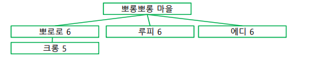
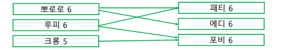
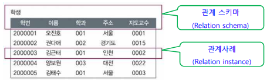

# Chapter 9. DataBase(DB)

+ Database : 해당 데이터를 필요로 하는 여러 사람이나 응용 프로그램이 그 데이터를 참조 가능하도록, 서로 논리적으로 연관되어 있어 통합 관리되는 데이터들의 모임

+ DB의 특징 : 
  - 통합된 데이터 : 관련 있는 데이터들을 통합하여 보여주는 것이 DB의 특징이다.
  - 중복의 최소화 : 관련있는 데이터들을 모아 놓아서, 한군에 모아서 권한있는 사람이 접속할 수 있게 하여 중복을 최소화한다.
    - 동일한 데이터가 중복으로 다른 두 곳에 저장되지 않으며, 한 DB에 접근하는 다양한 접근 방식이 마련되어 데이터를 검색/갱신/업데이트를 효율적으로 이루어지도록 함. 
    
  - 보조기억장치에 저장
  - 무결성 : DB안에 있는 데이터가, 시스템의 오류가 발생되어도 데이터 변경이 이루어지지 않아야 함. 
    - 데이터가 항상 정확하게 유지되어야 한다. 
  
  - 동시접근 : 어떠한 동일한 데이터에, 사람들이 동시에 접근할 수 있도록 해 줘야 한다. 
  - 보안 유지 : 권한 없는 사람은 접근하지 못하게 막아야 함. 
  - 장애 회복 : DB 시스템에 문제가 생기더라도, 이전 상태로 복구가 가능해야 함. 

### DBMS(DataBase Management System) 

+ DBMS : 사용자가 DB를 구축하고, DB 속에 있는 데이터를 유지관리하도록 도와주는 프로그램
  - 대표적인 프로그램 : Oracle, MySQL, mSQL, PostgreSQL, MongoDB ..등
    - SQL : Structed Query Language(구조화된, (데이터베이스에 요청하는)질의 언어)

+ DBMS 가 하는 일 : 응용 프로그램이나 사용자가 DBMS를 통해 데이터에 접근, 검색, 수정, 데이터를 공유할 수 있도록 하게 도와줌.
  - 통합 저장되어 있는 데이터를 관리하고, 모든 응용 프로그램이 공통으로 요구하는 데이터의 기본 처리를 담당함. 
  - 응용 프로그램이 다르더라도, 사용하는 DB가 같을 경우 동시에 사용할 수 있도록 DB를 공유함.
  - 보안/회복의 기능도 담당함. 

### DB 물리구조

+ 캐비닛 구조로 많이 비유함
  - 캐비닛 안의 서류철 : 파일
  - 캐비닛  : DB
  
+ 필드(Field) : 특정한 종류(Data types)의 데이터를 저장하기 위한 영역
  - 주소, 학점, 전화번호 등의 종류의 데이터를 하나의 column 으로 볼 수 있을 것이다. 

+ 레코드(Record) : 1개의 행을 보고 Record라고 한다. 그 객체의 정보가 모여있는 한 줄.
+ 이런 필드 값들을 가지고 있는 레코드들이 모여서 파일을 형성하게 된다. 
+ 파일들이 여러 개 모여서 DB를 구축하게 된다. 
+ DB는 파일을 여러 개 모아 논리적으로 연결해서, 필요한 정보를 적절히 활용할 수 있도록 서로 관련있는 데이터들을 통합한 파일의 집합이라고 할 수 있다.

### DB 추상화(abstraction) 

+ 추상화 : 복잡한 것들을 다 축약하거나 없애고, 핵심 코어만 추려서 간단하게 표현하는 것.
+ DB 내부구조는 되게 복잡하지만, 추상화 과정을 통해서 DB를 보는 관점을 3단계로 축약할 수 있다.
+ DB의 3단계
  - 물리적 단계
  - 논리적 단계
  - 뷰(View) 단계

+ 스키마(schema) : "DB의 전체적인 설계, DB를 구성하는 정보의 종류와 구조, 그리고 이들 간의 관계를 정의하는 구체적인 기술 및 명세(specification)" 이라고 되어 있다. 
  - DB의 데이터들을 어떤 식으로 어떻게 할 것인지 논리적 구조를 설정하기 위한 "DB의 전체적인 설계"를 명시해 놓은 것. 
  - DB의 구조와 제약조건을 명시해 놓은 것

+ 뷰(View) 단계 : 사용자와 직접 상호작용하는 단계. 사용자는 전체 DB에 관심을 가지기 보다, 본인 작업인 DB의 일부분만 관심을 가지므로, 사용자마다 다른 View를 정의할 수 있다.
  - ex) 백화점의 고객분석팀과 상품배송팀
    - DB에는 고객 번호, 이름, 성별, 나이, 직업, 주소 등등이 모두 백화점 고객 DB에 저장이 되어 있다고 하자.
    - 고객 분석팀에서는 다른건 다 필요없고, 성별, 나이, 직업 에만 관심을 가질 것이다.
    - 상품 배송팀에서는 고객번호, 이름, 주소, 연락처 에만 관심을 가질 것이다. 
  - 이렇게 두 사용자 팀에서 관심이 있는 정보가 다르다. 
  - DB에 데이터가 많이 있지만, 해당 당사자가 사용하는 응용프로그램은 그 데이터 중 일부분에만 관심있고, 전체 데이터에는 관심이 없을 것이다.
  - 사용자마다 다른 View를 정의해 사용할 수 있다. 
    - 고객분석팀 직원이 바라보는 View, 상품배송팀 직원이 바라보는 View는 엄연히 다를 것이다. 
    
  - View 단계가 최상위 단계?
    - 물리적, Hardware 단계로 가면 갈수록 하위 단계라고 본다면, 사용자와 상호작용하는 View 단계는 가장 최상위 단계가 된다.   
  - 외부 단계에서 바라보는 Schema는, SubSchema, 외부 Schema 라는 식으로 새로 바라볼 수 있을 것이다.
    - 그렇기 때문에, 외부 단계에서는 SubSchema가 여러 개 나오게 된다. 
     
+ 논리적 단계(개념 단계) : 논리 Schema, 혹은 개념 Schema라고 이야기한다. 
  - 데이터 종류와 데이터 간의 관계를 기술한 Schema, 혹은 단계
  - DB 전체의 데이터 구조를 Schema로 표현한 것이다. 
  - 내부 구조와 무관하게 간단한 구조로 전체 DB를 기술한 것이다. 
  - DB 전체를 기술한 Schema 이다보니, 당연히 DB당 하나밖에 없다. 
  - 보조 기억장치에 저장되어 있는 DB 안에 들어가는 데이터들이 어떻게 저장되어 있는지, 내부 구조와 무관하게 DB 전체를 간단한 구조로 기술한 것이 논리 Schema 라고 할 수 있다.

+ 물리적 단계(내부 단계) : 하드웨어(보조기억장치) 와 직접적인 상호작용을 다루는 단계이다.
  - 물리 schema는 다른 말로는 내부 schema라고 하는데, 하드웨어에 저장되는 DB의 물리적인 구조를 기술한 것이다.
  - 보조 기억장치에 어떻게 저장하는지에 대한 단계이다. 
  - ex) 보조 기억장치에 저장할 때, 고객 번호는 4byte, 이름 10byte, 성별 2byte 같은 식으로 지정해 두는지에 대한 계획들, 그 저장하는 곳의 구조, 제약조건 등을 물리적 구조를 표현함.
  - 물리 schema(내부 schema)는 하나만 존재한다. 

+ schema에 대해서 확실히 깨달아 두기!

### 데이터의 독립성(independency) 

+ "DB 추상화 과정에서 상위 수준의 스키마 정의에 영향을 주지 않고, 해당 스키마 정의를 수정할 수 있는 능력"
  - 독립성 : 다른 것들에 영향 주지 않고 일처리하는 것.
  - 하위 단계의 데이터 구조가 변경되더라도, 상위 단계에 영향을 미치지 않게 하는 것.
  - 논리적 스키마를 수정하고, 물리적 스키마를 수정한다 하더라도, 그 위 단계에 영향을 주지 않고 스키마를 수정할 수 있도록 해야 한다.

+ 논리적 데이터 독립성 
  - ex) 고객 정보에 "고객등급" 필드를 하나 더 추가 한다 하더라도, 기존에 사용하던 데이터에 접근한다던지 하는 코드나 응용 프로그램에는 영향을 주지 않는다. 
  - 논리 스키마를 조금 수정하더라도, 상위에 있는 응용 프로그램에는 영향 없이, 기존에 사용하던 응용프로그램을 사용할 수 있다. 
  - 이렇게 논리적 데이터 독립성이 지켜지게 된다. 

+ 물리적 데이터 독립성 : 
  - 물리적 데이터 스키마를 조정하더라도, 이보다 위에 있는 상위 스키마(논리 스키마 등)에 영향을 주지 않고 수정할 수 있는 능력

### DB 모델

+ 설계 데이터들 간의 관계를, 논리적으로 표현하는 것
+ 초창기에는, DB 를 계층 모델 혹은 네트워크 모델로 사용했다. 

+ 계층 모델 : 관련 있는 entity들을 연결해서, tree 형태로 만들어 놓은 모델.
  - 관련 있는 데이터들을, 위에 부모, 아래 자식 형태로 표현. 
  - 부모 entity는 여러 자식 entity를 가질 수 있고, entity들의 관계는 link로 표현
  - 만약 중간 entity가 없어지면 중간이 비어버리기 때문에, 구조 변경이 어렵다.
  - DB 초창기 때 사용한 모델이다.

+ 네트워크 모델 : 1970년대 DB 구축 때 사용하던 모델
  - 연관성 있는 entity 간에 단순히 link로 연결함. 
  - record 간의 관계를 연결하다 보니, 그물망 처럼 연결되는 특성을 보인다. 
  - 구조가 복잡하고, 어떠한 데이터를 하나 수정했을 때, 연결되어 있는 여러 데이터들을 모두 수정해야 하기 때문에, 마찬가지로 변경이 매우 어렵다. 

+ 관계형(relational) 모델 : 2차원 테이블 표로 표현하는 모델
  - 앞 그림에서 사용했던 화살 포인터가 없다. 

### 관계형 모델

+ 현재 가장 널리 사용하는 DB모델
+ 오라클, MySQL 등, DBMS를 사용해 구축한 DB들은 모두 관계형 모델과 관련 있다.
+ 데이터들을 표 형태로, 논리적 구조를 나타낸 것.

+ 표라고 부르지 않고, relation(관계) 라고 부른다. 그래서 "관계형 모델" 이다. 
  - ex) 1~5 원소가 "학번"이라는 집합안에 들어가 있고, "오진호" ~ " 김태수" 가 이름이라는 집합 안에 들어가 있는 셈이다. 
  - 학번이라는 집합의 원소들과, 이름이라는 집합의 원소, 학과라는 집합의 원소 등 각 집합에 있는 원소들 간의 "관계"를 나타낸다고 해서 관계형 모델이라고 부른다고 한다. 
  - "학생" 이라는 relation에, 학번, 이름, 학과, 주소, 지도교수 라는 속성(attribute)가 있는 것이다. 
  
+ 관계형 모델에서는, 표 자체를 relation 이라고 하고, 한 행을 tuple이라고 부름. 그리고 column을 속성이라고 부른다. 
  - 위의 학생이라는 relation 에서는 속성이 5개 있고, tuple 이 5개 있는 셈이다. 
  - 관계 schema(데이터들의 구조, 논리적 구조) 는 아래와 같이 표현할 수 있다. 
    - relation 이름 : 학생
    - 속성 : 5개(학번~지도교수)
      
  - 관계 사례(instance) 는, 해당되는 relation에 있는 tuple 하나하나를 가지고, 관계 사례(instance) 라고 부른다. 
    - instance는 객체라고 표현해도 좋을듯 하다. 

+ 어떤 relation의 schema는 정적인 특성을 가지고 있음.(변하지 않는다.)
+ 관계 instance는 동적인 특성이 있다(생겨났다 사라졌다 한다.)
+ relation 에서, 속성(attribute) 는 5개이다.     
+ relation 에서, tuple의 총 갯수를 cardinality 라고 할 수 있다.

