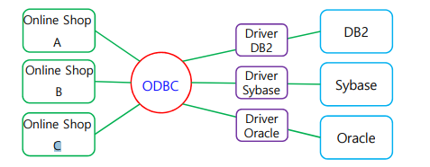

# Chapter 9. DataBase(DB)

+ Database : 해당 데이터를 필요로 하는 여러 사람이나 응용 프로그램이 그 데이터를 참조 가능하도록, 서로 논리적으로 연관되어 있어 통합 관리되는 데이터들의 모임

+ DB의 특징 : 
  - 통합된 데이터 : 관련 있는 데이터들을 통합하여 보여주는 것이 DB의 특징이다.
  - 중복의 최소화 : 관련있는 데이터들을 모아 놓아서, 한군에 모아서 권한있는 사람이 접속할 수 있게 하여 중복을 최소화한다.
    - 동일한 데이터가 중복으로 다른 두 곳에 저장되지 않으며, 한 DB에 접근하는 다양한 접근 방식이 마련되어 데이터를 검색/갱신/업데이트를 효율적으로 이루어지도록 함. 
    
  - 보조기억장치에 저장
  - 무결성 : DB안에 있는 데이터가, 시스템의 오류가 발생되어도 데이터 변경이 이루어지지 않아야 함. 
    - 데이터가 항상 정확하게 유지되어야 한다. 
  
  - 동시접근 : 어떠한 동일한 데이터에, 사람들이 동시에 접근할 수 있도록 해 줘야 한다. 
  - 보안 유지 : 권한 없는 사람은 접근하지 못하게 막아야 함. 
  - 장애 회복 : DB 시스템에 문제가 생기더라도, 이전 상태로 복구가 가능해야 함. 

### DBMS(DataBase Management System) 

+ DBMS : 사용자가 DB를 구축하고, DB 속에 있는 데이터를 유지관리하도록 도와주는 프로그램
  - 대표적인 프로그램 : Oracle, MySQL, mSQL, PostgreSQL, MongoDB ..등
    - SQL : Structed Query Language(구조화된, (데이터베이스에 요청하는)질의 언어)

+ DBMS 가 하는 일 : 응용 프로그램이나 사용자가 DBMS를 통해 데이터에 접근, 검색, 수정, 데이터를 공유할 수 있도록 하게 도와줌.
  - 통합 저장되어 있는 데이터를 관리하고, 모든 응용 프로그램이 공통으로 요구하는 데이터의 기본 처리를 담당함. 
  - 응용 프로그램이 다르더라도, 사용하는 DB가 같을 경우 동시에 사용할 수 있도록 DB를 공유함.
  - 보안/회복의 기능도 담당함. 

### DB 물리구조

+ 캐비닛 구조로 많이 비유함
  - 캐비닛 안의 서류철 : 파일
  - 캐비닛  : DB
  
+ 필드(Field) : 특정한 종류(Data types)의 데이터를 저장하기 위한 영역
  - 주소, 학점, 전화번호 등의 종류의 데이터를 하나의 column 으로 볼 수 있을 것이다. 

+ 레코드(Record) : 1개의 행을 보고 Record라고 한다. 그 객체의 정보가 모여있는 한 줄.
+ 이런 필드 값들을 가지고 있는 레코드들이 모여서 파일을 형성하게 된다. 
+ 파일들이 여러 개 모여서 DB를 구축하게 된다. 
+ DB는 파일을 여러 개 모아 논리적으로 연결해서, 필요한 정보를 적절히 활용할 수 있도록 서로 관련있는 데이터들을 통합한 파일의 집합이라고 할 수 있다.

### DB 추상화(abstraction) 

+ 추상화 : 복잡한 것들을 다 축약하거나 없애고, 핵심 코어만 추려서 간단하게 표현하는 것.
+ DB 내부구조는 되게 복잡하지만, 추상화 과정을 통해서 DB를 보는 관점을 3단계로 축약할 수 있다.
+ DB의 3단계
  - 물리적 단계
  - 논리적 단계
  - 뷰(View) 단계

+ 스키마(schema) : "DB의 전체적인 설계, DB를 구성하는 정보의 종류와 구조, 그리고 이들 간의 관계를 정의하는 구체적인 기술 및 명세(specification)" 이라고 되어 있다. 
  - DB의 데이터들을 어떤 식으로 어떻게 할 것인지 논리적 구조를 설정하기 위한 "DB의 전체적인 설계"를 명시해 놓은 것. 
  - DB의 구조와 제약조건을 명시해 놓은 것

+ 뷰(View) 단계 : 사용자와 직접 상호작용하는 단계. 사용자는 전체 DB에 관심을 가지기 보다, 본인 작업인 DB의 일부분만 관심을 가지므로, 사용자마다 다른 View를 정의할 수 있다.
  - ex) 백화점의 고객분석팀과 상품배송팀
    - DB에는 고객 번호, 이름, 성별, 나이, 직업, 주소 등등이 모두 백화점 고객 DB에 저장이 되어 있다고 하자.
    - 고객 분석팀에서는 다른건 다 필요없고, 성별, 나이, 직업 에만 관심을 가질 것이다.
    - 상품 배송팀에서는 고객번호, 이름, 주소, 연락처 에만 관심을 가질 것이다. 
  - 이렇게 두 사용자 팀에서 관심이 있는 정보가 다르다. 
  - DB에 데이터가 많이 있지만, 해당 당사자가 사용하는 응용프로그램은 그 데이터 중 일부분에만 관심있고, 전체 데이터에는 관심이 없을 것이다.
  - 사용자마다 다른 View를 정의해 사용할 수 있다. 
    - 고객분석팀 직원이 바라보는 View, 상품배송팀 직원이 바라보는 View는 엄연히 다를 것이다. 
    
  - View 단계가 최상위 단계?
    - 물리적, Hardware 단계로 가면 갈수록 하위 단계라고 본다면, 사용자와 상호작용하는 View 단계는 가장 최상위 단계가 된다.   
  - 외부 단계에서 바라보는 Schema는, SubSchema, 외부 Schema 라는 식으로 새로 바라볼 수 있을 것이다.
    - 그렇기 때문에, 외부 단계에서는 SubSchema가 여러 개 나오게 된다. 
     
+ 논리적 단계(개념 단계) : 논리 Schema, 혹은 개념 Schema라고 이야기한다. 
  - 데이터 종류와 데이터 간의 관계를 기술한 Schema, 혹은 단계
  - DB 전체의 데이터 구조를 Schema로 표현한 것이다. 
  - 내부 구조와 무관하게 간단한 구조로 전체 DB를 기술한 것이다. 
  - DB 전체를 기술한 Schema 이다보니, 당연히 DB당 하나밖에 없다. 
  - 보조 기억장치에 저장되어 있는 DB 안에 들어가는 데이터들이 어떻게 저장되어 있는지, 내부 구조와 무관하게 DB 전체를 간단한 구조로 기술한 것이 논리 Schema 라고 할 수 있다.

+ 물리적 단계(내부 단계) : 하드웨어(보조기억장치) 와 직접적인 상호작용을 다루는 단계이다.
  - 물리 schema는 다른 말로는 내부 schema라고 하는데, 하드웨어에 저장되는 DB의 물리적인 구조를 기술한 것이다.
  - 보조 기억장치에 어떻게 저장하는지에 대한 단계이다. 
  - ex) 보조 기억장치에 저장할 때, 고객 번호는 4byte, 이름 10byte, 성별 2byte 같은 식으로 지정해 두는지에 대한 계획들, 그 저장하는 곳의 구조, 제약조건 등을 물리적 구조를 표현함.
  - 물리 schema(내부 schema)는 하나만 존재한다. 

+ schema에 대해서 확실히 깨달아 두기!

### 데이터의 독립성(independency) 

+ "DB 추상화 과정에서 상위 수준의 스키마 정의에 영향을 주지 않고, 해당 스키마 정의를 수정할 수 있는 능력"
  - 독립성 : 다른 것들에 영향 주지 않고 일처리하는 것.
  - 하위 단계의 데이터 구조가 변경되더라도, 상위 단계에 영향을 미치지 않게 하는 것.
  - 논리적 스키마를 수정하고, 물리적 스키마를 수정한다 하더라도, 그 위 단계에 영향을 주지 않고 스키마를 수정할 수 있도록 해야 한다.

+ 논리적 데이터 독립성 
  - ex) 고객 정보에 "고객등급" 필드를 하나 더 추가 한다 하더라도, 기존에 사용하던 데이터에 접근한다던지 하는 코드나 응용 프로그램에는 영향을 주지 않는다. 
  - 논리 스키마를 조금 수정하더라도, 상위에 있는 응용 프로그램에는 영향 없이, 기존에 사용하던 응용프로그램을 사용할 수 있다. 
  - 이렇게 논리적 데이터 독립성이 지켜지게 된다. 

+ 물리적 데이터 독립성 : 
  - 물리적 데이터 스키마를 조정하더라도, 이보다 위에 있는 상위 스키마(논리 스키마 등)에 영향을 주지 않고 수정할 수 있는 능력

### DB 모델

+ 설계 데이터들 간의 관계를, 논리적으로 표현하는 것
+ 초창기에는, DB 를 계층 모델 혹은 네트워크 모델로 사용했다. 

+ 계층 모델 : 관련 있는 entity들을 연결해서, tree 형태로 만들어 놓은 모델.
  - 관련 있는 데이터들을, 위에 부모, 아래 자식 형태로 표현. 
  - 부모 entity는 여러 자식 entity를 가질 수 있고, entity들의 관계는 link로 표현
  - 만약 중간 entity가 없어지면 중간이 비어버리기 때문에, 구조 변경이 어렵다.
  - DB 초창기 때 사용한 모델이다.

+ 네트워크 모델 : 1970년대 DB 구축 때 사용하던 모델
  - 연관성 있는 entity 간에 단순히 link로 연결함. 
  - record 간의 관계를 연결하다 보니, 그물망 처럼 연결되는 특성을 보인다. 
  - 구조가 복잡하고, 어떠한 데이터를 하나 수정했을 때, 연결되어 있는 여러 데이터들을 모두 수정해야 하기 때문에, 마찬가지로 변경이 매우 어렵다. 

+ 관계형(relational) 모델 : 2차원 테이블 표로 표현하는 모델
  - 앞 그림에서 사용했던 화살 포인터가 없다. 

### 관계형 모델

+ 현재 가장 널리 사용하는 DB모델
+ 오라클, MySQL 등, DBMS를 사용해 구축한 DB들은 모두 관계형 모델과 관련 있다.
+ 데이터들을 표 형태로, 논리적 구조를 나타낸 것.

+ 표라고 부르지 않고, relation(관계) 라고 부른다. 그래서 "관계형 모델" 이다. 
  - ex) 1~5 원소가 "학번"이라는 집합안에 들어가 있고, "오진호" ~ " 김태수" 가 이름이라는 집합 안에 들어가 있는 셈이다. 
  - 학번이라는 집합의 원소들과, 이름이라는 집합의 원소, 학과라는 집합의 원소 등 각 집합에 있는 원소들 간의 "관계"를 나타낸다고 해서 관계형 모델이라고 부른다고 한다. 
  - "학생" 이라는 relation에, 학번, 이름, 학과, 주소, 지도교수 라는 속성(attribute)가 있는 것이다. 
  
+ 관계형 모델에서는, 표 자체를 relation 이라고 하고, 한 행을 tuple이라고 부름. 그리고 column을 속성이라고 부른다. 
  - 위의 학생이라는 relation 에서는 속성이 5개 있고, tuple 이 5개 있는 셈이다. 
  - 관계 schema(데이터들의 구조, 논리적 구조) 는 아래와 같이 표현할 수 있다. 
    - relation 이름 : 학생
    - 속성 : 5개(학번~지도교수)
      
  - 관계 사례(instance) 는, 해당되는 relation에 있는 tuple 하나하나를 가지고, 관계 사례(instance) 라고 부른다. 
    - instance는 객체라고 표현해도 좋을듯 하다. 

+ 어떤 relation의 schema는 정적인 특성을 가지고 있음.(변하지 않는다.)
+ 관계 instance는 동적인 특성이 있다(생겨났다 사라졌다 한다.)
+ relation 에서, 속성(attribute) 는 5개이다.     
+ relation 에서, tuple의 총 갯수를 cardinality 라고 할 수 있다.
+ Domain : 하나의 속성에서 취할 수 있는 값의 범위
  - 학생이라는 relation에서 학년이라는 속성의 domain : 1~4

+ relation 의 특징 : 
  - 한 relation 에서 속성의 이름은 유일해야 함. 
    - 중첩되면 query 를 못돌리겠지
  - relation 에서 tuple과 속성의 순서는 무의미하다. (query 문 돌려보면 무의미 하더라)
  - 중복된 tuple은 삽입될 수 없다. (완전히 속성값이 싹다 같은 애들은 들어갈수가 없다)
    - 어차피, 최소한 id라도 다름.
  - 더이상 나눌 수 없는 값(원자값)으로 tuple 에 들어가야 한다. 
    - ex) 주소를 자세히 하고 싶으면, 세분화해서 넣어야 함. 

+ key : 어떠한 relation에서, tuple들을 "유일하게 구분해 낼 수 있는" 속성들의 집합
  - 학번이라는 속성을 토대로 tuple들을 구별해 낼수 있으니, key 안에 들어가게 된다. 
  - 전화번호 라는 속성을 더 넣는다면, 학생들마다 전화번호가 다 다를테니 key 안에 들어갈 것이다. 
  - 한 table 안에 삽입될 수 있는 tuple은, 반드시 서로 가지고 있는 key가 다 달라야 함.

+ 후보 키(candidate key), 주 키(primary key) , 외래 키
   - 후보 키 : 속성 집합 중, "유일성"과 "최소성" 을 만족하는 key.
      - 유일성 : tuple 끼리 겹치는 것 없이. tuple - key 가 1 : 1 이 되어야 함.
      - 유일성이 만족되어야 tuple 들을 구별할 수 있다. 
      - 최소성 : relation 안에 있는 tuple을 구별해내기 위해, 속성이 최소한으로 들어가야 한다
      - 두개 묶여서 primary key로 만든다 하면, "최소성" 을 만족하지 못하는 것이다. 
      - 위의 사례에서는, "학번" 하나만으로 tuple을 모두 구분해낼 수 있다. 
      - 두 개의 속성을 묶어서 tuple을 구분해 내는 것은, key는 될 수 있지만 후보 key가 될 수는 없다.(유일성은 만족하지만, 최소성을 만족하지 않기 때문)(학번만으로도 구분할 수 있다)
      - 어떠한 relation 에서, 후보키는 여러 개가 나올 수 있다. 

  - 주 키(primary key) : 후보 키 중 가장 적합한 것을 primary key로 정함.
    - 위의 사례에서, 학번과 전화번호 중 더 적합한 것은 학번이다. 
    - 그래서 학번으로 primary key를 정하는 것이 더 바람직하다. 
    - 하나의 relation 에서 여러 tuple 중 하나의 tuple을 식별해낼 수 있는 역할을 수행한다.
  
  - 외래 키 : 어떠한 relation에서 한 속성이 다른 relation 에서 primary key로 작동하고 있으면, 해당하는 그 속성을 보고 외래 키라고 부른다.
    -  외래 키를 가지고, A relation 과 B relation 이 연결 지어진다고 생각할 수 있다. 

+ 관계에 대한 연산 (with query)
  - 삽입(insert) : tuple을 삽입하는 연산
     - insert into ~~~~(A,B,C,D) values (X,Y,Z,W) 
     - 위와 같은 식으로 query 문을 만들 수 있다.

  - 삭제(delete) : 관련된 tuple을 삭제 
    - delete ~~~
  - 수정(update) : 
    - update ~~~~~~~ set XXXXX where itemname like '%Y%'
  - 조회(select) : 
    - select * from ~~~~~~ where name like '%X%' 
   
   
### DBMS(DB 관리 시스템)의 구성

+ DBMS 는 DB를 정의하고, 구축/조작/제어하여 DB에서 정보를 쉽게 활용할 수있도록 만든 프로그램.
+ 종류 : MySQL, SQL server, MariaDB, PostgreSQL 등

+ DBMS 는 어떤 모듈 프로그램으로 이루어져 있는가?
  - 저장 관리자(Storage Manager) : 데이터를 실제적으로, 물리적 구조를 통해 데이터에 저장하는 것을 담당해 주는 모듈 프로그램. DB 구조를 결정하고 실제 저장장치에 자료를 저장하는 역할을 함.
  - 질의 처리기(Query Processor) : 들어온 SQL 명령어(query)를 처리해, 결과를 도출해 주는 모듈 프로그램
  - DBMS Interface :  사용자가 DB와 DB 안의 모든 장치에 쉽게 접근할 수 있게 해주는 프로그램

+ DBMS 종류 
   - MySQL : 대표적인 DBMS 프로그램. 오픈소스이다. GNU의 GPL(General Public License) 에 해당되는 프로그램이기 때문에, 무료로 다운로드 받을 수 있다.
     - GPL : Free Software Foundation(FSF) 에서 만든 라이선스로, 소프트웨어의 실행, 연구, 공유, 수정의 자유를 최종 사용자에게 보장해준다. 대표적으로 Linux Kernel 이 GPL의 대표적인 예시이다. 
     - 현재는 Oracle에 합병되어 있다.
     - 당연히 서버 컴퓨터에 설치가 되어 작동한다. 

  - Oracle : Oracle 사에서 개발한 기업용 대규모 DBMS 프로그램
    - 대기업, 중소기업 DB 구축에 많이 사용된다.(이건 MySQL도 많이쓰는데...?)
    - 일일이 DB를 구축해 관리하는 것이 아니라, Machine Learning을 통해 자동으로 DB가 관리될 수 있도록 작동이 된다고 한다. 
    - 최저 비용으로 높은 신뢰성과 보안 운영 효율성을 보장한다고 한다. 

  - SQL Server : 인텔 기반 서버용 컴퓨터에 너리 사용되는 DB
    - 중소 규모의 DB에서 활용이 된다.
    - 서버를 위한 운영체제인 Window NT에 MS사에서 사들인, 'Sybase' 에서 만들어낸 DBMS 프로그램을 재설계해서 발표한 SQL Server라는 DBMS 프로그램을 탑재했다고 한다.
    - ODBC(Open DB Connectivity) 역할을 함으로써, 미들웨어로써의 역할을 제공한다고 한다.

  - 미들웨어 : 분산 컴퓨팅 환경(네트워크로 컴퓨터들을 연결하여, 작업들을 모두 분산시켜 컴퓨팅 해 결과를 도출하는 환경) 에서, 컴퓨터 하드웨어 기종이라던지 프로토콜(통신 규약) 이 다를 것인데, 컴퓨터들의 응용 프로그램과 프로그램 운영 환경 사이의 통신이 원활하게 해 주는 중간 중계자 역할을 해 주는 소프트웨어이다.
  
  
  
  - ODBC(Open DB Connectivity) : DB를 사용하기 위한 표준 개방형 응용 프로그램, DBMS 에 관계없이 어떤 응용 프로그램에서나 모두 접근하여 사용할 수 있도록 하기 위해 MS에서 개발한 표준 방법
    - 어떤 DB를 연결하더라도, 원활하게 DB와 연결이 되도록 중간 중계자의 역할을 SQL Server가 수행할 수 있다.
    - DB의 독점적인 인터페이스를 한 쪽 응용프로그램이 알지 못하더라도, 미들웨어에서 중개자 역할을 해서 연결될 수 있게끔 만든다!
 
  - SQLite : 다른 DB보다 용량이 되게 작다. 작다보니 속도도 빠르고 개인용 embedded DB 엔진으로 많이 사용된다.
    - 작기 때문에 따로 서버가 필요하지는 않다. 
    - MySQL 같은 DB들은 설치되는 컴퓨터들이 서버 용도로 사용되는 컴퓨터에 많이 들어간다. 
    - 모바일 환경에 많이 내장되기도 한다.(무료이다)
    - cmd에서 DB작업 가능(근데 다른것도 돼)

  - 사용할 수 있는 명령어들(SQLite 에서만 나오는 것들)
    - .open : DB 파일열기
    - .save : DB 파일저장
    - .table(s) : 파일 내 있는  relation(표) 목록 보기
    - .help : 명령어 목록 보기
    - .quit : 쉘 종료
    - (뒤에 semicolon 오는 애들은 공통적으로 사용가능하다고 한다.)

  - 사용할 수 있는 명령어들(공통적으로 쓰는것들)
    - create table tableName( (테이블 만들기, 스키마를 작성한다고 한다.)
    -     departID int NOT NULL,
    -     name varchar(30) NOT NULL, (문자형 30byte 안에 쓰는 것.)
    -     numStudent int NULL,
    -     PRIMARY KEY(departID)
    -     );
    - insert into tableName values (1, '전자공학과', 10);     
    - select * from tableName ; (검색)
    - delete from tableName where numStudent = 30; (삭제)
    - update tableName set numStudent = 50 where numStudent <= 20; (수정, where에 걸리는 애들 다 바뀐다.)
    - 항상 끝났으면 저장하기 (.save), 그리고 나가기(.quit)

  - 하나의 file 안에 relation이 여러 개가 저장될 수 있다. 

### 데이터 마이닝(Data Mining)

+ 서로 관련있는 데이터들 사이에, 관계를 분석하고 서로 상관있는 단어들을 추출해 뽑아내어 분석하여 그것을 통해 새로운 가치있는 정보들을 추출해내는 기법.

+ 데이터 분석 방법으로 AI의 머신러닝 기법과 인공신경망의 딥러닝 등을 활용

+ 관련 있는 데이터를 어떻게 뽑아내는가? (Data Mining 기법)
  - 연관 규칙 : 서로 연관성이 강한 데이터의 조합을 통해 패턴을 발견함.  
  - 연속성 규칙 : transaction data 를 시각적으로 분석해 향후 예측하는 방식으로 데이터를 만든다. 
    - transaction : (사전적 의미로) 거래. DB의 데이터의 상태변경하는 것.
    - A라는 데이터를 검색하고, 전에 이런 식으로 검색을 했으니, 다음 번에는 어떠한 데이터를 검색하겟는지 등을 시간적으로 분석해 향후 예측을 할 수 있다. 
  - 분류 규칙 : 알려진 특정 그룹의 특징을 부여하고, 정의된 분류에 맞게 구분해 분류하는 것.
  - 군집 규칙 : 상호 유사한 특성을 지닌 데이터를 그룹화하여, 패턴을 분석. Machine Learning의 비지도 학습을 통해 편집할 수 있다. 

+ 데이터 마이닝 절차 : 
  - 프로젝트의 목표, 절차를 먼저 이해함. (무엇을 위한 비즈니스인가?)
  - 관련있는 데이터들을 수집
  - 데이터 분석
  - 데이터 모델링(데이터들을 어떤 모델에다 적용할지)
  - 결과의 검토 및 평가

### 문서 DB

+ 요즘 많이 사용하는 DB는 json 형태로 데이터들을 저장하는 것
  - JSON(JavaScript Object Notation) : JS에서 객체를 표현하는 형태로 데이터들을 저장하는 것.

+ 비관계형 데이터베이스(Not Only SQL) 
  - 관계형 DB에서는 Join(관련 있는 데이터들을 찾아 정보를 합치는 것)이 있는데, JSON 형태의 문서 DB에서는 그런 기능이 없다.
  - 비관계형 데이터베이스에서는 해당 "행"에 해당되는 정보를 모두 가져와(필드 : 값) JSON file로 묶어서 형성하게 된다.
  - 관계형 DB에서의 테이블은, 문서 데이터베이스에서는 "Collection"이라고 부른다. 
  - 행에 있는 정보들은, document라고 하여 JSON으로 모두 묶는다. 
  - 관계형 DB에서의 열(column) 은 필드라는 용어를 사용한다. 

+ NoSQL(Not Only SQL) 유형 4가지
  - 문서 지향
  - key : value
    - key : 관련 데이터값 형태로 저장
    - 데이터를 저장하는 형태가 간단하기 때문에, 데이터가 별로 많지 않을 때, query 형태가 복잡하지 않을 때 사용하는 형태라고 한다. 
    - Redis : key-value 형태의 대표적인 DB
  - wide column store
    - JSON 타입이 아닌, 표 형태를 사용해 저장함. 
    - 관계형 DB와의 차이점 : 관계형 DB는 column이 다 정해져 있는데, 얘는 각 행마다 column의 이름과 format이 각 행마다 다를 수 있다고 한다. 
    - 첫번째 행에서는 field 4개, 두번째 행에서는 field 5개, 세번째 행에서는 field 2개 이런식.
    - 대표적인 예시 : HBase
  - graph DB
    - graph의 node와 edge 정보가 DB 안에 저장되는 식이다. 
    - Node 와 Node 간의 관계를 DB에 저장한다. 
    - 대표적인 예시 : Neo4j

+ 관계형 DB에서는 테이블을 형성할 때 schema가 정해져서 미리 표를 만들어 놓고 그 안에 데이터를 그에 맞게 집어넣는 반면, NoSQL은 그런 schema가 정해져 있지 않다. 

+ 이미지나 동영상, 텍스트 등 대용량의 비정형 데이터들을 유연하게 처리할 수 있다. 
+ 이미지, 동영상, 텍스트 같은 비정형 데이터들은 schema도 형태가 다양하기 때문에, 정해져 있는 schema가 없다.(장점)
+ cloud 환경에서 이러한 데이터들을 저장하게 되면, 빠르게 데이터들을 수집,관리할 수 있다. 

+ 응용 프로그램의 코드와 동일한 문서 모델 형식을 사용하기 때문에, 쉽게 데이터를 저장하고 query 할 수 있다. (빠르다)

+ MongoDB : 문서 지향 DB 중 유명한 것 중 하나.
  - Open SW이기 때문에 무료다운로드 가능.

+ BSON(Binary JSON) : 실제로 저장되는 형식은 binary 형태로 저장되는 형태이다. 
